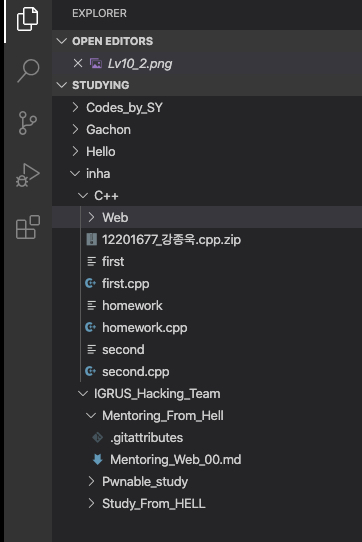

#Mentoring_Web
1-5 ~ 1-10
HTML이라는 언어를 사용하기 위한 코딩 실습 환경
	-- 웹 브라우저
	-- 코드를 작성하기 위한 텍스트 “에디터” 
		OS에도 훌륭한 에디터들이 내장되어 있지만 원래 코드를 작성하는 용도는 아니기에 코드 작성에 맞춤인 전문적인 에디터를 사용
	-- 영상 제작자는 Atom을 사용했지만,  VSCode를 사용중이므로 VSCode 사용
	-- 필요한(용도에 맞는) 편집기를 찾아내는것이 중요

오른쪽 화면 - 디렉토리를 관리하는 화면
웹 페이지의 확장자는 html이라 생각
웹페이지를 연다
	: 지금까지는 주소를 입력 -> 주소에 해당되는 다른 컴퓨터에 저장된 웹페이지를 읽기 위함
	: 내 컴퓨터에 있는 웹페이지를 연다? -> “파일 열기”

웹 브라우저에 주어진 텍스트에 “표시”
텍스트 입력 -> 저장(원인을 만듬) -> 웹 브라우저 새로 고침(결과로 표현)

원인 - 코드. html의 문법에 맞는 코드
결과 - 왼쪽의 웹 페이지

다른 문자들과 구분되게 진하게 표시(bold) - 문제
헤결 - html을 지배하는 문법, 태그
태그 - "설명"을 위함. 어떠한 특성을 가지는지 설명하기 위해.
*태그의 용도가 궁금하다면 태그에 사용된 단어를 먼저 사전에서 찾아보자. “비유적” 표현이 많을 것이다. (하나의 “시”로 셍긱힐 수 있다)
*태그의 적용이 끝나는 부분에 /태그를 붙여야 한다(닫는 태그! 시작하는 태그와 구분을 위함)

다른 문자들과 구분되게 글자를 강조하는 태그 _<strong>_
	

밑줄(underline)을 치는 태그 <u>
	

태그를 배우기 전과 후로 인생이 달라질 것.
태그를 알기 전에는 무엇을 모르는지도 인지하지 못했지만 태그를 알고 나서는 낯선 태그를 보았을 뗴 어떤 태그가 사용되었는지는 몰라도 그것이 태그라는 사실과 _무엇을 모르는지를_ 알 수 있다.  그것에 대해 대화할 수 있고 _궁금증을 해소할 수 있다_
기본적인 내용만 안다면, 전문적인 내용까지 알지 못해도 기계(검색앤진, sns, 기타 등등)가 대신 알려주고 해결해줄 것.

<h> 태그 - 제목 
(Heading)을 위한 태그, 숫자 h1 ~ h6까지 사용
	

현재 html에는 150개 이상의 태그가 존재 - 다 알필요는 없다, 그러나 일부 태그들은 인지하고 있어야 할 필요가 있다
통계를 기반으로 태그의 빈도수를 분석 - [The average web page from top twenty Google results](https://www.advancedwebranking.com/html/)
평균적으로 약 25~26개의 태그를 사용한다.

인기 있는 경쟁관계의 두가지 태그. (줄바꿈을 위한 태그)
css?!

코드에서의 줄바꿈 -> 웹사이트에서 반영되지 않음. 

-> 줄바꿈을 하는 태그가 필요하다
 
-- 줄바꿈을 표현하는 시각적인 의미를 가진다.
-- 다른 태그와 달리 감쌀 필요가 없기 때문에 닫히는 태그가 존재하지 않는다.

-- 단락을 표현하기 위해 사용하는 태그
-- 줄바꿈을 여러번 하기에는 불리 -> 시각적 자유도 떨어짐 -> CSS 이용해 간격을 정교하게 조정할 수 있다. (그러하다.)
	

결과는 같지만, 사용하는 태그는 다르다. 역할이 동일하기 때문에 사용하는 맥락, 의미에 따라 상황에 맞는 다른 표현을(태그를 사용) 해야 한다. 

기초는 기초만으로도 할 수 있는 일이 많다. 기초로 할 수 있는 일들을 통한 html의 중요도를 알아보자
일반인들이 게시판에 글을 쓸 때와 html을 배운 사람들이 글을 쓸 때 다른점을 생각해보자
일반인들이 제목을 작성할 때 단순히 폰트 사이즈를 키울 때, html을 배운 사람들은 제목 태그를 이용해 제목을 표현한다. 이는 코드 상에서 의미의 표현 여부에서 달라진다. 제목 태그를 이용했다면 코드에 “제목”이라는 정보가 표현이 되지만, 글씨 사이즈만 키운 제목은 그냥 일반 텍스트와 다르지 않을 것이다.
코드상에 정보가 "표현되는" 것과 표현되지 않는 것은 큰 차이가 존재한다. 검색엔진은 웹페이지를 저장하고 태그를 이용해 정보를 정리하는데, 일반인의 시각적으로만 표현된 제목이 아닌 제목이 태그를 통해 코드에 “표현”된 방식이 우선적으로 표시할 것이다. 검색엔진의 우선성은 정보의 공유에서 큰 차이를 갖는다.
웹은 보편적으로 사용할 수 있고 소스를 누구나 접근할 수 있다. 이러한 웹의 기본 철학은 accessibility,  접근성이라고 하는데 이는 정보의 외곽에 놓여진 장애인들, 시각장애인 등에게도 적용이 되어야한다. 시각장애인은 보조장치를 이용헤 정보를 접근하게 되고, 웹페이지의 글을 이미지로 만들게 된다면, 시각장애인들에겐 의미 없는 정보가 된다. 이러한 의미에서도 정확한 태그를 사용하는 것은 중요하게 여겨진다.
