#Mentoring_Web
1-11~1-15
속성 - 태그의 심화된 문법

화려함 + 이미지 첨부?

img>  이미지를 웹페이지에 포함시킬 때 사용하는 태그

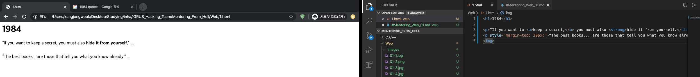

-> 어떠한 이미지를 뵤여줄것인지에 대한 정보가 없다 -> 당연히도 이미지는 보이지 않는다.

"태그의 이름만으로는 정보가 부족할 수 있다”

-> 새로운 문법 “속상”(Attribute)

위치 상관 없음. 태그의 이름만으로 정보가 부족할 때 태그에 더 많은 정보를 부여할 수 있다.

속성을 통해 이미지에 위치와 관련된 정보를 제시

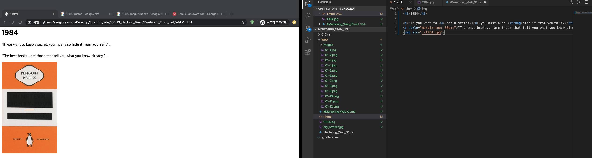

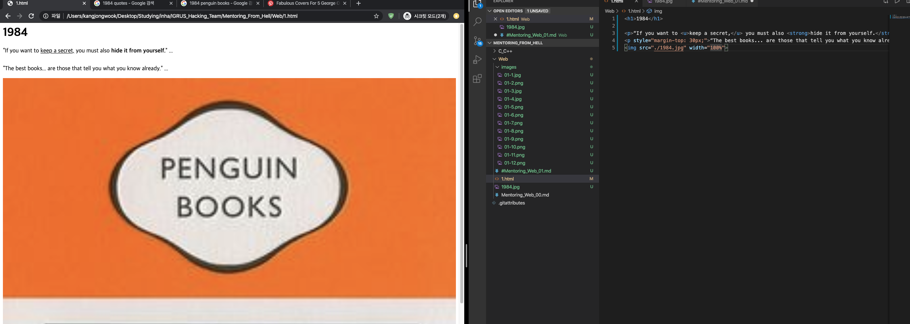

parent> child>
	-- 어떤 태그들은 상속관계가 바뀌지만, 어떤 태그들은 항상 부모 태그와 자식 태그가 붙어 있다

목차를 만들자
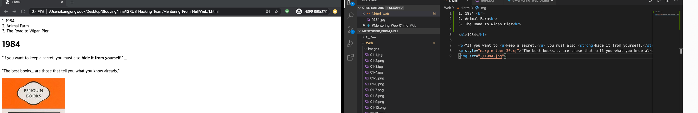
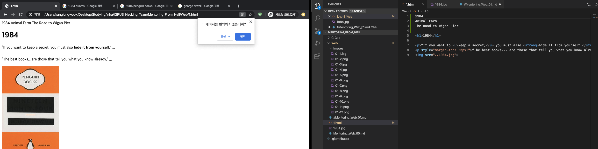

목록을 만드는 태그 li> -> 각각의 항목들을 리스트로 만듬

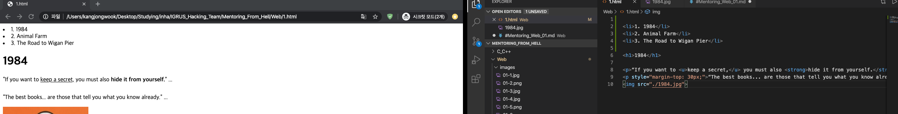
여러개의 리스트를 만들 경우에는 리스트들을 구분해야 할 수도 있다 (br으로 구분은 할 수 있겠지만, 맥락에 맞는 사용은 아님)

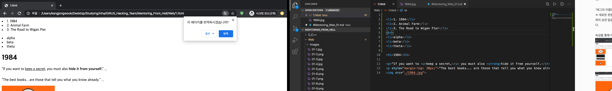
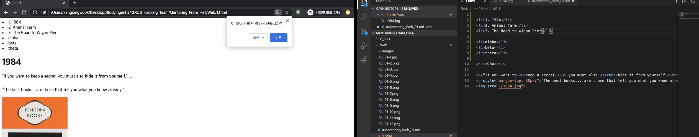

ul> - 여러가지 리스트를 구분하기 위해 만든 태그, li 태그의 부모! (Unordered list)

li와 같은 항목들을 경계를 짓기 위해 부모 태그를 항상 필요로 한다.
	
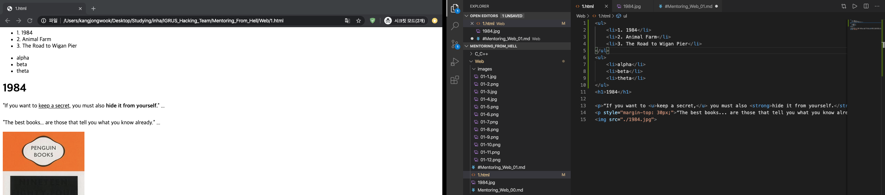

ol> - ordered list. 앞에 자동으로 숫자가 부여된다.
	
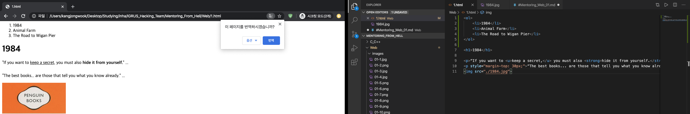

ol>과 ul>두 태그는 List라는 공통적인 특징을 갖고 있다.

이러한 부모 - 자식의 속성은 표를 만드는 table이라는 태그를 사용할대도 적용할 수 있을 것이다.

html의 문법을 배웠다 = 문장을 완성시키는 법을 배웠다

문장이 모이면 페이지가, 페이지가 모이면 책이 된다. 정보가 많아짐에 따라 정보를 잘 정리하기 위한 “구조”가 필요히디.

title> - 홈페이지의 제목을 표기하기 위한 태그
	
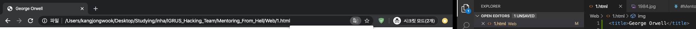

한국어로 입력했을 때 출력되는 글자가 다를 수 없다 -> 컴퓨터는 0과 1로 데이터를 저장하는데, 이 0과 1을 어떻게 저장할 것인지에 대한 여러가지 규격이 존재하는데, 이를 맞추지 않으면 문자가 깨질 수 있다. 이를 웹브라우저가 페이지를 열때도 같은 규격으로 열기 위해서는 웹브라우저에 이에 대한 정보를 제공해야 한다

meta> -> 웹브라우저에 정보를 제공하기 위한 태그

charset -> 문자의 규칙을 지정하는 것. Utf-8로 문서를 읽으라고 제시하는 것

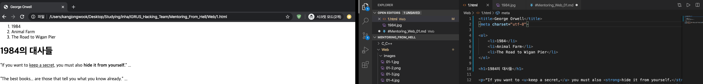

윗 부분의 코드들은 본문을 설명하기 위함, 아랫부분의 코드가 “본문”

-> 본문과 본문을 설명하기 위한 부분들을 분리하기 위한 태그가 약속되어 있다

body> -> 본문을 묶기 위해 설정한 태그. “약속”

head> -> 본문(body>)을 설명하기 위해 설정하는 태그
	
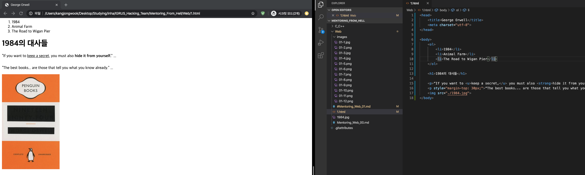

모든 html 태그는 body와 head 태그 아래에 놓여야 하고, html 태그가 그 위에 사용되어야 한다.

!doctype html> - 문서 타입을 html로 지정

전세계의 거의 모든 홈페이지들이 이러한 구조로 이루어져 있을 것이다

"링크" -> 정보를 연결해준다. 검색 엔진들을 돌아갈 수 있게 하는 원동력, HyperText의 의미.
a> - anchor. "링크”를 위해 사용하는 태그. 
	
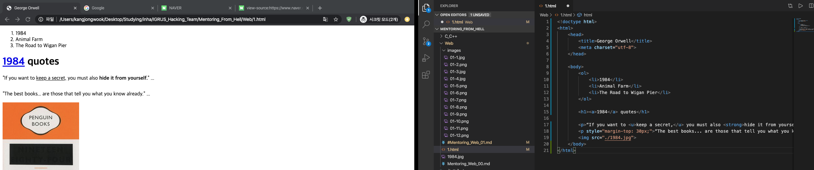

a 태그만으로는 정보가 부족 -> 앵커를 내리기 위한 링크를 제시해야한다

href 속성 -> 연결 될 링크를 제시한다.

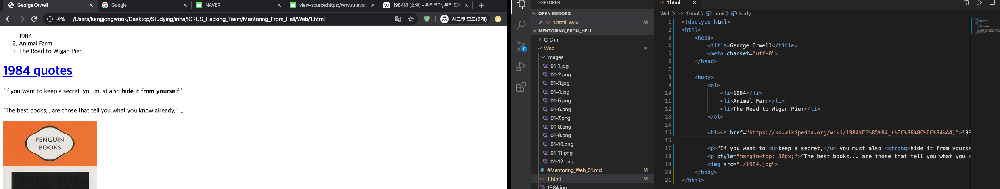

html specification -> w3c에서 제시하는 미래의 웹에 대한 “권고안”, html에서 사용되는 모든 태그에 대한 설명들이 제시되어 있다.

target -> 어떤 창에 띄울 것인가에 대한 속성 / title -> 툴팁에 정보 표시

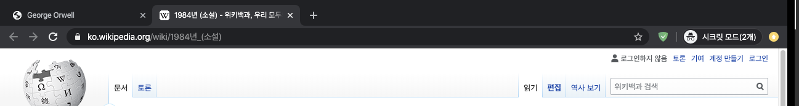

링크는 서로 연관된 웹페이지들을 결합해 하나의 “책”으로 연결한다는 점에서 실로 비유할 수 있을 것.

제목 - 인덱스. 웰컴 페이지가 나올것

목차를 누르면 각 목차에 맞는 웹사이트가 연결되도록.

하이퍼링크 작성, 목차에 따른 웹페이지 생성

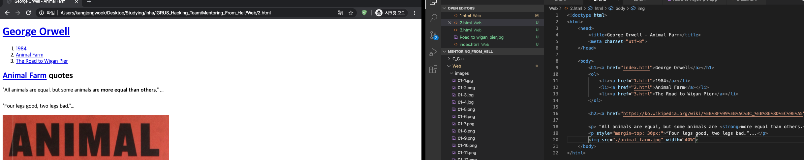
2.html

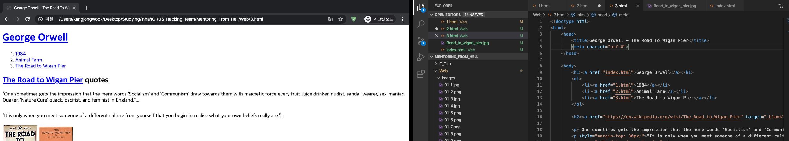
3.html
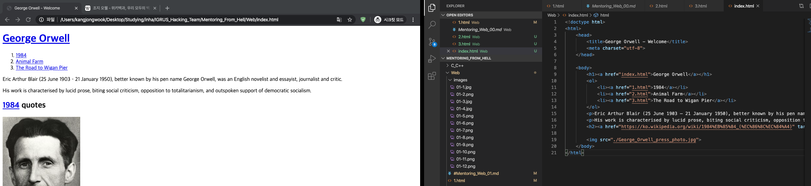
index.html

어쨌거나 웹사이트가 완성되었다.
