#Mentoring_Web

웹페이지를 만들고, 만든 웹페이지를 인터넷을 통해 “공유”하는 것이 우리의 목표

웹의 역사를 공부해보자!

웹은 처음 등장한지 27년이 지났고 그동안 정보를 전달하는 가장 좋은 방법이 되었다. 웹의 역사를 거슬라 올라가다보면 웹의 본질이 있을 수 있다.

인터넷과 웹은 다르다. 인터넷은 도시라면 웹은 하나의 건물이라고 할 수 있다. 인터넷이라는 분모 위에 웹은 존재하는 서비스이다.

1960년 인터넷이 등장하고, 30년 후 1990년 웹이 등장한다.

인터넷은 미국이 핵 공격을 당했을 때 통신 시스템이 마비되는 상황을 이겨내기 위해 탄생했다. 인터넷은 중앙 처리가 아닌, 분산 처리 방식으로 한 단위가 마비되어도 전체 시스템의 작동이 문제가 없도록 설계되었다.

인터넷이 출범하고 30년간 인터넷이 존재한다는 것을 사람들은 잘 알지 못했다. 군대 / 학교 등에서만 사용되는 시스템이었고,  일반인의 접근이 쉽지 않았기 때문이다. 이때 웹이 등장하면서 달라진다. 

웹은 스위스 제네바 유럽 입자물리연구소에서 1980년에 팀 버너스 리가 웹을 만들다 1989년 인터넷이 연구소에 들어오고, 1990년 www라는 프로그램을 만들고, 웹 서버라는 프로그램읋 만들어 웹이라는걸 배포한다.

1960년 엘리트들을 위해 존재했던 시스템이 웹이 등장하면서 대중들에게 배포되기 시작되어 지금에 이르게 되었다

인터넷이 동작하기 위해서는 2대의 컴퓨터가 필요하다. 2대의 컴퓨터가 정보를 “공유”하면서부터 세상은 달라졌다. 팀 버너스 리는 2대의 컴퓨터에서 웹 브라우저 / 웹 서버라는 프로그램을 만들었다.

브라우저에서 주소창에 주소를 입력하면, 웹 서버에서 이 신호를 받아서 필요로 하는 웹 페이지를 찾아 전기적 신호로 다시 웹 브라우저에게 보낸다. 그러면 컴퓨태에 웹페이지가 도착하고, 이를 브라우저가 해석해 정보를 표시한다.

이때 웹 브라우저는 정보를 "요청”(request), 웹 서버는 정보를 “응답”(response)한다. 그리고 웹 브라우저를 Client, 웹 서버를 Server 라고 부르기로 약속한다. 

웹 브라우저는 추상적인 논리적 구조이지만, 많이 접근하니까 물질적으로 느낀다. 웹 서버도 마찬가지로, 익숙해져 웹 브라우저와 같이 물질처럼 쓸 수 있다.

웹 서버를 만드는 과정에서 웹 호스팅이라는 업체에 대행하는 방법과 웹 서버를 컴퓨터에 직접 까는 방법이 있다. 직접 설치하는 것은 어렵지만 인터넷에 대한 많은 것을 배울 수 있고, 호스팅은 쉽지만 배울 것이 줄어들게 된다.

웹 서버를 직접 깔려면 웹 서버를 직접 깔아야 하고, 항상 컴퓨터를 켜 두어야 하며, 집 밖에서 연결을 위한 여러가지 작업을 해야한다.

이러한 대행을 하기 위해 호스트를 제공해주는 웹 호스팅 업체들이 있다. 

github는 전세계의 오픈 소스들이 만들어지고 있는 성지인데, 이중에서 웹 서버를 제공해주는 일을 하기도 한다.

새 repository를 만들고, 이를 통해 지금까지 만든 소스를 github에 저장해 둘 수 있다. 클라우드 서비스와 비슷하지만, 프로그래머들에게 특화되어 있다고 할 수 있다.

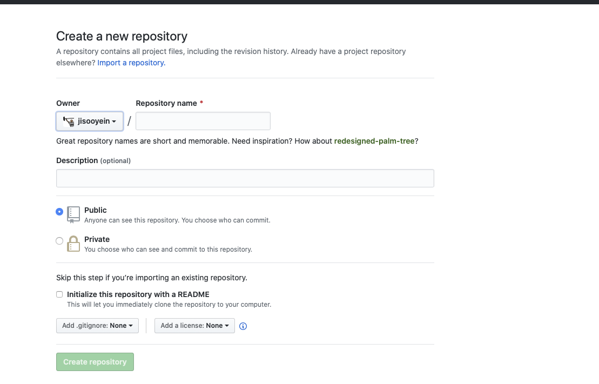

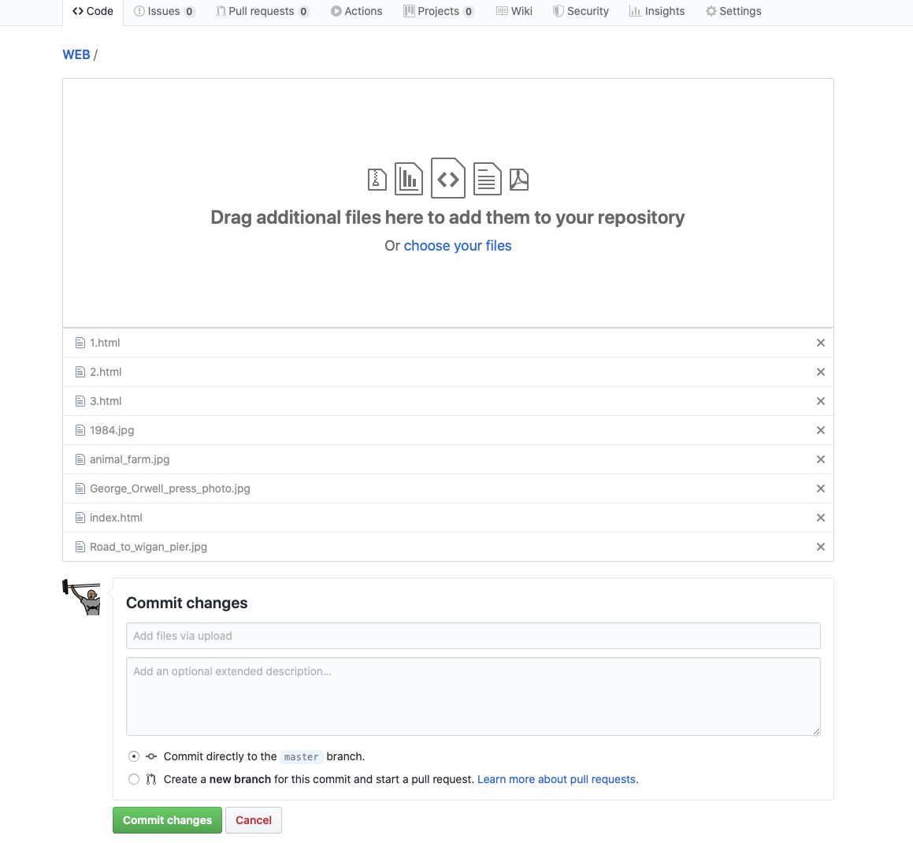

업로드 된 파일을 깃허브에 올리면 주소를 아는 사람들이 접근해 우리의 소스를 볼 수 있다.
웹 서버를 활성화 하기 위한 설정을 하기 위해 설정에 들어가고, 

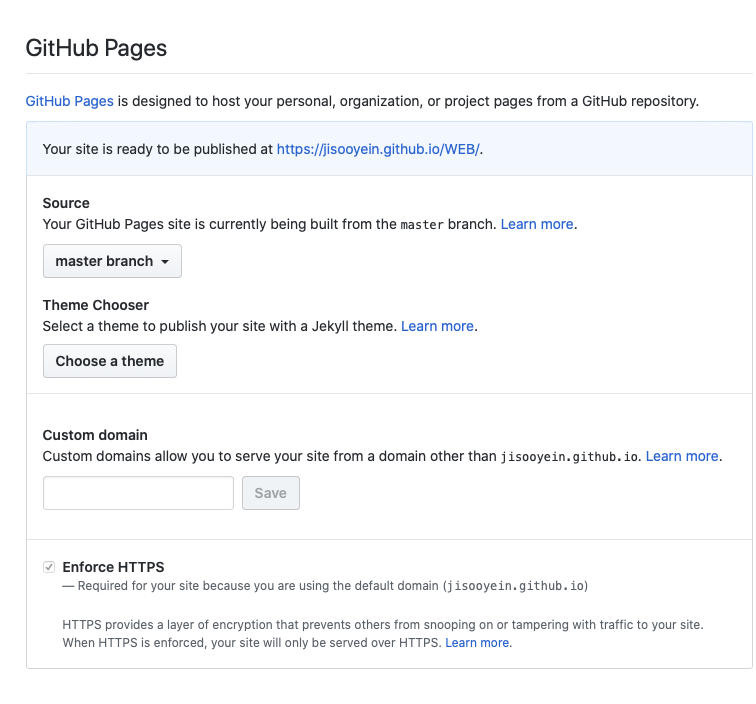

설정에 들어가 source를 master branch로 설정하면 웹 서버에 호스팅이 된다.

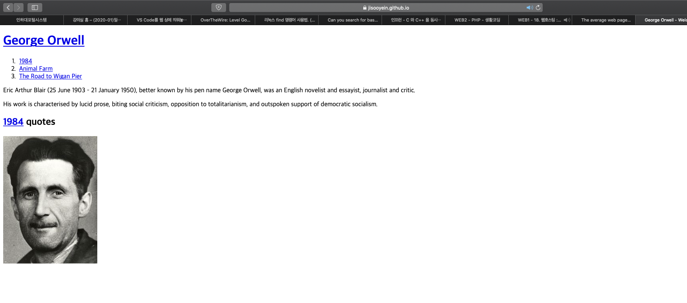
*안될땐 주소 뒤에 파일명인 index.html을 입력해보자

인터넷에 접속되어있는 컴퓨터를 host라고 하고, 이를 제공하는 사업을 hosting, 웹 서버를 hosting을 하는것을 web hosting이라고 하고, 우리가 지금 하는 웹 호스팅을 static web hosting이라고 한다. 나중에 php, python을 배우면 dynamic web hosting이 필요해질 것

우리는 우리가 만든 웹 페이지를 다른 사람들이 볼 수 있게 설정하고 싶지만 웹 서버가 없고 설정이 되어있지 않아 직접 하긴 어렵다. 따라서 컴퓨터에 있던 소스 파일들을 웹 호스팅을 위해 깃허브에 올리고 웹 서버로 사용하도록 설정을 하면 웹서버거 활성화 되고, 이 주소를 방문자에게 알려주면 방문자가 접속을 할 수 있게 된다.

웹 서버를 운영하다보면 어렵지만,  많은 것을 배울 수 있을것. 작동하지 않는다고 해도 너무 많은 오류 요소들이 있어 잘 작동한다고 치면 된다.
하나의 문제를 해결할 땐 수많은 지식과 경험을 보답으로 얻게 된다.

우선 자신의 컴퓨터에 웹 서버를 설치해야한다. 웹 서버는 여러 제품들이 있고, 우리는 apache를 사용할 것이다. 항상 점유을 1등을 차지했고, 오픈소스 소프트웨어이다.

윈도우에서 아파치를 직접 설치하는것은 까다롭다. 따라서 검색을 통해 쉬운 방법으로 설치하도록 하자. 윈도우가 설치된 환경이 없어 여기까지만 작성.

웹 서버에 올려서 주소를 입력해 접속하는것과 웹 페이지 파일을 여는 것은 똑같아 보이지만, 과정에서 완벽히 다르다. 주소를 입력해 접속하는것은 웹 브라우저가 웹 서버에 웹 페이지 파일을 요청해 이 요청에 웹서버가 응답해 받아온 웹 페이지를 실행하는것이고, 그냥 웹 페이지 파일은 컴퓨터에 저장되어있는 웹 페이지 파일을 웹 브라우저가 실행하는것이다. 웹 서버는 이때 개입하지 않는다. 이때, 전자는 http라는 통신을 위해 설정된 규약인 프로토콜을 이용하게 된다

두개의 컴퓨터가 서로 웹페이지를 주고 받는 방법

웹 서버에 index.html이 있고, 브라우저에서 이 파일을 받아오고 싶은 것이다

우선, 브라우저가 웹 서버에 요청하기 위해서는 주소가 필요하다. 주소를 안다면 요청을 할 수 있다.  

127.0.0.1은 자기 자신을 가리키는 ip로 약속되어 있다.

스마트폰에 같은 네트워크에 접속되어 있어야 스마트폰에서 우리가 만든 웹 서버에 저속할 수 있다. 스마트폰은 요청을 보내고, 웹 서버는 요청을 받아 웹 사이트를 보내고, 이를 스마트폰이 해석한다.

맥에는 기본적으로 아파치가 깔려있고, 서비스만 활성화해주면 된다. 방법이 바뀔 수도 있기 때문에 영상에서는 같은 방법을 사용했지만, 나는 기본 서비스를 쓸거다.
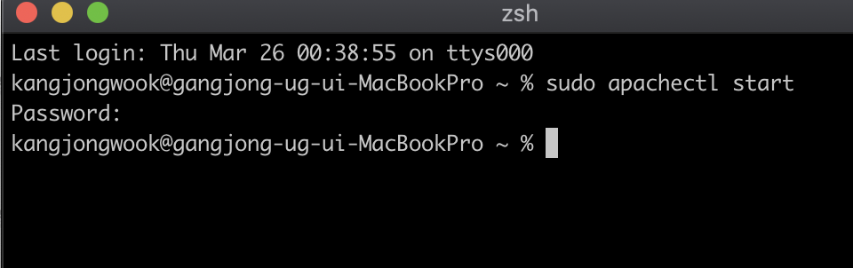
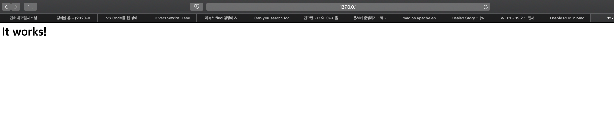
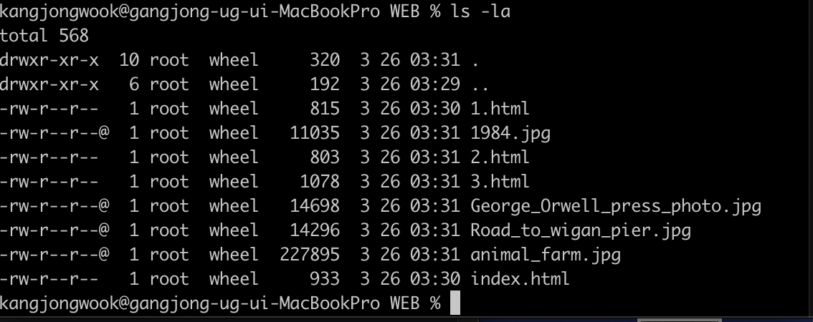

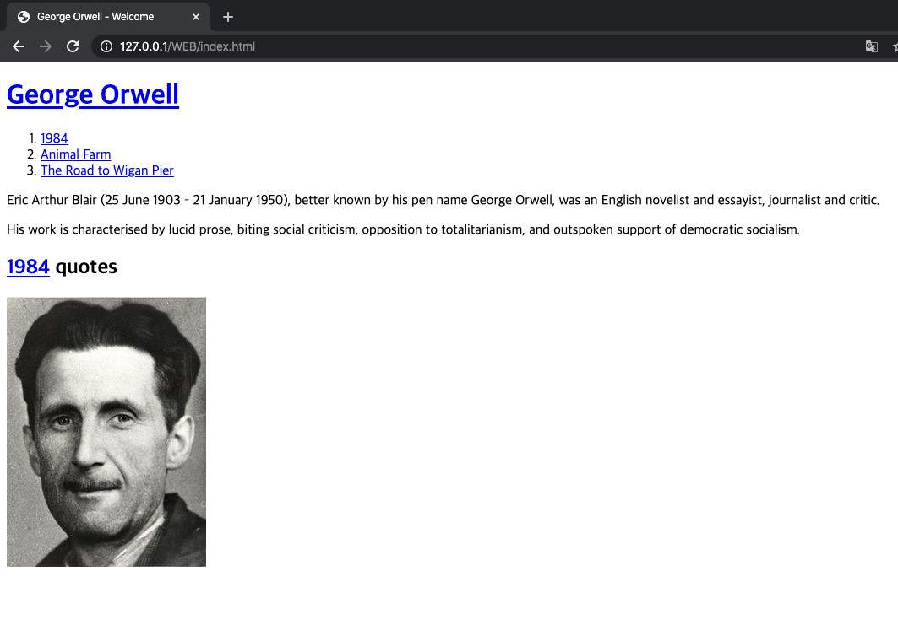

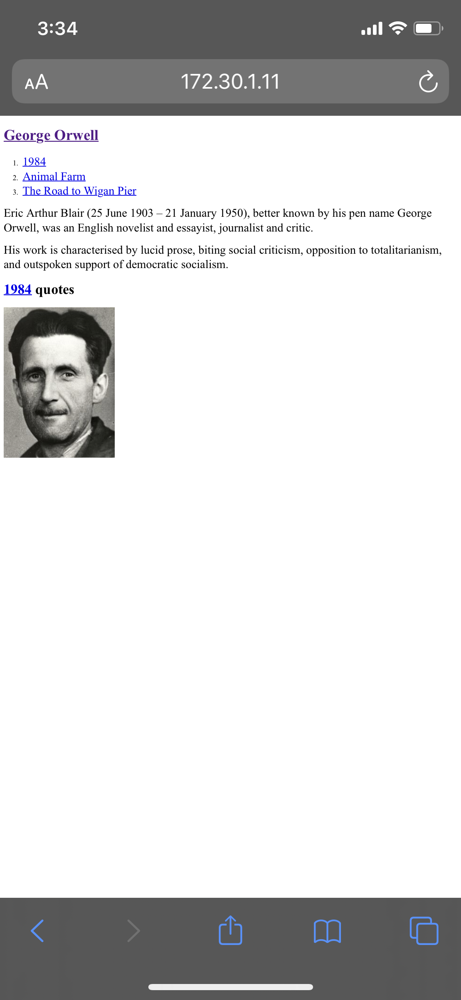

스마트폰에서도 잘 작동하고 있다.

웹서버가 동작하는 방법은 윈도우에서와 동일하게 적용된다.
작동을 중지하는 것은 터미널에서 명령어를 입력하면 된다.

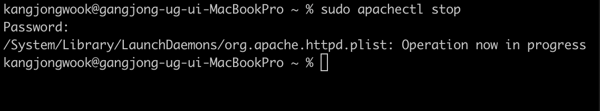
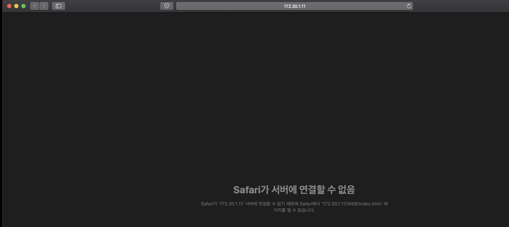)

본질은 교양과, 혁신은 직업과 연결된다. 진도가 나아갈 수록 중요도는 낮아지고 난이도는 높아진다. 그 교점의 앞으로 본질, 즉 교양과 연결되고 그 뒤로는 혁신, 직업으로 연결 된다.

교양은 조금만 배워도 할 수 있는 것이 기하급수적으로 늘어나지만, 직업에서는 큰 노력을 해도 능력의 성장이 눈에 띄지 않는다. 만족감, 기대감 등의 기대하는 것도 좋은 방법이다. 

좋은 코드가 무엇인지 아는데 좋은 코드를 짤 줄 모르면, 내가 짠 코드가 실망스럽게 되고, 이렇게 되면 좋은 생산자가 될 수 없다.

체크 박스 50개만으로도 1000조 개의 경우의 수를 만들 수 있다. 이런 경우 테스트 하지 못한 경우에 버그가 날 수 있고, 작은 기능을 추가하는 것도 어려워진다. 원래 복잡한거다, 공부를 한다는 것은 복잡함이 늘어난다는 것이다. 인류는 눈에 보이는 단순함에서 눈에 보이지 않는 복잡함을 만드는 것에 능하다.

알고 있는 것으로 프로젝트를 하거나, 컨텐츠를 만듬으로서 앍고 있는 것을 공고히 할 수 있다. 최소한으로 배워서 최대한으로 써먹자. 이제 PHP로 가자. 생산성의 한계를 극복하기 위한 백앤드 기술이다.
- - - -
