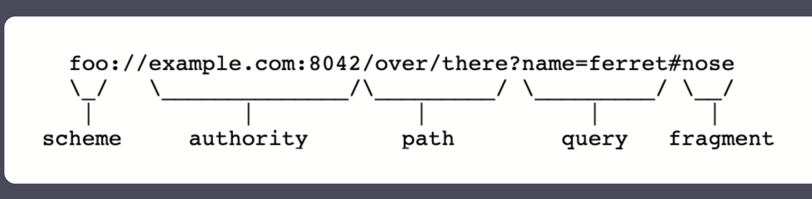
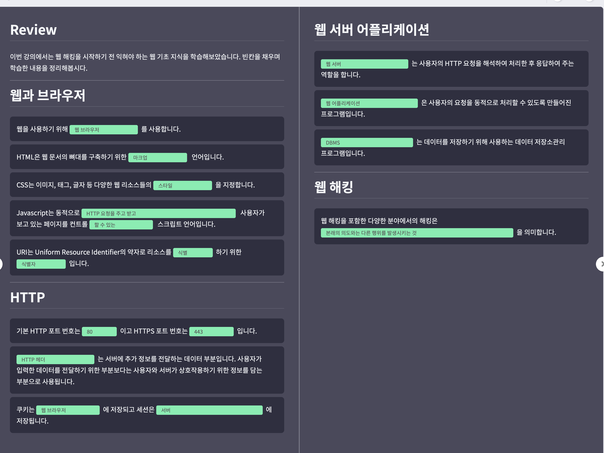

#Mentoring_Web #DreamHack

일단 기본적인 구축을 끝냈으니 파일 시스템 만들기 전에 공부부터 하도록 하자. 그러하다.

해킹이 무슨뜻인지는 귀에 못이 박히도록 설명했다. 본래의 의도와는 다른 행위를 발생시키는 것을 의미한다. 이러한 의도치 않은 행동을 발생시키기 위해서는 약점을 찾을 수 있어야 하고, 이를 위해서는 설계자 / 운영자보다 시스템에 대해 더 높은 이해도를 필요로 한다,

웹의 어원과 같은 내용은 충분히 설명한 것 같다. 넘어가자. 서비스 제공자가 서버고 서비스 요청자가 클라이언트라는걸 모르면 넌 공부를 하시면 안된다.

웹은 브라우저 이외에도 iot 등의 다양한 형태로 우리의 삶에 사용되고 있다. 그러하다.

웹의 역사도 HTML 문서 찾아보면 나온다. 중요한건, 과거의 웹 페이지가 정적인 페이지 였다면, 지금의 웹 페이지는 사용자와 상호작용을 할 수 있게 변했다. 과거의 오프라인에서 진행되던 과정이나 물리적으로 저장된 정보들이 웹에서 접근 가능한 디지털 정보로 변하게 되었고, 개인정보와 기업의 자산 등이 웹에서 접근 가능해지면서 웹 보안이 중요시 되고 있다.

우선 웹의 기초 지식들에 대해 좀 알아보자. 키워드들부터 적으면 웹브라우저, 웹 리소스, URI, HTTP, HTTPS, 쿠키, 세션, 도메인 네임, 서버, 어플리케이션, 데이터베이스이다. 이중에 모르는게 더 적긴 하다. 가자.

브라우저는 웹을 사용하기 위해 사용하는 프로그램이다. HTTP를 통해 인터넷 상에서 통신하고, 서버로부터 전달받은 웹 리소스를 가공해 HTTP의 동작 원리를 알지 못해도 웹을 사용할 수 있게 한다.

각 브라우저들이 수행하는 기능은 같지만, 웹 리소스들에 사용되는 언어들이 대부분 인터프리터 방식이라 해석 및 실행이 빠르고 이러한 점에서 조금씩 다르다. 
동작 원리를 몰라도 삶에 지장은 없다. 근데 모든 취약점은 사용자의 입력에서 시작된다는 점을 기억하자. 따라서 브라우저가 하는 행위를 이해해야 한다.

브라우저가 웹 서버에 html등을 요청하면, 서버는 이를 응답하게 된다.

웹 리소스는 웹에서 사용하는 컨텐츠이다. 주소를 입력하면 도메인 위에 있는 리소스에 대해 요청을 수행하는 것을 의미한다.
웹 리소스를 가리키는 주소는 URL이라고도 한다. 초기 웹에는 경로가 실제 경로로 사용되는 경우가 많았는데, 최근에는 개념적 / 추상적 경로로 사용되는 경우가 많다.
사용자가 보는 대표적인 웹 리소스들은 다음과 같다

-- HTML (Hyper Text Markup Language) : 웹 문서 뼈대를 구축하는 마크업 언더. 정해진 태그와 속성으로 문서 구성

-- CSS (Cascading Style Sheets) :  HTML이 표시되는 방법을 정의하는 스타일 시트 언어. 웹 리소스의 출력 스타일을 설정한다.

-- JS (JavaScript) : JS는 클라이언트단의 스크립트로 패이지 내의 액션을 설정할 수 있다. 액티브 웹페이지를 만드는 주 요소다. 참고로 이거 자바 아니다

-- 기타 등등. 사진, 동영상 등이 있다.

URI는 Uniform Resource Identifier의 약자로 리소스를 식별하기 위한 식별자다. URL은 URI의 하위 개념으로, 리소스의 위치를 식별하기 위한 개념이다. 최근에는 혼용해 사용하니까 그냥 URI로 통합해서 설명한단다

URL을 보며 구성요소 별로 나눠보자.

Scheme : 웹 서버에 접속할때 사용할 프로토콜 정보

Host : Authority의 일부, 접속할 웹 서버의 host, 서버 주소에 대한 정보

Port :  Authority의 일부, 접속할 웹 서버의 포트 정보. 안쓰면 기본 값으로 간다.

Path : 접속할 웹 서버의 경로에 대한 정보, /로 구분

Query : 웹 서버에 전달하는 파라미터, ? 뒤에 붙는다

Fragment : 메인 리소스 내에 존재하는 서브 리소스에 접근할 때 이를 식별하기 위한 정보를 담고 있음. # 뒤에 붙는다.

인코딩은 문자, 기호등의 정보, 형태를 다른 형태나 형식으로 변환하는 처리 / 처리 방식을 말한다. 다시 원래 형식으로 변경하는 것은 디코딩이다.
encode와 encryption의 차이점은 키와 같은 요소의 포함이다. 키와 같은 private한 요소가 없다면 인코딩이다. 대표적인 인코딩은 URL과 HTML Entity가 있다.

URL Encoding은 URL 구조 내에서 예약어로 사용되는 문자들을 전송할 때 사용된다. 예약어들은 URI 구조 내에서 문법적으로 중요한 의미로 사용되어 문법적으로 사용되지 않을땐 반드시 인코딩 되어 사용되어야 한다.

HTML entity Encoding은 HTML 문서 내에서 사용되는 문자열들이 HTML에서 사용하는 태그들의 문자로 인식하지 않도록 하기 위해 사용한다. 

HTTP는 웹에서 이루어지는 통신을 정의한 프로토콜이다. 우선 프로토콜에 대해 알아보자. 프로토콜은 컴퓨터 내부 혹은 컴퓨터끼리 어떻게 데이터가 교환하는지 정의하는 규칙 체계다. TCP나 TLS를 사용하고, 기본 포트는 80(HTTP) / 443(HTTPS) 를 사용한다.
HTTP는 데이터를 평문으로 보내는데, 이를 보안하기 위해 HTTPS가 등장했다. 핵심 구조와 동작 원리는 동일하다.
HTTP는 사용자의 요청(Request)과 서버의 응답(Response)로 이루어진다

HTTP Request는 서버에 대한 요청이다. 사용자가 서버가 서로 통신하려면 서로가 이해할 수 있는 약속된 구조로 데이터가 전달되어야 한다.
HTTP의 구조에서 줄바꿈은 CRLF로 이루어져야 한다.
HTML Request의 구조에서 첫줄은 사용자가 수행하고자 하는 동작인 Method, 요청하는 웹 리소스의 경로 Path, 사용 HTTP의 버전을 나타내는 버전으로 구성된다.
헤더는 두번째 불부터 시작되고, (이름 : 값) 형태로 이루어진다. 헤더는 상황에 따라 데이터의 양이 달라저 줄의 수는 상관 없어, Header의 끝에는 CRLF를 한번 더 표시한다
마지막에는 사용자의 데이터를 담는 Body이다.

Method의 종류를 조금 알아보자. 
OPTION : 요청하는 리소스가 허용하는 메소드 목록을 반환한다. 예를 들어 GET, POST 메소듬만 허용하는 경우 OPTIONS, GET, POST가 반환된다

HEAD : GET 메소드와 동일하지만, Response의 Header만 받는다.

GET : 리소스를 요청한다

POST : 특정 리소스 생성 및데이터 추가를 위해 값을 제출할 때 사용

PUT : 특정 리소스의 내용을 보낸 값으로 설정

PATCH : 특정 리소스의 내용 중 보낸 값의 key 만 변경

DELETE : 특정 리소스를 삭제

헤더의 구성 요소들도 살펴보자
-- Host : 데이터를 보내는 서버의 주소

-- Cookie : 사용자를 식별하기 위해 사용하는 정보

-- User-Agent : 사용자가 사용하는 프로그램의 정보

-- Referer : 페이지 이동 시 이전 URI의 정보

-- Content-Type : 사용자가 전달하는 데이터의 처리 방식과 형식. 사용자와 서버 간의 데이터 처리 방식이 동일해야 정상적인 데이터 통신이 이루어진다.

HTTP Response는 사용자의 요청에 대한 서버의 응답이다. Response의 구조와 Request의 구조와 유사하가 CRLF로 줄바꿈이 이루어져야 한다.

Response의 첫 줄에는 HTTP의 Version과 요청에 대한 서버의 응답 코드인 Status code로 구성된다.
두번째 줄 부터는 헤더다. 헤더는 사용자와 상호작용하기 위한 데이터를 담는 부분으로 사용된다.. Header 부분의 각 줄은 이름 : 값 형태로 이뤄진다. 헤더 끝에 CRLF 한번 더 출력되고, 서버의 응답 데이터인 Body가 나온다.

웹 해킹에서는 사용자의 입력에 대한 서버의 응답을 주목해야 한다. 공격을 위한 입력을 보냈을 때 500 status code가 뜨면 서버에 영향을 끼쳤다고 가정할 수 있고, 이를 통해 더 살펴볼 수 있어야 한다.

자주 사용하는 상태 코드도 좀 알아가자

-- 200번대 : 사용자 요청 처리가 성공적으로 이루어짐

	-- 200 OK
	-- 201 Created

-- 300번대 : 사용자 요청한 리소스가 다른 경로로 변경된 경우. 이 영역이 반환되면, Response Header에 포함된 Location 헤더값으로 리다이렉트된다.

	-- 301 Moved Permanently
	-- 302 Found

-- 400번대 : 사용자가 서버에 요청하는 구조 / 데이터가 잘못되었음
	--  400 Bad Request :전달한 데이터 또는 구조의 잘못된 문법으로 인해 서버가 요청을 이해할 수 없음.
	— 403 Forbidden : 해당 웹 리소스에 접근할 권한이 없음
	-- 404 Not Found : 요청한 경로에 대해 응답할 데이터가 없음
	-- 405 Method Not Allowed : 요청한 Method가 서버에서는 허용되지 않음

-- 500번대 : 서버에 에러와 관련됨
	--  500 Internal Server Error : 서버의 에러가 발생
	-- 503 Service Unavailable :서버가 사용자의 요청을 처리할 준비가 되지 않음.

헤더의 구성 요소도 좀 알아보자.
	
-- Content-Type : 서버의 응답 데이터를 웹 브라우저에서 처리할 방식과 형식을 나타냄

-- Content-Length :서버가 사용자에게 응답해주는 데이터의 길이

-- Server : 서버가 사용하는 소프트웨어의 정보

-- Allow : 허용되는 Method 목록 사용자에게 전달

-- Location : 300번 영역의 응답 코드 사용 시 변경된 웹 리소스의 주소

-- Set-Cookie  사용자에게 쿠키를 발급할 때 사용. 해당 헤더를 받은 웹 브라우저는 해당 쿠키를 저장.

HTTP는 요청 / 응답의 쌍이 독립적으로 구성되너 통신하는 connectionless, stateless 프로토콜이다.

Connectionless 속성은 하나의 응답을 한 후 네트워스 연결을 끝내는 것을 의미한다. 웹이라는 서비스의 특성상 연결상태를 계속 유지하는것은 서버 부하로 이어질 수 있어 이러한 속성이 사용되게 되었다. 최근에는 성능이 향상되어 Keep-Alive 속성으로 계속 연결을 맺는 방식을 사용한다

stateless 속성은 네트워크가 연결을 끝맺을 때 상태를 유지하지 않는 것을 의미한다. HTTP 요청마다 새로운 커넥션을 열기 때문에 인증을 계속해서 해야한다. 이러한 상황에서 쿠키라는 개념이 등장한다

웹브라우저는 Set-Cookie Header나 JS의 document.cookie를 이용해 데이터를 쿠키에 저장한다.

주로 HTTP 요청을 보낼 때 웹브라우저가 자동으로 쿠키를 헤더에 추가해 전송한다.

쿠키는 인증 상태를 포함할 수 있다. 서버는 해당 정보를 갖고 인증된 사용자의 정보를 응답한다.

쿠키는 사용자의 브라우저에 저장된다. 인증 상태를 쿠키에 저장하게 되면, 쿠키를 조작해 계정 권한을 탈취하는 공격이 이루어질 수 있다. 여기서 또다시 세션이라는 것이 등장한다.

세션은 서버에 데이터를 저장하기 위해 사용된다. 세션을 활용하면 데이터를 서버에 저장하고 해당 데이터를 접근할 수 있는 유추 불가능한 랜덤 문자열 키를 만들어 응답하며, 이를 세션 id라 부른다. 브라우저는 해당 키를 쿠키에 저장하고 HTTP 요청을 보내면 서버에 해당 키에 해당하는 데이터를 가저와 인증 상태를 확인한다. 브라우저는 해당 키를 쿠키에 저장하고 HTTP 요청을 보내면 서버에서 해당 키에 해당하는 데이터를 가져와 인증 상태를 확인한다.

쿠키와 세션의 가장 큰 차이는 저장되는 위치이다. 쿠키는 데이터를 유저가 저장하고, 세션은 서버가 저장한다.

HTTP와 HTTPS의 차이에 대해 좀 알아보자. 웹은 다양한 분야에서 사용되는데, 여기서 민감한 정보가 담길 수 도 있다. 이때 HTTP는 모든 데이터를 암호화 없이 평문으로 전송하는데, 데이터를 감청할 수 있다면 민감한 정보를 다룰 때 문제가 될 수 있다. 상위 네트워크 장비나 같은 네트워크 상의 중간자 공격이 발생하면 평문 그대로 정보가 노출되어 문제가 될 수 있다.

HTTPS는 TLS, SSL을 이용해 암호화한다. 공개키 암호화를 사용해 클라이언트와 서버가 키를 교환하기 때문에 데이터를 중간에서 빼돌리더라도 해독할 수 없어 비교적 안전하다.

URL의 구성 요소 중 Host는 웹 브라우저가 어디 연결할지 정한다. Domain Name이나 IP 주소가 호스트에 사용된다.

IP 주소는 네트워크상에서 통신이 이루어질 대 장치들을 식별하기 위해 사용되는 주소이다. 사람이 쓰기는 어렵기 때문에, 쉽고 의미 부여를 위해 Domain Name을 사용하게 된다.

도메인 네임을 이용해 호스트를 조회할땐 IP주소와 도메인 이름이 맵핑되어 있는 DNS에서 ip를 가져와 사용한다.

웹 서버는 사용자의 HTTP 요청을 해석하여 처리하는 역할은 한다. 종류는 nginx, apache, tomcat등이 있다. 웹 서버는 사용자의 요청을 웹 서버 자체에서 처리하거나, 알맞은 내부 서비스로 연결해줄 수 있다 ..html 확장자를 가진 리소스를 요청하면 웹서버 자체적으로 처리하고, .php 확장자는 php 엔진에 요청을 처리하도록 하는등의 역할을 한다.

웹 어플리케이션은 사용자의 요청을 동적으로 처리할 수 있도록 만들어진 어플리케이션이다. 웹 앱을 작성할땐 사용자가 요청한 내용을 동적으로 처리하기 위해 Web Application Language가 사용되며, PHP, Node.js, Python, Java등이 있다.  이외에도 많은 언어들이 존재하고, 웹 개발을 편하게 해주는 프레임워크들도 존재한다. 웹 앱은 서버에서 동작하기 대문에 웹 앱 구현체에서 취약점이 발생하면 서버와 직접적으로 연결되기 때문에 더 큰 영향을 끼치게 된다.

DBMS. 솔직히 넘어가고싶다. 데이터 베이스 내의 CRUD를 사용할 수 있도록 하는 어플리케이션이다. DBMS가 관리하는 데이터를 데이터베이라고 한다. 동어 반복이다 그냥. 제발 커먼 센스를 좀 알고 가자. 제발. 여튼 민감한 정보도 있으니까 주의하자

프로그래머는 DB의 CRUD를 위해 DBMS를 사용한다. DB는 SQL query로 동작하는데, 여기 사용자의 입력값이 노출되면 SQL injection 공격으로 이어질 수 있다. 아셔야해요. 제발.

웹 해킹은 웹에서 본래의 의도와 다른 동작을 일으키거나, 주허진 권한으로 정보를 다루는 것을 의미한다. 다양한 분야가 웹으로 서비스되면서 제공하는 서비스의 복잡도와 다양성이 증가해, 서버와 애플리케이션이 처리하는 사용자의 입력도 다양해졌으며, 복잡도가 높아지면서 개발 당시 의도하지 않았던 동작을 일으키는 웹 해킹의 위협도 증가했다.

여러가지 민감한 정보들이 웹에 포함되어 있고, 공격자는 가치 있는 정보를 획득하기 위해 웹 해킹을 시도하고 있다.

많은 기업들이 공격 보호를 위해 내부망에서 서비스와 네트워크를 사용하지만, 웹을 통해 서비스가 운영되는 경우가 많고, 이러한 웹 서비스가 내부망과 연결되어 있을 확률이 높아 내부망 침투를 위해 웹을 공격하기도 한다.

여튼 웹 해킹도 짱짱 중요하다. 가자.

웹 해킹의 공격 벡터 좀 알아보자. 접속이 이루어질때 클라이언트와 서버로 나뉘는데, 이걸 공격할때도 동일하게 적용할 수 있다. 공격 대상에 따라 공격 방식, 형태가 달라지고, 가능한 행위가 달라진다

Client-side Attack은 서비스 사용자를 공격한다, 웹을 이용하는 사용자는 웹 서버가 제공해주는 데이터가 공격자에 의해 변조되었을 경우 웹 브라우저에서 렌더 되는 과정에서 취약점이 발생할 수 있다. 스크립트 삽입 등의 공격이 사용된다.

Server-side Attack은 서비스 제공자에 대한 공격이다. 다양한 공격 형태가 존재하고, 공격 성공시 서버의 코드나 다른 유저의 정보 유출, 서버 탈취 등의 공격으로 이어질 수 있다. 서비스의 구조와 특징에 따라 위협의 형태도 달라지고, 특별한 공격 방법이 존재할 수도 있다.

퀴즈도 있길래 풀어보았다. 이제 자러가야겠다.