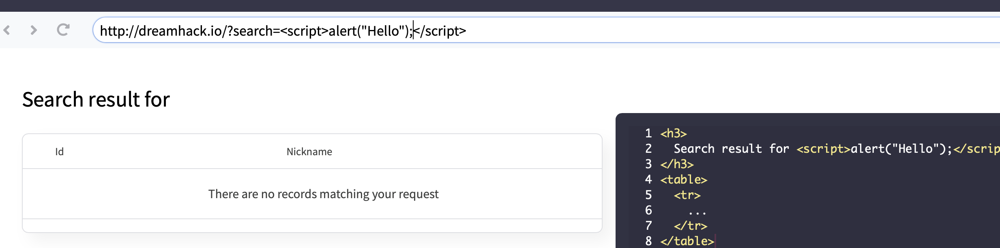
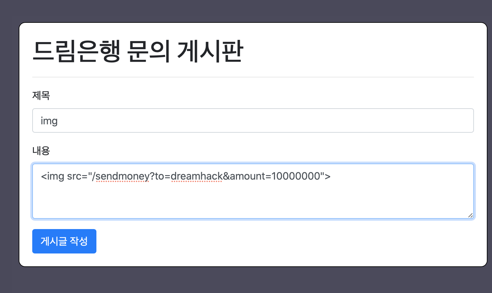

#Mentoring_Web #DreamHack

지금 알았는데 owasp랑 드림핵이랑 겹치는 내용이 있단다. 아. 겹치는 내용은 생략해가면서 공부해야겠다.

HTTP 프로토콜 특성때문에 웹 서버가 사용자 식별 위해 쿠키랑 세션 쓴다고 얘기했다. 공격자는 정상적인 클라이언트를 공격해 쿠키나 쿠키에 저장된 세션 id를 탈취해 사용자 권한을 얻거나 사용자 브라우저에세 자바스크립트를 실행하거나 특정 행위를 수행하도록 해 사용자가 보낸 것처럼 요청을 전송하도록 하는게 클라이언트 단을 공격하는 목적이다.

클라이언트 단에서 취약점이 발생할 수 있는 이유는 웹 브라우저가 stateful한 상태를유지하기 위해서 모든 HTTP요청에 쿠키를 보내기 때문이다; 웹 브라우저는 HTTP 요청을 생성할 때 시작 주소와 상관 없이 대상 호스트가 발급한 쿠키를 삽입한다.

첫 강의에서 JS를 이용해 페이지 내부 요소를 관리할 수 있다고 했다. 그리고 웹 브라우저를 통해 대상의 호스트에 요청 시 사용자의 정보를담은 쿠키도 함께 전송되기 때문에 외부 리소스를 불러오는 요소들을 JS로 관리할 수 있따면 사용자의 동의 없이 해당 내용을 읽거나 변조할 수 있게 된다. 다른 사이트에서 또다른 사이트의 컨텐츠를 볼 수 있게 되는 것이다.

위와 같은 공격을 막기 위해 Same Origin Policy가 만들어졌다. 이 정책은 서로 다른 오리진의 문서 또는 스크립트들의 상호 작용을 제한한다.
오리진은 프로토콜 / 포트 / 호스트로 구성된다. 구성 요소가 모두 일치해야 동일한 오리진이라 할 수 있다. 동일한 오리진이 아닐 경우 웹 브라우저가 사용자를 보호하기 위해 다른 오리진의 문서 또는 스크립트의 내용을 읽지 못하게 하는 것이 SOP의 대표적 예시이다.

일반적으로는 SOP의 영향으로 서로 다른 오리진들과 리소스를 공유하지 못한다. 하지만 특정 목적으로 다른 오리진들과 리소스를 공유해야하는 상황이 발생하며, SOP가 적용된 상황에서도 리소스를 공유하는 방법이 존재한다.

-- postMessage : 메시지를 주고받기 위한 이벤트 핸들러를 이용해 리소스 공유

-- JSONP : 스크립트 태그를 통해 외부 JS 코드를 호춣하면 현재 오리진에서 해당 코드가 실행된다는 점 이용한다. 스크립트 태그로 다른 오리진의 리소스를 요청하고, 응답 데이터를 현재 오리진의 Callback 함수에서 다루는 방식을 통해 리소스를 공유한다.

-- CORS 헤더 : 다른 오리진이 허용하는 설정 등을 HTTP 헤더로 확인한 후 허용 요청을 보내 리소스를 공유. CORS 헤더 이용시 두 오리진이 서로 다른 스킴을 사용하면 허용도지 않을 수 있음.

클라이언트를 상대로 공격하는 클라이언트 사읻, 취약점은 본인 식별을 위한 사용자 정보, 즉 쿠키에 저장된 세션 아이디를 탈취해 사용자 권한을 얻거나 사용자의 브라우저에서 JS를 실행해 사용자가 보낸 것철머 요청을 전송하는 것을 주 목적으로 한다. 다음과 같은 취약점들이 있다,.

XSS - 모르면 지옥가요. 공격자의 입력 값이 크로스 사이트의 JS 일부로 웹 브라우저에서 실행되는 취약점을 말한다. 실행된 스크립트는 해당 사이트의 일부가 되어 SOP 제약 없이 사이트 구조를 변경하거나 HTTP 요청을 보낼 수 있다.

CSRF - 비정상적으로 사용자 의도와 무관하게 HTTP 요청을 보내는 것을 CSRF 공격이라 한다. Simple Request나 HTML 엘리먼트는 SOP의 제약을 받지 않는다는 점을 이용한다.

Open Redirect -- 리다이렉트 기능을 악용해 피싱 사이트로 접속을 유도하거나, 다른 취약점을 연계해 사용자를 공격한다.

Click Hijacking -- 공격자가 생성한 버튼, 이미지 같은 정상적인 iframe 위에 겹처 올려 UI를 스푸핑해 사용자의 의도와는 다른 작업을 수행하게 하는 취약점

XSS부터 살펴보자, 서버의 응답에 공격자가 삽입한 악성 스크립트를 받은 사용자의 웹 브라우저에서 악성 스크립트가 실행되는 취약점이 XSS다. 그러니까 공격자가 입력값에 스크립트를 삽입해서 발생하는 문제이다.

XSS로 악성 스크립트를 실행할 수 있고, 해당 웹사이트의 사용자 쿠키나 세션을 탈취해 사용자의 권한을얻거나 페이지를 변조하는 등의 공격이 이루어질 수 있다.

XSS에 취약한 2가지 조건 뭐지?

	--입력 데이터 검증 과정 충분하지 않음 -> 서버에 스크립트 저장됨

	-- 서버 응답 데이터가 웹 브라우저 내 페이지에 출력할 때 충분한 검증 과정 X	-> 스크립트 실행됨

대표적인 예시로 게시판 서비스가 있다. 공격자의 악성 스크립트가 포함된 게시글이 검증이 이루어지지 않은 채 웹 서버에 업로드 되고, 다른 사용자가 게시글을 조회하는 순간 공격자의 악성 스크립트가 사용자의 브라우저에서 실행된다.

XSS는 전달 방식에 따라 Stored XSS, Reflected XSS로 구분된다. 전달 방식에 차이가 있을 뿐 악성 스크립트 실행한다는 취약점의 원인은 동일하다.

JS는 웹 페이지를 액티브하게 만들때 사용하는데, UI적인 측면 외에도 사용자와의 상호 작용 없이 사용자 권한으로 정보 조회하거나 변경하는 등의 요청을 주고 받는것도 가능하다. 사용자의 권한을 가지고 있는 세션 ID는 쿠키에 저장되어있고 웹 브라우저는 헤당 쿠키에 접근할 수 있기 때문이다.

이 외에도 출력 페이지 내용 조작이나, 리다이렉팅 공격도 가능하다. 이처럼 사용자 입장에서 발생하는 행위를 동작시킬 수 있어 JS는 XSS 공격시 많이 사용된다.

JS를 이용하는 대표적안 공격 방법은 공격자가 입력 데이터로 script 태그를 전송하고 다른 유저가 이 데이터를 열람하면 공격자의 스크립트가 실행된다. Script 태그 말고도 onclick같은 on* 태그로도 실행 가능하다.

아까 전달 방식에 따라 stored와 reflecrted로 나뉜다고 이야기 했다. Stored XSS는 악성 스크립트가 서버 내에 저장되어 있다가 일반 사용자가 이 스크립트를 조회해 발생한다. 게시판과 같이 서버 내에 저장되어 있는 형태에서 불특정 다수에게 공격이 이루어지므로 파급력이 클 수 있다. 공격을 시행하는 서비스의 형태와 접근성, 해당 서비스를 토해 얻을 수 있는 정보 또는 행위들에 따라 파급력이 달라질 수 있다.

Reflected XSS는 악성 스크립트가 사용자의 요청시 전송되는 형태다. 사용자의 요청 데이터가 서버의 응답에 포함되는 과정에서 HTML등의 악성 스크립트가 그대로 출력되어 발생한다.

Stored XSS와 다르게 사용자의 요청 데이터에 의해 취약점이 발생하기 때문에, 변조된 데이터가 사용자의 요청으로 전송되는 형태가 되어야 한다. 가장 간단한 방법은 특정 링크를 유도하는 방식이고, click jacking, open redirect등의 취약점과 연계되어 사용될 수 있다.

대표적인 예시로 게시판에서 작성 게시물 조회 과정에서 조회하기 위해 입력한 데이터에 의해 발생하는 방식이 잇다. 게시물 조회를 요청하면, 서버는 해당 요청에 대해 조회한 결과를 응답을 출력하고, 편의성을 위해 사용자가 조회한 내용을 응답에 포함시키기도 하는데, 서버에서 악성 스크립트에 대한 방어를 올바르게 하지 못하고, 스크립터가 응답에 포함되어 웹브라우저에서 페이지 출력시 반영되는 결과로 인해 Reflected XSS로 이어질 수 있다

XSS는 웹 서비스에서 오랫동안 사용되어온 취약점이라, 이를 막기 위한 방법들이 생겼다. 방어 기술들을 좀 알아보자.

Secver-side Mitigations는 서버 단에서 사용하는 방어 방법이다. XSS 유발 태그 삽입을 방지하기 위해 사용자의 입력을 서버 단에서 검증하고, HTML 태그가 입력될 필요가 없다면 꺽쇠와 따옴표 등의 HTML 태그에 사용되는 특수문자를 인코딩으로 escape 처리할 수 있다.

사용자 인풋에 HTML 형태를 지원하는 경우, 안전한 일부 태그, 속성을 제외한 태그들을 필터링하는 화이트리스트 필터링을 적용한다.

사용자의 입력을 필터링 할 때는 URL Query나 POST Body값만이 아닌, 사용자로부터 입력된 모든 값에 적용되어야 한다는 것이다. Bleach라는 라이브러리도 있으니 확인하자.

그 외에도 로그인할때 세션에 로그인 한 IP주소를 함께 저장하고, 사용자가 페이지를 접속할 때 마다 현재 IP주소와 로그인했던 IP주소가 동일한지 여부를 확인하는 방법이 있다.  최근에는 모바일 환경때문에 Ip보다는 국가를 이용한다.

다음 방어법은 HTTPOnly 플래그를 이용하는것이다.  HTTPOnly 플래그는 서버 측에서 응답 헤더에 Set-Cookie 헤더를 전송해 쿠키를 생성할 때 옵션으로 설정 가능하며 자바스크립트에서 해당 쿠키에 접근 하는 것을 금지한다. 이를 활용하면 XSS 취약점이 발생하더라도 공격자가 쿠키값을 알 수 없게 된다.

Content Security Policy는 지시어를 적용해 사이트에서 로드하는 리소스의 출처를 제한할 수 있고, 응답 헤더나 meta 태그에 선언해 사용할 수 있다.
script-src를 선언해 자바스크립트 코드에 출처를 제한할 수 있으며, 공격자가 외부 JS 파일을 호출하거나 직접 작성하는 행동을 막을 수 있다.

많은 리소스 형식의 출처를 제한할 수 있는 지시어들이 존재하고, script-src를 이용해 nonce 값을 설정하고 HTML 태그를 이용해 JS 실행할 때 반드시 서버에서 생성된 nonce 값을 알아야 실행 가능하도록 할 수 있다. XSS 공격이 이루어져도 nonce 값을 모르면 일반적인 방법으로 실행할 수 없다.

또한 자바스크립트나 스타일시트의 해시를 구해 CSP를 설정하면 미리 구해둔 해시와 다를 때, 즉 값이 오염되었을 때 실행되지 않도록 할 수 있다.

X-XSS-Protection Header는 Response Header에 선언해 사용하고, 웹 브라우저에 내장된 XSS Filter의 활성화 여부를 설정한다.

XSS 필터는 브라우저에서 전송된 요청이 XSS 공격 코드와 유사하게 생겼고, 응답에 해당 공격 코드가 포함되었을 경우 XSS 공격이 수행되었다고 판단, 유저에게 알리고 차단한다. XSS 요청과 응답을 비교하는것으로, 데이터의 송수신 과정에서 무결성을 확인하는 과정이므로 Reflected XSS 공격을 막는데 사용한다. 근데 최근 브라우저에서는 삭제되는 추세이다. 그러하다.

결국 다 썼다. 망할.

여튼 다음은 Cross Site Request Forgery다. 웹 브라우저는 기본적으로 SOP 위반하지 않은 모든 요청에 쿠키를 함께 보내는데, 비정상적으로 다른 사이트에 HTTP 요청을 보내도록 하는 것을 CSRF 공격이라 한다.

이 공격을 통해 공격자는 세션 id를 취득해 권한을 획득할 수 있다. 기존 권한을 갖고 있는 사용자가 쓸 수 있는 정상적인 기능을 공격자가 사용자의 의도와 무관하게 요청을 보낼 수 있게 된다.

CSRF 공격을 위해서는 2가지 조건이 필요하다

1. 해당 사이트가 인증 방식으로 쿠키를 이용

	-- 모든 HTTP 전송에 쿠키가 함께 전송되므로 쿠키에 저장된 세션 ID도 전송

2. 공격자가 사전에 모든 파라미터에 대해 알아야 한다.

	-- 자동입력 방지 문자는 공격자가 미리 알 수 없다

	-- 패스워드 변경 기능에서 기존 패스워드를 입력받으면 이 또한 공격자가 미리 알 수 없다.

인터렉티브 예시가 뭔지 겨우 이해했다. 게시판에 이미지를 통해 자신의 계정으로 입금하는 파라미터를 작성하고 게시글을 올리면, 이 게시글을 여는 사람들은 자신의 쿠키로 이 파라미터에 접속하게 되어 송금이 이루어지는 것이다.

방어법을 알아보자. 보통 두가지 방법이 있다

1. 세션 쿠키 대신 사용자 인증만을 위한 커스텀 헤더를 이용해 사용자 인증

2. 공격자가 예측할 수 없는 파라미터 추가와 검증

    -- same origin에서만 접근 가능한 토큰등의 데이터 삽입
    
    -- 캡챠
    
    -- 정상 사용자만 아는 기존 데이터값 검증

서버사이드에서 추가적 검증을 하는 방어법인 SameSite Cookie도 있다. 서버 코드에 검증 로직이 추가되어 추가적인 처리시간이 발생하게 된다. CSRF 공격은 다른 사이트로부터 시작된 요청에 쿠키를 함께 전송해서 문제가 발생한다. 브라우저는 요청에 삽입할 지 여부를 쿠키의 SameSite 설정을 확인하여 결정한다.

크로스 사이트에서 출발한 요청에 제한적으로 쿠키를 포함시키도록 하는 옵션이다. 이 옵션을 통해 모든 크로스 사이트에서 출발한 요청에 해당 쿠키를 삽입하지 않게 할 수 있다. 여러가지 옵션이 있으니 찾아보자.

다음은 Open Redirect 공격이다. 리다이렉트는 사용자의 위치를 이동시키는데 사용된다. HTTP Response의 300번대 status code나 JS로 이동한다. 이때 이동하는 주소가 공격자에 의해 변조될 수 있는 경우 Open Redirect 취약점이 발생한다.

오픈 리다이렉트 취약점은 사용자가 접속한 도메인 사이트에 대한 신뢰를 공격한다. 이 취약점을 통해 피싱사이트로 연결하거나, 다른 취약점을 연계해 사용자를 공격할 수 있다.

오픈 리다이렉트의 공격법은 리다이렉트가 발생하는 경로에서 공격자의 입력 값에 의해 연결되는 주소가 변경될 경우, 해당 경로와 공격자의 값이 함께 전달되도록 사용자를 유도한다.

리다이렉트는 서비스적으로 사용해야하는 경우가 있어, 취약점의 리스크를 최소화시켜야 한다. 우선 허용된 주소들에 대해서만 이동시키는 경우가 있다.

사용자의 입력 값으로 리다이렉트 되는 기능을 사용해야 하는 경우 서버에서 해당 링크에 대한 검증을 거친 후 사용자를 이동시키거나, 외부 링크로 이동하는 것을 사용자에게 알리는 방법 등이 있다.

다음 공격은 클릭 재킹이다. 화면 출력에 영향을 미치는 요소들을 이용해 사용자의 눈을 속이고, 이를 통해 사용자의 클릭을 유도하는 공격 방법이다. 외부 페이지 리소스를 불러올 수 있는 태그들을 이용한다.

사용자의 클릭을 유도하는 페이지를 구성하고, 그 페이지 위에 외부 페이지를 불러오는 태그를 이용해 페이지를 로드한다. 그리고 투명도를 조정해 사용자의 눈에는 보이지 않도록 숨겨 놓는 방법으로 공격을 하게 된다.

그러니까 공격자가 원하는 리소스의 원하는 동작의 클릭을 유도하도록 공격자가 하려고 하는 액션의 버튼과 속이기 위한 버튼을 구성하고, 유저는 이를 모르고 버튼을 누르게 되어 공격자가 원하는 행위로 이어지게 된다.

클릭 재킹의 방어법은 2가지가 있다. 두 설정 모두 부모 페이지의 URL을 제한하는 방식으로 클락 재킹을 방어한다.

헤더에 X-Frame-Options이라는 옵션이 있다. 이를 통해 X-Frame 차단 옵션을 사용할 수 있다.

두번째는 CSP의 frame-ancestors 지시어를 이용하여 작성한다. HTTP 응답 헤더로 설정되어야 하고 meta 태그로는 설정할 수 없다. X-Frame-Options 보다 옵션을 다양하게 적용할 수 있다.

일반적으로는 최신 기술인 frame-ancestors를 사용하는것을 권고한다.

여튼 한장 요약을 읽어보도록 하자.