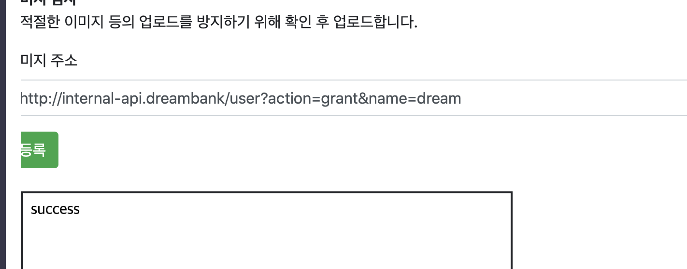

#Mentoring_Web #DreamHack

생각보다 분량이 더럽게 많다. 오늘도 새벽 5시쯤 잠들 수 있을것 같다. 아오

여튼 이번에는 서버단에서 발생하는 취약점들이다. ARABOZA

서버는 사용자의 요청 데이터를 해석하고 처리해 사용자에게 응답한다. 그 과정에서 웹앱이나 DB같은 서버의 자원을 이용해 처리하기도 한다. 이 과정에서 사용자의 요청에 의해 발생하는 취약점을 서버 사이드 취약점이라고 한다.

HTTP Request를 보낼 때, 브라우저에서 조작할 수 없는 데이터도 다른 네트워크 프로그램을 통해 전송할 수 있다. 따라서 서버는 사용자가 보낸 어떠한 데이터도 신뢰해선 안된다. 사용자의 데이터에 대한 검증 과정의 부재, 혹은 올바르지 않은 검증과정의 사용으로 취약점이 발생할 수 있다.

HTTP 요청시 모든 데이터를 조작해 전송이 가능하고, 악의적 사용자는 이를 통해 서버의 취약점을 확인한다.

nc를 이용해 HTTP Request를 직접 보내는 모습이다.

서버 사이드 취약점들은 서버 내에 존재하는 사용자들의 정보를 탕취하거나, 서버의 권한을 탈취하는 등 서비스를 공격하는 것이 주 목적이다. 종류별로 알아보도록 하자

Injection이다. 이것도 모르면 사람새끼가 아니시다. XSS랑 injection이 투탑이에요. 여튼 사용자의 입력 데이터가 어플리케이션의 처리 과정에서 구조 / 문법적인 데이터로 해석되어 취약점이 발생한다. 변조된 입력을 주입해 의도한 행위를 변조하고, 의도하지 않은 행뒤를 발생시킨다.

이 문제는 사용자의 요청이 올바르게 검증되지 않고 실행되었을 때 발생할 수 있다. 이처럼 사용자의 입력에 변조된 입력을 주입해 의도하지 않은 행위를 일으키는것이 인젝션이다.

SQL 뭔지 모르시면 진짜 여기서 이러시면 안되니까 설명 넘긴다. 웹 어플리케이션에서 컨텐츠의 CRUD를 위해 DB를 사용하는데, 이때 쿼리를 요청하게 된다. 이때 사용자의 입력이 SQL 쿼리에 삽입되어 SQL 구문으로 해석되거나 문법적으로 조작하게 되면 정상적인 쿼리가 아닌 사용자가 입력한 임의의 쿼리가 사용될 수 있다.

즉 SQL 인젝션은 SQL 쿼리에 사용자의 입력 데이터가 삽입되어 사용자가 원하는 쿼리를 실행하도록 하는 공격이다. SQL Injection이 발생하면 현재 쿼리를 실행시키는 DBMS 권한으로 공격이 가능하고, 데이터에 임의로 접근하고 제거할 수 있게 된다.

SQL 종류는 사용 목적으로 갈리는데 한번 읽어보고 가자.
	
	-- Data Definition Language(DDL) : 데이터 정의 위한 언어. 테이블 / DB 생성 / 수정 / 삭제등의 행위 수행

	-- Data Manipulation Language(DML) : 데이터를 조작하기 위한 언어. DB 내에 존재하는 데이터에 대해 CRUD를 하게 된다.
	
	-- Data Control Language(DCL) : DB 접근권한을 설정하기 위한 언어.

명령어는 따로 안쓴다. 이건 모르면 지옥가는 영역이다.
SQL 쿼리 문자열으로 보통 입력을 받게 되는데, 이때 입력에 ‘를 포함시켜 문자열을 탈출하고 새로운 쿼리를 작성해 전달하면 DBMS에서 사용자가 입력한 쿼리를 실행시킬 수 있다.

또 실습 예제다, 우리는 admin의 비밀번호를 모르지만, 계정 한 개를 알기 때문에 SQL의 논리 구조를 이용해 where 부분을 참으로 만들 수 있고, 이를 통해 비밀번호를 알아낼 수 있다.

SQL 취약점을 막기 위해서는 사용자의 입력이 쿼리로 해석되면 안된다. 앞의 경우는 문자열 구분자가 들어 있어서 원래 쿼리 형태를 벗어나 인젝션이 발생했다. 문자열 구분자 앞에 escape 처리를 하는 방식을 자주 이용했지만, 사용자의 입력이 문자열 일수도 있지만 숫자일 수도 있기 때문에 최근에는 권장되지 않는다. 숫자로 입력을 받으면 바로 쿼리에 사용자의 입력을 삽입할 수 있고, 따라서 인젝션이 발생할 수 있다.

SQL 인젝션을 막기 위해 권장되는 방법은 ORM 등의 검증된 SQL 라이브러리를 사용하는 것이다. 이를 통해 개발자가 직접 쿼리를 작성하지 않아도 기능 구현이 가능하고, 인젝션 공격에서도 안전하다.

ORM도 알고가자. Object Relational Mapper의 약자인데, SQL의 쿼리 작성을 편리하게 돕기 위해 사용하는 라이브러리다. 사용자의 입력값을 라이브러리 단에서 알아서 escape처리 하고 쿼리로 보내서 안전하게 사용할 수 있다.

ORM을 사용하더라도 입력 데이터의 타입 검증이 필요하다. 아니면 잠재적 위협이 될 수 있다.

다음은 Command Injection이다. 웹 앱에서 OS Command를 사용하기 위해 여러 프레임워크에서 함수가 구현되어 있다. 이걸 웹 앱에서 왜 쓰냐면, 이미 기능을 구현한 OS 실행 파일이 존재할 때 코드 상에서 다시 구현하는 것보다 명령어로 실행시키는게 편해서 그렇다.

OS Comand는 내부적으로 쉘을 통해 실행하는데, 쉘에는 한줄에 여러 명령어를 실행하는 등의 특수 문자들이 존재한다. 이때 사용자의 입력이 검증되지 않고 OS Command 함수로 들어가게 된다면 특수문자를 통해 사용자가 원하는 명령어를 함께 실행할 수도 있다.

-- `` -> `` 내부의 명령어를 실행한 결과로 치환한다. 이거 버퍼 오버플로우할때 썼다.

-- $() -> ``랑 같은데, 얘는 중복 사용이 된다

-- && -> 한 줄에 여러 명령어를 실행할 수 있다. 논리적으로 and 구조라 앞 명령어에서 오류 없어야 뒷 명령어를 실행한다

-- || -> 한줄에 여러 명령어를 삽입하는데, 논리적으로 XOR 구조고 앞 명령어에서 오류가 있어야 뒷 명령어가 실행된다.

-- ; -> 한줄에 여러 명령어를 삽입하는데, 명령어 구분용이라, 앞 명령어의 결과와 상관 없이 뒷 명령어를 실행한다.

-- | -> 앞 명령어의 결과가 뒷 명령어의 입력으로 들어간다.

예제다, 명령어를 여러줄 실행하는 특수문자로 원하는 명령어를 실행시키는 모습이다. 그러하다.

명령어 인젝션을 막기 위해서는 사용자의 입력 데이터가 command 인자가 아닌 다른 값으로 해석되는것을 막아야 한다. 가장 좋은 방법은 OS 명령어 안쓰는거다.

굳이 쓰셔야 한다면, 필터링을 통해 리스크를 줄여야한다. 일반적으로 필터링으로 막게 되는데, 화이트리스트 / 블랙리스트 있는건 알거다.

장규식을 통해 화이트리스트를 작성하는 방법 / OS 명령어에서 메타 문자로 사용되는 특수문자를 필터링하고, 따옴표로 감싸는 방법 / execve args 인자로 사용해 shell meta 문자로 해석되지 않게 입력값을 넣는 방법 등이 있다. 근데 웬만하면 쓰지 마라. 쓰지말라면 좀 쓰지마라.

다음 취약점은 Server Side Template Injection이다. 웹 앱에서 동적인 내용을 출력할 때 미리 정의한 템플릿에 동적인 값을 넣어 출력하는 경우도 있다.

만약 템플릿 내부에서 사용되눈 상황이 아닌 Templete Source에 사용자의 입력이 들어가면, 공격자는 개발자가 의도하지 않은 임의의 templete 기능을 사용할 수 있다. 사용자의 입력 데이터가 템플릿에 직접 사용되면, 템플릿 엔진이 해석하는 문법을 사용할 수 있어 SSTI 취약점이 발생한다

SSTI 취약점을 막기 위해 사용자의 입력을 Template Source에 삽입하지 않도록 해야한다. 사용자의 입력을 템플릿에서 출력하려면 context에 값을 넣어라.

Path는 URL/File의 로직에서 대표적으로 사용된다. URL/File의 Path에는 상위 디렉토리를 의미하는 구분자 ..이 있다.  사용자의 입력 데이터가 적절한 검증 없이 URL / File Path에 직접적으로 사용되면, 의도하지 않은 임의의 경로에 접근하는 Path Traversal 취약점이 발생하게 된다.

사용자의 입력 데이터가 경로로 사용되는 경우, URL Encoding과 같은 Encoding을 사용해 입력 데이터에 포함된 구분 문자가 인식되지 않도록 해 취약점을 방지할 수 있다.

예시 문제다. 내부 코드가 알려져 있어 관리자를 만드는 API가 있다는 사실과 위치를 알고 있었고, Path Traversal 취약점을 이용해 이 api를 GUest에 사용한 모습이다.

다음은 Server-side Request Forgery이다. 웹 앱에서 사용자가 입력한 URL에 요청을 보내는 기능이 구현되어야 하는 경우도 있다. 예를 들어 사용자가 입력한 사진을 업로드 하는 기능을 구현하면 사용자가 입력한 URL을 웹 앱이 접근해야한다.

CSRF와의 차이점은 변조된 요청을 보내는 대상의 차이다. CSRF는 변조된 요청이 클라이언트가 보내고, SSRF는 웹 앱에서 보내지게 된다. 웹 앱에서 요청을 보내기 때문에 웹 앱에서 작동하고 있는 서버 내부 포트, 내부망에 요청을 보낼 수 있고, 서버 단에서 변조된 요청 / 의도하지 않은 서버로 요청을 보내는 공격이 SSRF이다.

웹 서비스 구성할 때 외부망 / 내부망 나누고 내부망에서 인증 없이 기능 구현하는 경우 있고, 클라우드 플랫폼에서도 내부망처럼 구현하는 경우 있는데, SSRF 공격 발생하면 인프라 공격하는 취약점이 될 수 있다.

SSRF 취약점을 방지하기 위해서는 사용자의 입력 URL의 HOST를 화이트리스트로 필터링하는 방식이 있다. 그 외에 사용자 URL 처리하는 서비스를 독립해 이 취약점과 다른 취약점이 연계되지 않도록 방지하는 방법이 있다.

SSRF 취약점을 이용해 내부 서버에 접근한 모습이다. 그러하다.

풀이 보니까 유저에게 관리자 권한 주는것도 있어서 해봤다. 그러하다.

File Vulnerabillity

웹 앱에는 글만으로는 전달하기 힘든 특별한 형식을 가진 파일을 공유하기 위해 파일 업/다운로드 기능이 존재한다. 이러한 파일 업 / 다운로드 과정에서 발생하는 취약점이 FIle Vulnerability이다.

파일 업로드는 사용자의 파일이 서버 파일시스템에 저장되어 차리된다는 이유로 취약점이 발생할 수 있다. 사용자가 파일 업로드 시 파일의 내용과 파일의 이름도 서버로 전송되는데, 이 때 아무런 검증이 없으면 서버의 파일시스템에 원하는 파일이 저장될 수 있고, 이는 취약점으로 연결될 수 있다.

예시에서는 상위 디렉토리로 이동하는 문자를 삽입해, 저장된 디렉토리를 벗어난 경로에 파일이 업로드가 되었다.

파일 업로드 취약점을 통해 서버의 파일 시스템에 원하는 파일 경로 / 파일명으로 업로드 할 수 있다면 악의적인 공격자는 웹 앱 / 서버의 서비스가 참조하는 파일을 업로드해 공격에 이용할 수 있다.

공격에 앞서 CGI의 개념을 이해하자. Common Gateway Interface의 약자인 CGI는 사용자의 요청을 받은 서버가 동적인 페이지를 구성하기 위해 엔진에 요청을 보내고 엔진이 처리한 결과를 서버에게 반환하는 기능을 말한다. Php 엔진 동작하는거 생각해라.
php 확장자 이외에도 php, jsp, asp처럼 외부 엔진에 연결해서 사용하는 경우는 CGI를 이용한다.

이와 같이 웹 서비스가 동작하는 경로에 사용자가 원하는 파일 내용과 파일명을 업로드 할 수 있다면 서버가 엔진에 요청하는 확장자를 업로드해 웹 앱에서 원하는 코드를 실행할 수 있다. 웹 서버는 사용자의 요청이 들어오면 파일 시스템에서 해당 파일을 실행하는 것이기 때문에 웹 서버가 서비스하는 경로에 파일을 업로드 할 수 있어야 한다.

웹 앱이 실행하는 코드를 공격자가 조작할 수 있다면 웹 앱 언어에 내장된 OS 명령어 등을 사용할 수 있으며, 해당 서버의 쉘을 웹으로 사용한다고 WebShell 이라는 악성 코드가 등작했다.

*Python의 flask, django 와 Node.js의 express 등은 서버, CGI, 웹 앱 등이 통합된 프레임워크다.. 미리 라우팅 된 경로에만 접근이 가능하도록 설정하여 서비스 된다.

예제다. PHP 코드를 업로드해 실행시켜 본 모습이다.

사용자가 업로드환 파일을 다운로드 하는 기능도 당연히 존재한다, 파일 다운로드 기능을 구현하는 방법은 여러가지지만, 파일 이름을 검증하지 않은 채 그대로 다운로드 시켜주는 경우가 있는데, Path Traversal 취약점과 연계되어 개발자가 의도하지 않은 시스템 파일 / 설정 파알 등의 중요한 정보를 다운로드 할 수 있다.

파일 다운로드 취약점은 웹 앱의 소스코드, 관리자의 패스워드, 서비스 키, 설정 파일 등을 유출할 수 있어 이차적인 공격을 위한 발판이 될 수 있다.

Path Traversal 취약점과 연계되어 비밀 정보가 포함되어 있는 코드를 습득한 모습이다. 그러하다.

파일 다운로드 취약점을 막기 위해서는 인자에 다운로드 받으려는 파일의 경로나 이름을 넘기지 않고, 이름을 넘겨야 한다면 상대 경로로 사용하는 문자들을 필터링해야 한다. 

그 다음으로 권장되는 방법은 DB에 다운로드 될 파일의 경로와 해당하는 랜덤 키를 생성해 1대1로 매칭해 저장하고, 해당 랜덤 값이 인자로 넘어왔을 때 DB에 존재하는 파일인지를 검증하고 다운로드하는 방법이 있다.

다음은 Business Logic Vulnerability이다. 비즈니스 로직은 규칙에 따라 데이터를 CRUD하는 로직 / 알고리즘을 의미한다. 비즈니스 로직 취약점은 정상적인 비즈니스 로직을 악용하는 것을 의미한다. 인젝션 / 파일 관련 취약점은 사용자의 악의적 데이터가 서버의 시스템 상에서 악영향을 미치는 공격을 수행하지만, 비즈니스 로직 취약점은 기능에서 적용해야  할 로직이 없거나 잘못 설계되어 발생한다.

예시를 살펴보자. 첫번째는 그대로 Business Logic Vulnerability이다. 비즈니스 로직 취약점은 검증의 불충분함으로 인해 발생한다. 비즈니스 로직은 서비스에 따라 다양한 형태의 로직이 포함되며, 각각의 형태에 따라 다양한 비즈니스 로직 취약점이 밝생할 수 있다. 서비스 일부의 취약점에 대해서만 패치하더라도, 서비스 정체에더 또 다른 취약점이 발생했을 수도 있다.

비즈니스 로직 취약점을 방어하기 위해서는 비즈니스 로직을 확실히 이해하고, 설계 및 개발 단계에서 가능한 위협을 파악하고 방어하는 것이 중요하다. 가장 중요한것은 서비스 구조와 형태에 올바른 비즈니스 로직을 선택하여 구현해야 한다.

다음 취약점은 Insecure Direct Object Reference, IDOR 취약점은 객체 참조시 사용하는 객체 참조 키가 사용자에 의해 조작되었을 때, 조작된 객체 참조 키를 통해 객체를 참조하고, 해당 객체 정보를 기반으로 로직이 수행되는 것을 의미한다.

발생하는 주된 원인은 사용자의 입력 데이터에 의해 참조하는 객체가 변하는 기능에서 사용자가 참조하고자 하는 객체에 대한 권한 검증이 올바르지 않아 발생한다. 결국 다른 사용자의 객체로 원하는 작업을 수행하게 된다.

IDOR 취약점을 방어하기 위해서는 객체 참조시 사용자의 권한을 검증하고, 사용자에게 의도한 권한을 벗어난 행동을 할 수 없도록 권한을 분리해야 한다,

또한 로그인 등의 기능을 통해 사용자 인증을 거친 후 사용하는 서비스에는 사용자 식별을 위한 정보를 사용자의 입력으로 구분하기 보다 세션을 통해 서버 내에서 처리하는 것이 안전하다.

그 외에도 객체를 참조하기 위해 사용하는 객체 참조 키를 무작위 문자 생성등을 이용해 악의적인 공격자가 객체 참조를 추축하기 어렵게 하는 방법등이 있다. 객체 참조 키를 암호화처리할 때 숫자만을 암호화하는것보다 솔트 처리하는것이 좋다.

Race Condition 취약점이다. 레이스 컨디션은 공유 자원 처리 과정에서 해당 자원에 대한 동시다발적인 접근으로 인해 발생한다.

웹 해킹에서는 웹 앱에서 공유하는 자원들에 대한 접근 과정에서 데이터를 참조하는 타이밍으로 인해 취약점이 발생하게 된다. 주로 검증 과정에서의 데이터의 수정 과정에서 데이터의 차이로 인해 웹 앱에서 의도하지 않은 흐름이 진행된다. 또한 비즈니스 로직의 잘못된 순서로 인해 취약점이 발생하기도 한다.

레이스 컨디션에서 안전하게 보호되어야 하는 로직들은 하나의 접근이 끝난 후 다음 접근을 처리하도록 동시 다발적인 접근을 방지해야 한다. 또한, 레이스 컨디션 취약점을 발생시키기 위해 다량의 접근이 필요하다는 점을 이용해 특정 행위를 요청할 시 CSRF 토큰, 캡챠 등으로 다량의 접근을 방지하는 방법을 통해 웹 앱을 보호할 수 있다.

이제 비즈니스 로직과 관련된 취약점은 끝났다, 다음은 Language specific Vulnerability 취약점이다. 이 취약점은 언어의 특성, 함수로 발생할 수 있는 취약점이다.

특정 언어에서 제공하는 모든 함수가 안전한 것은 아니다. 의도한 기능을 제공하는 함수를 잘못 사용해 문제가 발생할 수도 있고, 사용자의 입력 데이터가 함수의 인자로 사용되어 취약점이 발생하기도 한다.

PHP, JS, Python에서의 취약점을 좀 알아보자. 일단 저중에 제대로 쓸 줄 아는 언어가 PHP밖에 없으니까 모르겠으면 가만히 있어야겠다.

우선 웹 앱에서 공통적으로 조심해야하는 함수 패턴에 대해 알아보자.

첫번째는 eval이다. eval은 위에 언급한 모든 언어에 존재하는데, 인자로 사용자의 입력 데이터가 사용되는 경우 악의적인 데이터를 입력해 원하는 프로그램 코드를 실행할 수 있어 사용자의 입력 데이터가 eval의 인자로 사용되지 않아야 한다.

두번째는 OS Command를 실행하는 함수들이다. 예전에도 언급했는데, 웬만하면 쓰지마라.

세번째는 파일 시스템에 접근하는 함수들이다. 앱에서 파일 시스템에 접근할 수 있는 함수들의 인자가 사용자의 입력 데이터 또는 변조될 가능성이 있는 변수들을 사용할 경우 서버의 파일 시스템을 공격하거나, 다른 취약점으로 악용될 수 있다.

파일을 읽는 함수 -> 어플리케이션의 소스 코드, configuration의 노출

파일을 쓰는 함수 -> WebShell 생성을 통한 원격 코드 실행이나 기존 설정 파일을 덮는 공격으로 설정 변경,

또 다른 문제로는 파일 복사로 파일 쓰기 공격과 유사한 상황을 일으키거나 설정 파일을 삭재헤 서비스를 무력화하는 등의 공격이 가능하다.

직렬화 / 역직렬화에서 발생하는 문제가 다음이다. 직렬화 모르면 지옥가는데 다시 한번 설명은 해둔다. 객체 전송하기 위한 포맷으로 변환하는게 직렬화다. 역직렬화는 이걸 다시 객체로 바꾸는거다.

직렬화는 객체, 데이터의 현재 상태와 타입들을 저장하고, 원하는 상황에서 역직렬화를 통해 동일한 상태 / 타입을 가진 오브젝트 또는 데이터를 사용할 수 있다.

공격자는 역직렬화 과정에서 어플리케이션 상에서 다른 행위를 발생 또는 타입을 이용해 악의적인 행위를 발생시키거나, 특정 상황에서 호출되는 메소드를 이용해 공격힌디.

객체 개념이 아예 없으니까 뭔 소리인지를 모르겠다. 일단 대충 넘어가자.

다음은 PHP의 함수들에서 발생하는 문제들을 좀 알아보자. 첫번째는 include 함수이다.

include 함수는 인자로 전달된 파일을 읽어 해당 파일의 내용을 출력하는데, 파일의 내용 중 PHP 코드로 해석되는 구문이 존재하면 해당 구문을 실행한다. 동적으로 다른 PHP 페이지를 로드해야 할 때 주로 사용하는데, 배경이나 기본 레이아웃은 고정시키고 내용 변경이 필요할 경우 include를 통해 다른 PHP 파일을 포함시킬 수 있다.

이때 include 함수는 확장자나 타입과는 상관 없이 파일 내용에 php 태그가 포함되면 php 코드가 실행되어 문제가 될 수 있다. Include할 파일을 사용자의 입력 데이터에 의해 조작될 수 있다면, 서버 내의 파일 정보를 출력하거나, 업로드 취약점과 연계해 서버에서 원하는 PHP코드를 실행해 공격에 사용될 수 있다.

서버 로컬 파일을 include하는 취약점을 Local File Inclusion, 외부 자원을 include 하는 취약점을 Remote File Inclusion이라 부른다.

두번째 PHP의 취약점은 Wrapper이다. PHP는 파일 시스템을 사용하는 함수에서 URL style 프로토콜을 위한 wrapper 등이 존재한다. 파일 시스템 관련 함수로 filename이 사용자의 입력이 될 경우 php에 존재하는 wrapper를 사용해 개발자의 의도와 다른 행위를 발생시킬 수 있다.

다음 PHP의 취약점은 Extract에서 발생한다. Extract 함수는 배열에서 변수를 가지고 오는데, 신뢰 할 수 없는 데이터가 사용되면 다른 변수를 변조하여 공격에 사용될 수 있다.

대충 보니까 거의 대부분의 문제는 사용자의 데이터는 검증과 필터링 없이 사용해서 문제가 발생하는 것 같다. 

다음 문제는 Type Juggling이다. 서로 다른 타입의 변수를 비교 / 연산시 자동으로 형변환이 발생해 문제가 발생할 수 있다. 여기서 파생하는 문제가 Comparison이다. 서로 다른 타입이 비교 연산자에 사용될 경우 의도하지 않은 결과가 발생할 수 있다. 타입까지 비교해 정확한 결과를 얻기 위해서는 ==가 아닌 ===가 사용되어야 한다.

PHP에서 문자열을 비교하는 strcmp를 사용할 때, 같으면 0, 전자가 크면 음수, 후자가 크면 양수를 반환하고, 배열 인자로 주면 NULL 반환한다,

NULL == 0 같은 식의 비교를 할 시 타입 저글링 발생해서 0==0으로 비교되고, 이로 인해 문제가 발생할 수 있다.

다음에는 Session에서 문제가 발생한다. 세션 로직 구현 해보셨어요. 모르면 큰일나. 라눅스 시스템에서 기본 설정이면 세션 기본경로가 정해져있고, 세션에서 사용되는 키를 사용자는 쿠키의 정보를 확인하여 알 수 있기 때문에 서버의 파일 시스템에서 세션 파일이 저장되는 경로와 파일을 추측할 수 있다. 세션에 사용자의 입력 데이터가 들어가게 된다면 다른 공격과 연계되어 사용할 수 있다. 예를 들어 include 함수 인자를 조작할 수 있고, 인자에 대한 검증이 없는 페이지에서 세션 파일을 include 인자로 넘겨 원하는 PHP 코드를 실행할 수 있다.  솔직히 잘 모르겠다. 조금 더 생각해보도록 하자.

파일 업로드에서도 취약점이 발생할 수 있다. php에서 파일을 업로드하면 서버에서 지정된 파일 시스템 경로로 업로드 되는게 아니라, 임시 디렉토리에 저장되고 move_uploaded_files 함수로 서버 코드가 설정된 경로로 파일을 옮긴다. 이때 임시파일이 로직 처리등의 이유로 지연 시간동안 존재한다.

이러한 로직에서 다음과 같은 문제가 발생할 수 있다.

1. PHP 코드상에서 업로드 기능을 구현하지 않아도 사용자가 서버의 임시 디렉토리에 업로드 가능

PHP 기본 설정에서 사용자의 요청 중 파일이 존재한다면 코드상에서 처리하는 로직이 존재하지 않더라도 임시 파일을 생성한다.원하는 파일 경로나 파일명으로 서버 파일 시스템에 존재하는 것은 아니지만, 원하는 파일 데이터가 서버의 예측 가능한 디렉토리에 작성될 수 있다.

또한 php 엔진의 문제를 발생시키는 Unhandled exception이 발생하게 되면 php 로직이 정상적으로 종료되지 않고, 파일 업로드 로직의 마지막 과정인 임시 파일 삭제가 실행되지 않는다. 삭제되지 않은 임시 파일은 특별한 행위가 발생하기 전까지 임시 디렉토리에 남아 있는다.

2. 예측 가능한 임시 파일 생성 규칙

임시 파일의 파일명을 생성할땐 규칙이 있다. 일반적으로 해당 파일 명을 한번에 찾기 어렵지만, Unhandled Exception을 이용해 임시 디렉토리 내에 임시파일이 삭제되지 않도록 하고, 같은 파일 데이터를 가진 파일을 무한히 업로드하면 브루트포스로 예측 가능한 범위까지 줄일 수 있다.

파일 업로드 내부 로직에서 발생할 수 있는 문제점이 include 또는 파일 시스템에서 발생하는 취약점과 연계되면 서버에 원격 코드 실행등의 공격으로 이어질 수 있다.

PHP는 다 둘러보았다. 이제 JS를 살펴보려는데 일단 JS 기억이 안나고, 객체 개념이 이렇게 들어오는건 도저히 모르겠어서 이걸 읽어봐야 의미가 없다는 결론이 났다. 나중에 읽겠습니다 삭님 봐주십쇼 헤헤

여튼 언어에서 발생하는 문제는 모두 살펴보았다. 이제 잘못된 설정으로 취약점이 발생하는 경우를 찾아보도록 하자. 이는 모든 웹 앱 계층에서 발생할 수 있다. 잘못된 설정으로 공격자가 허가되지 않은 동작을 수행할 수 있게 된다.

다른 취약점처럼 코드에 존재하는 로직에 의해 발생하는 취약점이 아니라 간단한 설정으로 인해 발생하므로, 기본 매뉴얼에 존재하는 룰을 따랐는지만 확인하면 되어서 자동화 도구로 확인하기 쉽다. OWASP 읽으면서 충분히 확인했다.

보통 4가지 원인이 있다. 개발 과정에서의 부주의 / 편의성을 위한 설정 / 매뉴얼과 실제 구현체의 차이 / 해당 코드나 설정에 대한 이해 부족이 4가지 이유이다.

우선 개발 과정에서의 부주의를 살펴보자. 우선 권한 설정 문제가 있다. 사용하는 요소 중 기본적으로 제공하는 계정을 삭제하지 않아 문제가 발생할 수 있다. 기본 계정을 공개되어있고, 이게 비활성화 안되어있으면 특별한 취약점 없이 공부할 수 있다.

권한 설정으로 발생할 수 있는 두번째 문제는 잘못된 권한 설정으로 발생한다. 웹 서버를 운용하는 상황에서 필요 이상의 권한 부여로 문제가 발생할 수 있다. 서비스를 운용한느 OS의 사용자의 권한으로 그냥 root 쓰면, 서비스와 로직이 root 권한으로 굴러가고, 이런 저런 공격에서 슈퍼유저의 권한으로 공격이 이루어지게 되며, 시스템 장악으로 이어질 수 있게 된다. DB나 Docker같은 컨테이너에서도 필요 이상의 권한 부여가 이루어지면 문제가 발생할 수 있다.

두번째 문제는 기본으로 제공되는 서비스에 의해 발생한다. 개발 당시에는 필요하거나 내부적으로 사용되어야 하는 기능이지만, 운영 시에는 의도하지 않은 기능 / 경로가 노출될 수 있다.

편의성에 의해 발생하는 문제점들을 살펴보자. 우선 디버그 모드로 설정하거나 디버그 목적으로 특정 정보를 유저에게 제공할 경우 해당 정보로 서버의 환경 / 정보가 노출될 수 있다.

서버 환경설정 또는 프레임워크 등 어플리케이션 구동시 환경 설정의 Debug 옵션을 설정한 후 운용할 때, 사용자 입력으로 에러 발생하면 에러에 대한 정보가 노출될 수 있다. 이러한 에러로 공격자는 서버에 대한 정보를 얻을 수 있다,

Error Message Disclosure는 방금이랑 비슷한 문제다. 예외처리 제대로 안되서 에러메시지 필요 이상으로 출력되고, 이는 공격자에게 정보 노출로 이어질 수 있다.

임시 / 백업 파일이 웹 서버 디렉토리 내에 존재한다면 디렉토리 스캐너로 파일이 유출될 수 있다. 공격자에게 악용될 수 있는 여러가지 파일이 있으므로 살펴보자.

swp -> vim로 파일을 열게 되면 생성되는 임시 파일이다. 이 파일을 습득하면, 원본 파일을 구할 수 있게 된다.

bak -> 백업 파일. 대부분 에디터에서 사용

config -> 설정 파일 , 비밀 키들이 존재할 수 있다

sql -> sql schema 파일, DB 구조를 알아낼 수 있다.

sh -> shell script 파일

~ -> bluefish 에디터 백업 파일

이를 해결하기 위해서는 서비스와는 무관한 설정 및 파일을 제거해야 한다. 그리고 필터링을 통해 위험한 확장자에 대한 요청을 거부하는 방법으로 위험을 없앨 수 있다.

버전 관리 도구를 사용해 소스코드를 다운로드 하거나 웹 폴더에서 직접 개발을 하다 보면 해당 VCs가 자동으로 정보파일을 생성한다. 이러한 정보가 유출되면 문제가 될 수 있다. 이도 마찬가지로 서비스 이전에 필요 없는 정보를 제거해야 한다.

내부 서비스나 특정 네트워크에서만 접근할 수 있도록 접근 제어가 이루어져야 하는 서버에 편의를 위해 0.0.0.0으로 바인딩 해놓고 서비스 올려서 문제가 발생하는 경우도 있다. 이러한 경우 인증 없거나 취약한 내부 서비스에 접근할 수 있게 된다.

공격자는 기본적으로 인증을 사용하지 않거나 취약한 기본 계정을 이용하는 서비스를 대사응을 공격한다.

두가지 방법으로 문제를 해결할 수 있는데, 클라우드 플랫폼의 방화벽 기능을 이용해 허용할 포트를 제외한 설정을 모두 삭제하거나, 설정 파일에서 취약한 부분을 찾아 패치하는 것이다. 결정적으로 내부에서만 사용할 시스템에 bind 0.0.0.0을 서비스할때 왜 올리냐.

Nginx alias path traversal이라고 nginx에서 경로 설정에 사용하는 방법 때문에도 문제가 발생할 수 있다. 이 방법 안쓰는게 좋고, 아니면 location 마지막에 /를 붙이거나 alias 맨 뒤 /를 삭제해 패치하면 된단다. Nginx 한번도 안써봐서 모르겠다 ㅎㅎ.

다음 문제도 NGINX와 관련된 문제인데 SSRF가 발생하는 취약점이다. 이를 통해 내부 네트워크 서비스에 접근할 수 있다고 하는데, 설정 파일 수정해 미리 정의한 호스트에게만 요청할 수 있도록 변경하면 된다.

초보자용 강의라는데 너무 깊은 내용이 많아 멘탈이 나간다. 나한테 왜그러는지 모르겠다. 그러하다.