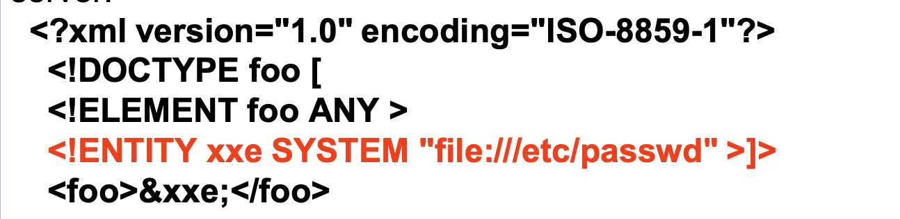
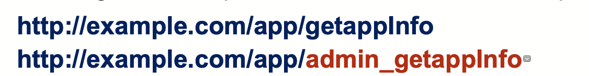

#Mentoring_Web #OWASP_TOP_10

한 페이지당 하나로 나누니 문서가 조금 짧은것같다. 뭐 어쩔수 없지. 여튼 이번 문서는 XML External Entities이다. 많은 오래되거나 잘못 설정된 XML 프로세서들은 외부 개체를 xml document 내부에서 evaluate 한다. 외부 객체는 내부 파일을 유출할 때 사용될 수 있고, 내부 포트 스캐닝, 원격 코드 작동, DOS 공격에 사용될 수 있다.

우선 공격 가능성은 2점이다. 공격자들은 XML이나 공격할 수 있는 코드를 입력할 수 있을때 취약한 XML을 공격하고, 취약한 코드와, 의존성, 통합성을 공격할 수 있다.

존재 가능성은 2점, 발견 가능성은 3점이다. 기본적으로, 많은 오래된 XML 프로세서들은 특성을 외부 개채에서 가져올 수 있다. URI는 XML이 처리되는 동안 dereferenced 될 수 있고 evaluate될 수 있다.
SAST 툴이 이러한 이슈를 의존성과 설정 검사를 통해 발견할 수 있다. DAST 툴은 이러한 문제를 발견하고 공격하는데 추가적인 과정들이 필요하다 .수동 테스터들은 XXE를 발견하기 위한 훈련이 필요하고, 일반적으로 테스트 하지 않는다.

기술적 피해 가능성은 3점이다. 이러한 취약점은 데이터를 추출하고, 외부에서 request를 보내는데 사용될 수 있으며, 내부 시스템을 스캔하는데 사용될 수도 있고, dos 공격이나 다른 공격을 시행하도록 사용될 수도 있다.

어플리케이션, 특히 XML 기반의 웹서비스나 하위 호환등이 사용되고, 이러한 상황일때  공격에 취약할 수 있다.

-- 어플리케이션이 XML이 적접적으로, 혹은 업로드를 하도록 허용할 때. 특히 신뢰할 수 없는 곳에서 받거나, 신뢰할 수 없는 데이터를 XML 문서에 삽입하고, 이를 XML 프로세서가 처리할 떄.

-- 앱 내부의 XML 프로세서나 SOAP 기반 웹 서비스에서 DTDs가 활성화 되었을 때. DTD를 비활성화하는 과정은 프로세서마다 다르겠지만,  관련 문서를 참조하는 것이 좋고 OWASP에도 관련 레퍼런스가 있다.

(*DTDs : document type definitions)

-- 어플리케이션에서 SAML을 신원 처리에 federated 보안이나 SSO 목적에 사용할 떄, SAML는 XML을 신원 표명에 사용하기 때문에 취약할 수 있다.

-- 어플리케이션이 SOAP를 버전 1.2 이전 버전을 사용 할 때, XML 개체들이 SOAP로 전달된다면 취약할 수 있다.

-- XXE 공격에 취약해지는 것은 어플리케이션이 DOS나 Billon Laughs 공격에 취약해진다는 것을 의미한다.

XXE 공격을 완화하고 인식하기 위해서는 개발자의 훈련이 필수적이다. 그것에 더해, XXE를 막기 위해서는 다음과 같은 것들이 필요하다

-- 가능하다면, JSON같은 덜 복잡한 데이터 포맷을 사용하고, 민감한 데이터를 직렬화하지 말자. 직렬화는 데이터 스토리지에서 데이터 구조나 객체 상태를 동일하거나 다른 컴퓨터 환경에 저장하고 나중에 재구성 할 수 있는 포맷으로 변환하는 과정이다.

-- 어플리케이션과 OS에 사용하는 XML 프로세서와 라이브러리를 패치하거나 업그레이드하고, 의존성 체커를 사용하자. SOAP도 버전 1.2 이상을 사용하자.

-- XML 외부 객체와  어플리케이션의 parser에서 처리하는 모든 DTD를 비활성화하자.

-- XML 문서, 헤더나 노드등의 공격 데이터들이 입력되지 않도록 서버단 입력에 대해 whitelisting 처리를 하고, 필터링과 데이터 sanitazing을 하자,

-- XSD 검증등의 방법법으로 들어오는 XML이나 XSL 파일 업로드에 대해 검증하자.

-- SAST 툴이 코드에서 XXE를 발견하는데 도움이 된다. 코드를 다 리뷰하는게 가장 좋은 방법이지만, 큰 구조에서는 SAST 툴이 도움이 될것이다.
이러한 관리가 불가능할 떈 가상 패칭, API 보안 게이트웨이, 웹 애플리케이션 방화벽을 사용해 XXE 공격을 방어할 수 있다.

임베디드 장치들을 공격하는 것을 포함한 많은 XXE 문제들은 이미 발견되었다. XXE는 예상치도 못한 많은 곳에서 발생할 수 있고, 깊은 종속성을 가진 곳에서도 발생할 수 있다 .가장 쉬운 방법은 공격을 위한 XML을 업로드하는것이다. 예시를 살펴보자

공격자가 서버에서 데이터를 빼내려 시도하는 코드를 삽입한 상황이다.

공격자가 ENTITY 줄 위의 네트워크를 바꾸어 서버단 내부의 네트워크를 조사하려는 모습이다.

끝이 없을 파일을 통해 DOS 공격을 시도하는 모습이다.

여튼 그러하다. 넘어가자.
