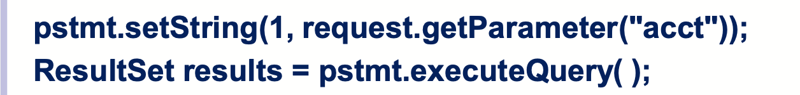

#Mentoring_Web #OWASP_TOP_10

이번에는 Broken Access Control이다. 이러한 기법이 아닌 개발자의 실수 등으로 의도치 않게 발생하는 취약점들은 뭔가 이름을 보면 대충 느낌이 오는 느낌적인 느낌이다.
승인된 유저들에게 적용되는 제한 정책들은 적절하게 강제되지 않을 수 있다. 공격자는 이러한 약점을 공격하고 접근하여 승인되지 않은 기능이나 데이테 접근해 문제를 일으킬 수 있다.

우선 공격 가능성은 2점이다. 액세스 컨트롤을 공격하는 공격자들의 핵심 능력이다. SAST / DAST 툴들이  이러한 접근 제한의 부재를 발견할 수 있지만 이러한 기능이 존재할때 정상적으로 작동하는지는 확인 할 수 없다. 접근 제한은 수동으로 확인하거나, 특정 프레임워크에서 접근 제한의 부재를 자동으로 확인함으로서 발견할 수 있다.

존재 가능성과 발견가능성은 모두 2점이다. 접근 제한 취약점은 자동 발견 시스템의 부재와 개발자들을 위한 효율적인 기능성 테스트의 부재로 많이 발견된다.
접근 제한 발견은 자동 정적이나 다이나믹 테스팅애 amenable하지 않다. 수동 테스팅이 접근 제한을 발견하는 가장 좋은 방식이다.

기술적인 영향은 3점이다. 공격자가 자신이 아닌 유저난 관리자의 접근을 해 취득한 권한으로 의도치 않은 행동을 할 수 있다.

접근 제한은 유저들이 의도된 권한 내에서 행동하도록 제한한다. 이러한 취약점은 승인되지 않은 정보 유출, 모든 데이터의 오염 혹은 파괴 등으로 이이지게 된다. 다음과 같은 상황에서 발생할 수 있게 된다.

-- 접근 제한을 URL, 내부 어플리케이션 상태, HTML 페이지 등으로 시행하거나 API 공격 툴을 사용할 때

-- 데이터베이스에서 읽어올  primary key를 바꿀 수 있도록 해 다른 사람들의 정보를 읽거나 수정할 수 있도록 하는 것.

-- 권한의 상승. 로그인 하지 않고 유저처럼 행동하거나 유저로 로그인해 관리자처럼 행동하도록 하는것.

-- JWT 접근 제한 토큰이나 쿠키를 replaying하거나 템퍼링해 권한을 상승시키고, JWT의 invalidation을 이용해 메타데이터를 조작하는것,

-- CORS의 잘못된 설정이 승인되지 않은 API의 접근을 가능하게 함

-- 승인이 필요한 페이지에 승인되지 않은 유저가 접속하도록 Force 하거나 특정 권한을 가진 유저만 접속할 수 있는 페이지에 일반 유저가 접속하도록 하는것. POST, PUT, DELETE에 대해 접근 제한 없이 APi에 접근하도록 하는것

접근 관리는 공격자가 접근 관리의 대한 확인과 메타데이터를 수정할 수 없는 신뢰할 수 있는 서버 사이드의 코드나 서버가 없는 API에서 강요될 떄만 효과적이다. 예방법은 다음과 같다

-- 공개적인 리소스에 대환 예외를 포함해, 기본적으로 deny 처리를 하라.

-- 접근 제한 메커니즘을 채택해 모든 어플리케이션에 적용하고, CORS 사용을 최소화하라.

-- 접근 제한을 유저가 기록을 CRUD를 할 수 있도록 하기 보단, ownership을 강제하도록 디자인하라.

-- Unique application business limit requirements가 domain model에 강제되도록 하자.

-- 웹 서버 디렉토리 리스팅을 비활성화하고, 파일의 메타데이터와 백업 데이터가 웹서버의 루트 디렉토리에 제공되지 않도록 한다.

-- 로그 접근 제한에 문제가 발생했을 때, 관리자에게 알림이 오도록 한다.

-- limit API와 컨트롤러 접근을 평가해 자동 공격 툴의 공격 피해를 최소화한다.

-- JWT 토큰이 로그아웃될 때 서버에서 비활성화 되어야 한다.

예시 공격들을 조금 살펴보자

어플리케이션이 승인되지 않은 데이터를 사용해 계정 정보에 접근하고 있다

공격자는 url의 acct 파라미터를 수정해 원하는 계정 번호를 얻을 수 있다. 적절히 승인과정이 이루어지지 않는다면, 공격자는 어떠한 계정 권한도 얻을 수 있다.

공격자는 브라우저로 관리자의 권한으로 들어갈 수 있는 페이지에 접속을 시도하는 모습이다. 승인되지 않은 유저가 이 페이지들에 접근할 수 있다면, 이는 취약점이다. 관리자가 아닌 계정이 아래 페이지에 접속할 수 있더라도 이는 취약점이다.

여기까지.