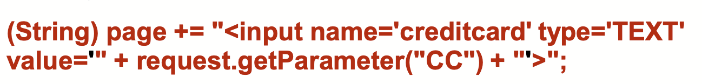
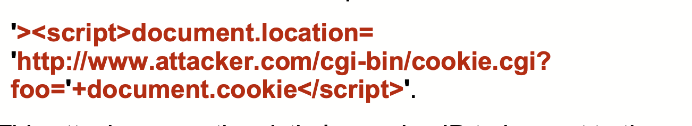

#Mentoring_Web #OWASP_TOP_10

XSS다. 이거 php인가 게시판 구성인가에서 배웠다. 스크립트를 서버에 삽입해 문제를 발생시키는 거다. 이러한 취약점은 서버가 신뢰할 수 없는 데이터를 적절한 인증과 escaping 없이 새 웹 페이지에서 사용하거나 이미 만들어진 페이지에서 유저가 제공한 데이터를 API 등을 통해 HTML이나 JS를 생성하는데 사용하면 발생한다.
XXS는 공격자들이 다른 피해자의 브라우저에서 스크립트가 실행되게 해, 유저의 세션을 훔치고, 웹사이트를 deface하거나, 멀웨어 사이트로 리다이렉트 시킬 수 있다.

우선 공격 가능성은 3점이다, 굉장히 많다. 자동화 툴도 존재해서 모든 XSS의 종류에 대해 발견할 수 있고, 자유롭게 사용 가능한 공격 프레임워크도 있다

존재 가능성과 발견 가능성도 3점이다. XSS는 OWASP TOP10에서 두번째로 많이 발견되는 문제로, 전 세계의 모든 어플리케이션에서 2/3정도는 이 문제를 지니고 있다.
자동화 툴은 XSS 문제를 발견할 수 있다. 

기술적 영향은 2점이다. 모든 3가지 종류의 XSS는 일반적으로 피해자 유저를 대상으로 리모트 코드 공격을 사용해 권한과 세션을 훔치고, 멀웨어를 전달하려 한다.

XSS에는 3가지 종류가 있다. 이에 대해 알아보고 취약한 경우를 찾아보자.
-- Reflected XSS  : 어플리케이션이 API가 유저의 입력을 검증이나 이스케이핑 없이 HTML으로 출력한다면, 공격자들은 이를 통해 임의의 HTML과 JS를 피해자의 브라우저에서 실행시킬 수 있다. 일반적으로 유저는 공격자가 컨트롤한 멀웨어 링크를 사용하게 될 수 있다.
-- Stored XSS : 어플리케이션이 sanitized되지 않은 유저의 입력을 저장하면, 유저나 관리자가 나중에 그 입력을 발견해 문제가 발생할 수 있다. 이는 큰 문제를 발생시킨다.
-- DOM XSS : JS 프레임워크, 싱글페이지 어플리케이션, 공격자가 컨트롤 할 수 있는 데이터를 포함한 API는 DOM XSS공격에 취약하다. 동일하게, 어플리케이션은 공격자가 컨트롤 할 수 있는 데이터를 안전하지 않은 JS APi에 보내지 않을 것이다.

일반적으로 XSS 공격은 세션 훔치기, 계정 차지, MFA 바이패스, DOM 노드 replacement / defacement를 일으키고, 이를 통해 유저의 브라우저를 공격한다.

예방법을 알아보자. XSS를 예방하는 것은 브라우저가 보여주는 내용에서 신뢰할 수 없는 내용을 분리하는것이다. 다음과 같은 방법이 있다.
-- 자동으로 XSS에 이스케이프문을 적용하는 프레임워크를 사용하자.그리고 각 프레임워크의 XSS 보호의 한계를 인식하고 커버되지 않는 경우에 대해 적절히 다루자.
-- 신뢰할 수 없는 HTTP 데이터 요청에 대해 상황에 따라 이스케이프를 적용하자. 이를 통해 Reflected XSS와 Stored XSS 문제를 해결할 수 있다
-- 클라이언트 단의 문서를 수정할 때 상황에 따른 인코딩을 적용하자. DOM XSS 문제를 해결할 수 있다. 이러한 처리가 안된다면, 유사한 상황에 따른 이스케이핑 기술을 적용하자.
--  Content Security Policy를 활성화해 mitigating control을 이용한 방어로 XSS를 막을 수 있다. 이것은 다른 멀웨어 코드를 포함시키는 취약점이 로컬 내부에 포함되지 않을 때 효과적이다.

공격 시나리오를 또다시 살펴보자.

어플리케이션이 신뢰할 수 없는 데이터의 인증이나 이스케이핑 없이 다음과 같이 구조에 사용할 경우 발생할 수 있다.

공격자는 CC 파라미터를 다음과 같이 삽입해 공격할 수 있다.

이 공격은 피해자의 세션 ID를 공격자의 웹사이트로 훔쳐, 유저의 현재 세션을 하이재킹한다.
공격자는 XSS를 어떠한 자동하 CSRF 방어를 무력화하는데 사용 할 수 있다.