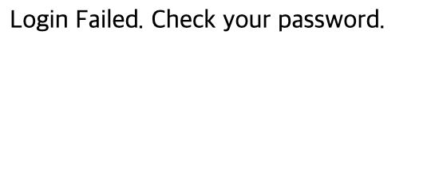

#Mentoring_Web #Building_Board

게시판을 만들어야 한다. 하라면 해야지 뭐
우선 웹사이트의 구조부터 조금 생각해보자. 2가지로 구성할 수 있을 것 같다. 첫번째는 로그인 페이지, 두번째는 게시판 페이지이다. 
우선 로그인은, 아이디와 비밀번호를 post 방식으로 넘기고 로그인이 이루어지지 않으면 게시판에 글 작성하는 것이 불가능해야 한다.아마 쿠키나 세션을 이용해야 할 것 같다. 세션을 이용해 구현하는 것이 좋을듯 하다.

환경구축 좀 하자. 몇번 대가리 깨져보니까 너무 편하게 된다.  test_db 데이터베이스에 접속해 연결까지 확인한 모습이다.
우선 루트로 작업을 하다가, 어느정도 구성이 되면 새로운 계정 만들어서 이 테이블만 관리할 수 있도록 권한을 주도록 하자.

우선 기본적인 틀을 구성하고, DB를 설계하자.
기본적으로, 모든 시스템에는 CRUD가 필요하다. 근데 유저 관리에서 UD는 우선 안만들거다. 이미 충분히 대가리가 깨질것같거든. 본문과 댓글만 수정이 가능하도록 하자.

DB를 설계했다. 이미 충분히 복잡하기 때분에 최소한의 데이터를 받도록 설계했다.
우선 3개의 테이블로 나뉘게 된다. 유저 / 댓글 / 게시물 데이터이다. 댓글과 게시글을 분리하고, 댓글 키에 입력된 게시글의 키를 이용해 게시글에서 댓글을 출력할 수 있을 것이다. 

설계한 DB를 바탕으로 테이블을 만들었다.

일단 DB도 설계했으니, 어떤 페이지들이 필요할지 생각해보자. 4가지 페이지로 나눌 수 있을것 같다. 인덱스 / 리스트 페이지, 로그인 페이지, 게시글 페이지. 회원가입 페이지가 될 것이다.

우선 index 페이지는, 로그인이 되어있지 않은 상태라면 게시글을 볼 수만 있어야 하고, 작성할 수는 없어야 한다.
게시글 페이지는 get을 통해 본문의 id를 받아와, 본문과 댓글을 출력해야 한다.
로그인 페이지는, id와 password를 이용해 페이지를 

다른 페이지의 의존성이 가장 낮은 로그인 페이지와 회원가입 페이지부터 만들어 보자. 얘는 뭐 별거 없다. 박스로 아이디 비밀번호만 입력받고 넘겨주면 된다. 그리고 회원 가입 페이지로 연결하는 하이퍼링크까지 만들어줬다. 

데이터도 전달이 잘 되는 모습이다. password가 평문으로 넘어가는데, 암호화 처리는 일단 어느정도 윤곽이 나오면 하도록 하자.

우선 user가 있어야 로그인이 되니, user를 생성하는 register process부터 만들어주자. 정상적으로 데이터가 전달되고, 쿼리문이 완성되는 모습이다. 

실수로 쿼리문 확인을 못하고 다 넘겨버렸는데, 어쨌거나 정상적으로 작동한다. 그럼 장땡이지 뭐 ㅋㅋㅋ

sql injection을 막기 위한 filtering 처리까지 했다.

넘어가기 전에, 모든 값의 공백을 막는 처리와 id의 중복을 막기 위한 처리가 필요하다. 우선 입력한 id값을 통해 sql에 조회를 하고, id가 겁색이 되어 mysqli_query가 null이 아니라면, 주어진 문장이 작동하게 된다. 

우선 공백을 방지하도록 한 모습이다.

공백 막는 처리와 중복 방지 처리를 한 모습이다. 

시용중인 id를 입력했을 때 다른 id를 요구하는 모습이다. 

사용중이지 않은 id를 입력하면 insert하는 쿼리문이 정상적으로 실행된다.

효율성을 위해 select문에서 id값만 가져오게 변형했다. 어차피 값 존재성만 확인하는거니까.

이제 로그인 작업을 처리하는 페이지를 만들어보자. 우선 입력된 id의 유효값을 확인하고, password가 일치하는지 확인해주면 된다.

select문을 통해 끌어온 데이터가 null인지를 확인해 Id값이 유효한지 확인하고, password 일치를 확인한다.

id가 다를땐 

로그인 페이지로 돌아가는 코드까지 반영했다.

정상적인 계정으로 로그인 하면 잘된다.

로그인은 우선 이정도이다. 여러가지 아쉬움들이 있다. password가 평문으로 왔다갔다 하는 것같은 것들은 해결해야할 문제다. 어쨌거나 됐으면 됐다.