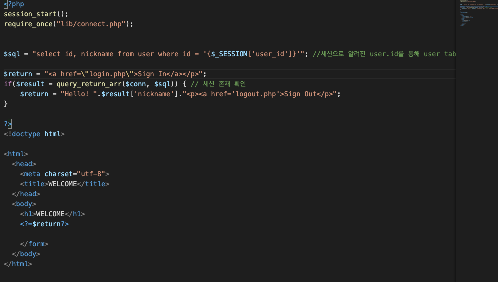
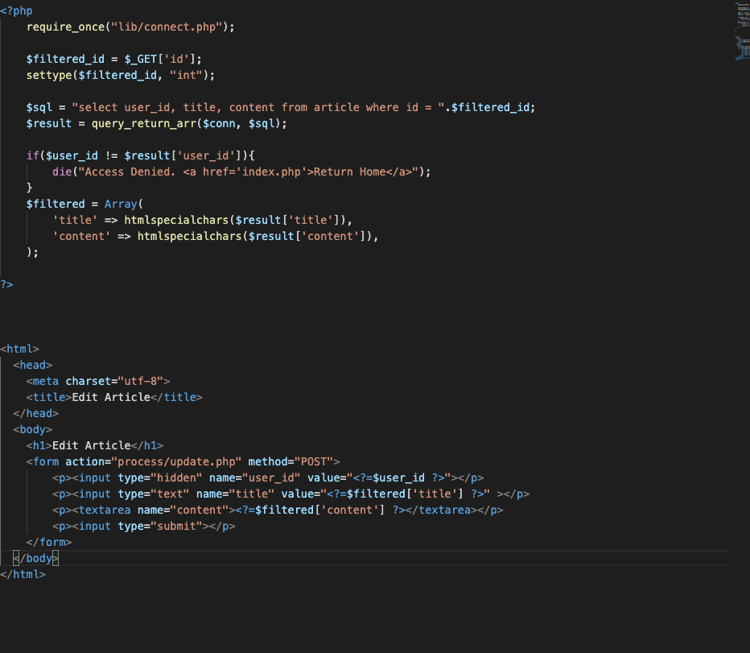

#Mentoring_Web# #Building_Board

본격적으로 게시판 제작을 시작하기 전에, 필요한 함수들을 좀 만들어보려 한다. 정말 답도없이 많이 써서 이건 좀 할 필요가 있다 싶은것들은 함수화 좀 해두려고 한다.

첫번째는 query 출력 받은거 array로 변환하는 함수이다. 이거 진짜 한 코드에도 수십번씩 반복되고, 할때마다 변수도 몇개씩 나오고 그러니까 지쳐서 그냥 이렇게 짰다. 
쓰다보니까 발견한건데 이거 함수 호출할 때마다 쿼리 다시넘겨서 이것도 반복문에서는 못쓰는것같다. 아오.

원래 $_post로 받은 배열 filter 처리해주는 함수도 만드려는데 $_POST 연관배열로 넘어와서 안된다. 아

우리가 사용할 세션에 대해 좀 알아보자. 세션은 서버의 컴퓨터에 저장되는 사용자의 간략한 정보라고 할 수 있다. 쿠키보다 보안이 좋아 이용된다.

로그인 처리 과정에 세션 처리를 좀 해준 모습이다.

인덱스 파일을 만들었다 세션을 통해 전달되고 있는 id값을 통해 sql에서 계정 정보를 가지고 왔디.

세션이 정상적으로 작동하는 모습을 볼 수 있다. 어려울 줄 알았는데 생각보다는 간단한 이야기다.

하고 있는데 갑자기 컴퓨터가 폭주하기 시작했다. 발열 올라오는걸 보니 그만하라는 뜻같다. 여기까지만 하자.
우리가 지금까지 공부했던 예시들을 참고해 글 목록을 index에 만들어보자.

역시 사람은 잠을 좀 자야한다. 머리가 굴러가니까 이제야 알고리즘이 좀 머리속에 굴러간다. 우선 함수로 만들었던 구조를 풀어줘 함수를 무한히 조회하지 않게 했고(어제 컴퓨터 폭주한게 이거때문인거같다.) 반복문이 사용되기 전에 mysqli_fetch_array가 호출되어 더이상 읽을 글이 없어졌는데, 첫 사용을 반복문의 조건문으로 삽입해 이를 막았다.

간단한 작업을 좀 해줬다. login_process에서 login로 바로 리다이렉트되고, 문제 발생시 에러메시지가 같은 창에서 보여지도록 설정했다.
우선 여기까지 했다. 글 목록까지 표현되고, 로그인 시스템은 완성되었다. 이제 글 생성 페이지를 만들어보자.

글 생성 페이지를 만드는 과정에서 생각해보니까, 본문 테이블에 user_id가 없었다 ㅋㅋㅋㅋㅋㅋ 새로 만들어주었다.

우선 글 생성 페이지만 만들어 주었다. 사실 뭐 별거 없다. $process에서 세션 가져오는것보다 hidden 속성 이용해서 post 방식으로 세션 넘겨주는게 나을것같아서 이렇게 했는데 뭐가 나은지는 삭님이 알려주실거다.

어쨌거나 데이터는 잘 넘어간다. 그럼 됐지 뭐.

예제 풀면서 했던 코드를 알맞게 변형해 글을 제작하는 코드를 짰다. 우선 정상적인 쿼리가 완성되는지 확인하기 위해 die로 쿼리만 출력을 해보았다.

히든 칸만 만들어놓고 정작 값을 안넘겨줬다.

여튼 수정핟고 나니까 정상적으로 쿼리가 완성되는 모습이다.

완성된 쿼리는 mysql에서도 정상 작동한다. 따라서 이제 정상작동할거다.

정상적으로 작동하는 모습이다. 글 목록에 id를 내림차순으로 정리할 필요가 있는것같다. 

정상적으로 처리되었다.

글 읽기를 만들기 전에, join 명령을 입력하는 법을 좀 생각해보자. user_id를 매개로 묶으면 될거다.

글 읽기 시스템을 완성했다. 이런저런 이야기들이 있지만, 커트라인이 눈앞에 있는데 그딴거 써제낄 시간 없다. 그래도 하나만 남기자면, 함수를 리턴하면 부울값이 나온다는걸 기억하자. Settype 이새끼야.

수정 페이지도 만들었다. 코드는 역시 우려먹어야 제맛,

삭제 페이지까지 완성했고, 정상 작동 확인했다. session의 id값을 확인하는 과정을 그냥 connect 라이브러리에 넣었다.

생각해보니까 두가지 오류가 있는데, 게시글의 id가 글의 제작자의 id가 아닌 로그인 한 id로 표시되었고, 로그인 여부에 상관 없이 삭제/수정 버튼이 뜨길래 이거 없애주게 코딩해줬다. 댓글 기능 만들다 발견해서 수정했다.

