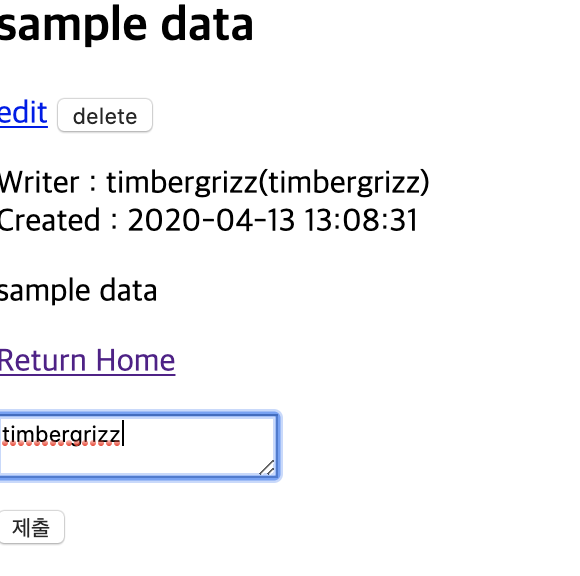

 #Mentoring_Web #DB&PHP
이제 댓글 관리를 추가해야한다. 댓글 표시와 작성은 view 페이지 안에서 이루어져야 하고, 수정만 다른 페이지에서 이루어져야 한다. 

우선 뷰 페이지에 폼을 만들고, 만들어진 sql을 확인하는 코드를 작성했다. 

Sql 확인하는 코드로 쿼리를 완성시켰고, 정상적으로 생성되는 모습이다. 
이제 create는 됐으니 read를 해보도록 하자. read는 view 파일 단에서 이루어져야 한다.

댓글 표시창도 만들었다. 이제 수정 삭제만 하면되는데, 왜이렇게 힘드냐.

댓글 삭제부터 구현 했다. 이게 더 쉽기 때문.

댓글 수정도 구현이 완료된 모습이다. 문서가 끝으로 갈수록 성의가 없어진다. 사실 할 얘기가 별로 없었다 댓글은, 게시판을 만드는 과정에서 생성한 함수들을 이용해 충분히 만들 수 있었기 때문이다. 이거 모듈화 시키라고 하면 멘토링 나가야하나?

