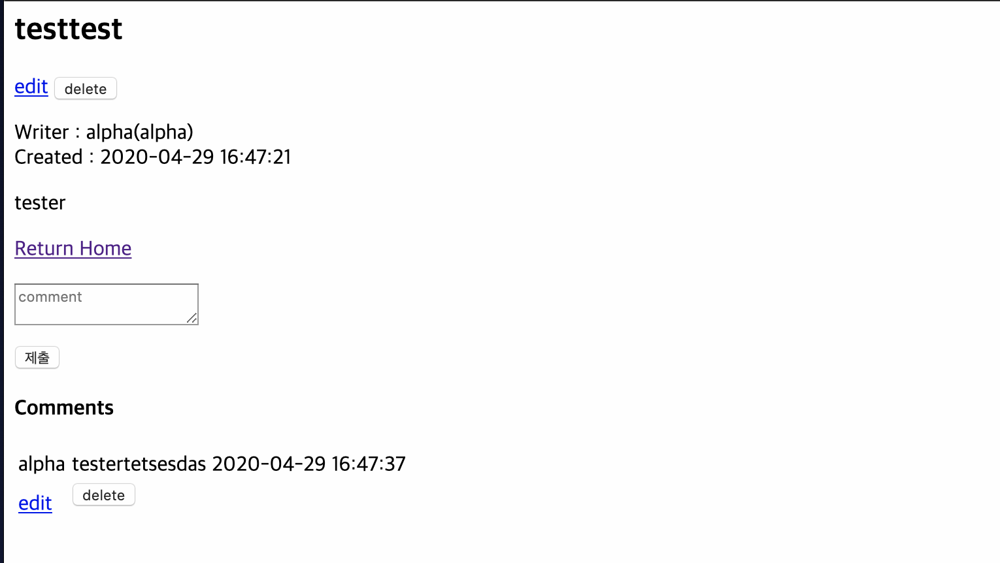

#Mentoring_Web #Building_Board #AWS 

이제 다운로드를 구현해야 한다. 우선 AWS 제대로 안만들어놓고 나와서 제대로 구현되는지 확인해두고 가자.

로그인 서비스, 댓글 작성, 게시글 작성 다 잘 굴러간다. 문제는 디렉토리 바뀌면서 이걸 다 조정해줘야한다. 얼른 하자.

로그아웃 문서를 프로세스 디렉토리 안으로 넣어주면 해결된다. 이러하면 코드 배치의 일관성 문제도 해결될 수 있다.

로그아웃 문제도 해결이 되었다.  이제 파일 업로드르 구현해보도록 하자.

파일 업로드 옵션은 잘 켜져있다. 구현하려면 우선 글 쓰기에서 파일 업로드가 구현되어야 하고, 파일 다운로드가 게시글 조회에서 구현되어야 한다. 가보자.

우선 테스트를 위한 페이지를 만들어보자.

파일 업로드가 보여지는 HTML 페이지다. 뭐 이건 별 문제가 아니고, 업로드가 이루어지는 프로세스를 만들자.

프로세스를 만들었다. 유효성 검사는 일단 테스트니까 최소화했다. 목적에 따라, 보안 정책에 따라 유효성 검사가 달라질 수 있다.

우선 파일 넘어오는지, 어떤 형식으로 넘어오는지 확인하기 위해 이런식으로 코드를 작성했다.

테스터 작동이 계속 안되서 보는데 오타가 폭발하고 있었다. 폭발하는 오타를 뚫어내고 업로드에 성공했다.

이 화면 보는데 3시간 걸렸다.

업로드 되는걸 확인했다. 이제 이걸 본 서비스에 적용하자.

글 업로드가 진행되는 과정에 업로드 구현하는 로직을 삽입했다.

업로드 보여지는 화면에도 폼을 구현했다. enctype으로 선언을 해야 파일이 넘어가는지 알 수 있다고 한다. 그러하다.

저거 테스트 성공한 이후로 원래 게시판에 이걸 통합하다가 실패했다. 그래서 일단 다시 시작해본다. 그러하다.

우선 에러 발생하던 세션의 변수를 날려버렸다. 필요 없을것같다 

파일 업로드 자체는 성공했다. 여러가지 나의 실수에 의한 문제들이 있었지만, 나의 멍청함에 의해 발생한 문제들이니까 뭐 그냥 살도록 하자.

이제 sql을 이용해 업로드 된 파일을 관리하고, 파일이 업로드 된 글을 조회할 때  파일을 볼 수 있도록 해야한다. 우선 테이블을 새로 생성해야 한다. 구조도를 다시 좀 그려보자.

이정도면 우선 될것같다. 우선 테이블부터 만들자.

뭐 테이블 만드는건 일도 아니니까. 이제 만들어진 테이블을 적용해 파일 관리를 DB로 해보도록 하자.

생각해보니까 이렇게 하면 파일 테이블이랑 글 테이블이 구분되고 그러면서 일이 너무 귀찮아져서, 그냥 게시글 테이블에 파일 이름과 사이즈만 넣는게 나을것같다. 

다시 그린 테이블은 이렇게 된다. 시작해보자.

게시글 테이블에 반영한 모습이다.  이제 php에 반영해보자,

우선 글을 작성할 때, 파일 이름과 사이즈가 넘어가도록 해야한다. 파일이 없을때는 데이터가 전송되면 안되고, 이를 한번에 처리하는 것 보다 파일이 있을때와 없을대  파일이 없을때와 있을 때 넘어가는 쿼리문이 달라지게 설정했다.

테스트 시행하는 사진은 못찍었는데 업로드가 정상적으로 이루어진다. 이제 글에서 보이는 부분을 구현하자. 링크만 연결하면 다운로드는 알아서 구현될거다.

우선은 저렇게 파일을 링크하도록 구현을 했는데, 찾아보니까 좋지 않은 방법이라 구글신이 시키는 대로 헤더를 조금 변경하면 될 것 같다. 어차피 get 파라미터로 넘겨줘도 상관없으니까.

업로드 되어있는 파일이 있으면 링크가 뜨고, 없으면 링크가 안뜨는 모습이다. 계획대로 구현되었다. 이제 다운로드 프로세스만 만들면 된다.

파일 다운로드 로직이다. 헤더 부분은 솔직히 모르겠어서 끌어다 썼다. GET 파라미터로 파일을 전달받고, 파일을 오픈해서, passthru로 보내주어야 한다. 이 과정이 이루어진다면 파일을 닫고 리다이렉션 기능으로 원래 페이지로 돌려주었다.

조금 더 고급지게 짠다면 게시글 id로 받아서 게시글 id에 존재하는 파일로 넘겨줄 수 있긴 한데, 귀찮으니까.

혹시나 없는 파일 다운로드 요청할 때 예외처리까지 해주었는데 계속 문제가 발생한다. 이거 리다이렉션 해줄 필요 없다. 헤더가 알아서 해준다. 그래서 리다이렉션 처리는 제외.

두번째, 어디서 문제가 생기는진 모르겠는데 파일이 다운로드가 안된다, 그래서 일단 되었을때의 상황으로 초기화해주고, 이름만 제대로 다운로드되게 처리했다.

결과물은 이 로직이다.

다운로드 정상적으로 잘 된다. 데이터도 잘 넘어온다.

데이터도 정상적으로 잘 넘어온다.

보안적 취약점이 넘쳐 나지만, 어쨌거나 서비스 자체는 장장 3주에 걸쳐 구현해줬다. 수준은 좀 낮지만 지금까지의 내 노력에 가슴이 웅장해진다. 이제 자자.
