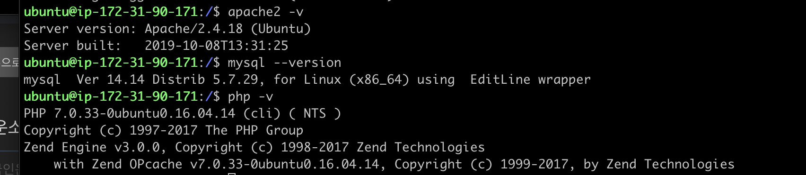

#Mentoring_Web #Building_Board #AWS

내가 가천대 1학기 끝나고 웹 프로그래밍 하면서 내가 웹프로그래밍 하면 사람**가 아니라는 생각을 했었다. 시험이 좀 그렇긴 했지만, 학점이 C+이 나온걸 보고 충격과 공포를 받았었는데, 이래놓고 php와 mysql로 게시판 구축하고, 이걸로 AWS에 서버 올리고 있다. 뭐 이건 해킹공부라 다른건가?라고 더블띵킹을 열심히 해보도록 하자.

GitHub 학생 계정이 등록되어있으면 자비로운 AWS께서는 100불의 크레딧을 주신다. 여튼 등록이 완료되어서 lightsail을 등록하려는데 안된다. 구글에 검색해보니까 원래 된다는데 내가 aws educate starter 계정으로 가입했다고 ec2밖에 못쓴단다. 뭘 하든 어떻게 한번을 쉽게 못간다. 아오. 이걸 보는 누군가는 미리 AWS 계정을 만들고 그 계정과 educate 계정을 연결해 원래 계정에 크레딧을 받도록 하자.

그래도 EC2 T2.micro는 무료다. 서버 자체는 무료인데, 고정 ip 옵션이나 기타등등 옵션을 물리기 시작하면 불을 뿜는 과금이 시작되니 주의하도록 하자.

기본적으로 제공되는 우분투에는 아무런 서비스가 깔려있지 않다. 다시 다 깔아줘야 한다 이말이다. 그래서 다시 다 깔아준 모습이다. 과정은 어디갔냐고? 이제 과정까지 적어 두기엔 좀 하지 않았나?

포트를 사용할 수 있도록 보안 규정에서 열어줬다.

원래는 html로 접속이 안되었지만, 포트를 열어줘 접속이 되는 모습이다. 이제 테스트 페이지를 만들어보자.

원래 php 설정을 하는 과정, 체크하는 과정과 mysql 트러블슈팅 과정이 있었는데 스크린셧을 안찍었다. 여튼 mysql까지 연결은 잘 됐다. 이제 파일 업로드만 하고 웹해킹 공부부터 좀 하러가자.

파일을 업로드하기 위해서는 두가지 방법이 있다. git으로 연결하는거나, ftp로 연결하거나. 깃으로 연결하는게 바로 연동되는 것이 좋을것같은데 지금 내 폴더가 전부 깃으로 연결되고 있어서 좀 그렇다.

git 연결해서 우리가 필요한 소스 데이터만 연결된 모습인데, 이게 좀 그런게 디렉토리 데이터도 같이 넘어갔다. 유저 디렉토리나 루트 디렉토리를 바꿔야겠다.
해야할 것들을 정리하자. 우선 db 정보를 조금 바꿔야하고,  테이블을 생성해야 한다.

우선 소스코드 자체는 잘 넘어가는 모습이다.

테이블을 만들었다. 예전에 만들어두었던 표를 이용하니까 편하게 만들 수 있었다.

로그인 시스템이 정상적으로 작동하는 모습이다. 지금 글쓰기 소스가 파일 업로드 시스템 구현하느라 다 막아둬서 테스트는 파일 업/다운로드 구현하고 하는게 나을것같다. 여튼 그러하다.
도커 이미지만 올리면 사실 한번에 해결할 수 있는데, 도커 이미지에서 파일시스템 구현 안되던거 샏각하면 그대로 올리기보다는 조금 더 손을 대야 할 것 같디.