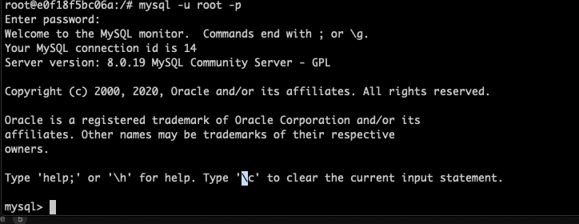
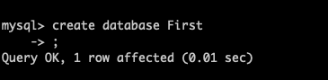
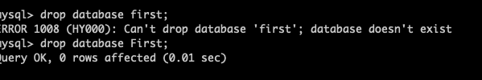
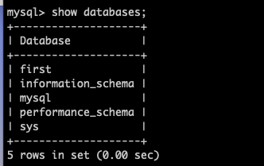
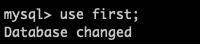
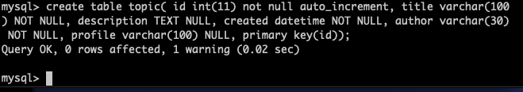

#Mentoring_Web #DBMS

사실, 대충은 다 아는걸 걸려버려서 과제가 다르긴 한데, 나도 정보를 좀 정리할 시간은 필요하니까 여튼 하는김에 기록도 좀 해본다.

인류는 컴퓨터로 정보를 관리하기 위해서 파일을 만들었다. 파일은 여러가지 장점이 있어 지금도 사용되고 있고 미래에도 사용될 것이다. db도 결국은 그 정보를 파일에 저장한다
정보가 증가하고 다양해지면서 파일만으로는 입/출력과 저장이 어려워졌다. 이러한 문제에서 데이터베이스라는 물건이 등장한다.

1970년, 관계형 데이터베이스라는것이 ibm에서 개발된다. 이 이론에 기반해 여러가지 제품들이 출시되었고, 지금도 최고의 강자로 군림하고 있다. 데이터를 표로 정리할 수 있고, 정리한 데이터의 검색, 정리등을 훨씬 안전하고 편하게 할 수 있다.

MySQL은 오픈소스이면서 관계형 db의 주요한 기능들을 모두 갖추고 있는 준수한 솔루션이다. 웹이 성장하면서 웹개발자들은 웹페이지를 통해 표현할 정보를 저장할 데이터베이스를 찾는 과정에서, 오픈 소스였던 Mysql은 훌륭한 제품이었고, 웹과 함께 성장해 지금은 많은 서비스를 지배하고 있다.

우선 할일이 없어서 mysql 자체는 미리 깔아놨었다. 도커에 대해 설명한 글은 다른 폴더에 있다. 여튼 mysql 자체는 세팅이 되어 있으니, 다음으로 넘어가자.

리빙포인트) 나중에 게시판 세팅할 때 우분투 이미지에다가 깔아서 써라. 그때 다시 셋업하면서 도커쪽 문서도 업데이트 되지 않을까 싶다.

MySQL의 구조를 한번 보도록 하자. 3개의 구성 요소가 있다. 데이터를 기록하는 테이블 (스프레드시트와 비슷한 표 구조) / 많은 테이블들을 정돈하기 위해 연관된 테이블을 그룹지어 연관되지 않은 테이블과 구별하는 데이터베이스(스키머) / 스키마들이 저장되는 데이터베이스 서버 3가지로 나누어진다.
mysql을 설치한 것은 데이터베이스 서버를 설치한것이고, 이를 통해 데이터를 다루는 것이라고 할 수 있다.

데이터베이스 서버 > 데이터베이스(스키마) > 테이블이라고 생각하면 된다.
데이터베이스의 효용중 첫번쨰는 보안이다. 파일 시스템은 한번 뚫리면 모든 파일이 공격 대상이지만, 데이터베이스는 자체적인 보안 체계를 가지고 있어 안전하게 데이터를 보관할 수 있고, 권한 등록을 통해 여러명의 사용자를 등록할 수 있다.
 
서버 열심히 접속하는 영상도 있는데, 이거 하는것도 위에 사진에 잘 나와있다. 일반적으로 root는 관리자다. 모든 권한이 뚫려있기 때문에, 중요한 시스템에는 별도의 사용자를 만들어 필요한 권한만 넣은 후, 필요할 때만 root를 사용하는 것이 좋다.
리빙포인트) root 비밀번호 rootroot로 설정해놨다.
이제 데이터베이스 서버의 접근은 성공했다. 데이터베이스로 넘어가자.

스키마를 먼저 만들어 표를 만들 준비를 해보자. 데이터베이스를 만드는 query는 create database db_name;이다. 

데이터베이스를 삭제하는 명령어는 drop database db_name;이다. 이름은 대소문자 구분하는것에 주의하도록 하자.

사실 데이터베이스를 만들거나 삭제하는 등의 명령어는 칠 일이 거의 없을거다. 명령어를 하나 하나 다 외우는것보다, 검색을 통해 명령어를 알아내는 능력이 더 중요할 수 있다는 것이다.

mysql에서 데이터베이스의 목록은 show databases;이다 구글에 mysql show database로 검색횄더니 이게 명령어였다.

데이터베이스를 생성했으면 표를 만들어야한다. 그전에 데이터베이스를 사용하겠다는 명령을 mysql에 전달해야한다. 전달하는 명령어는 use db_name;이다. 이렇게 적으면 mysql은 내리는 명령을 first의 표를 대상을 명령을 수행하는것이다.

데이터베이스는 많고 다양한 데이터를 다루기떄문에, 많은 단계로 이루어져 있다. 이제 테이블을 다룰 준비가 되었으니 테이블로 들어가보도록 하자.

표를 만들기 전에 sql과 테이블의 구조를 좀 알고 가자. 이제부터 sql을 베우기 될건데, sql은 structured query language의 줄임말이다.
관계형 db에선 기본적으로 표의 형식으로 데이터를 정리할 수 있다고 하는데, 그 표를 작성하는것을 structured라고 한다
query는 데이터베이스에게 질의한다는 문맥에서 사용된다. mysql에게 query를 전달하기 위해선 나와 서버 모두 공통의 약속으로 정해진 문법을 사용해야 하기 때문에, 이를 language라고 한다.
그렇게 데이터베이스의 서버에게 전달하기 위해 사용하는 언어르 sql이라고 한다. 

sql에는 두가지 특징이 있다. 첫번째는, 앞으로 만나게 될 어떤 언어보다도 쉬울것이다. 이렇게 말하는 언어가 html이고 하나는 sql이다. 그리고 두번째로 중요하다. sql이라는 언어는 관계형 db에 속하는 제품들이 공통적으로 데이터베이스 서버를 제어할 때 사용하는 표준화된 언어이다. 압도적인 데이터베이스 서버들이 sql을 통해 동작하고,  하루에 우리도 모르게 sql을 통해 수많은 정보 시스템을 접하게 된다. 여튼 중요하다.
그래서, sql이라는걸 배울것이고, 표를 본격적으로 다루어 볼 것이다. 표는, 테이블이라고도 한다. 이는 x축과 y축으로 나눌 수 있는데, 수평으로 가는 행을 row, record라고 하고, 수직으로 가는 열을 column, attribute라고도 한다. 

이제 테이블을 생성하고, 데이터를 입출력 해보도록 하자. 우선 테이블을 만들자. 테이블 생성할 일도 삶에서 많진 않다. 어떤 소프트웨어를 사용하면 엑셀을 사용하듯이 편리하게 사용할 수도 있다.
그러나 지금 우리는 sql을 배우는 과정이고, 언어를 배우는 과정에서 sql 말고도 db의 장점이 보이는 특성이 드러나게 된다.
결국 스스로 만드는 법을 알아야 하고, 이를 위해서는 검색 능력이 필요하다. 검색하려는 키워드에  Cheet sheet로 검색하면 잘 정리된 파일로 볼 수 있다. 
엑셀과 같은 경우, column에 어떠한 형태의 데이터튼 사용할 수 있지만, 데이터베이스는 이를 미리 지정해 두어야 한다. 엑셀에서 데이터가 많아지는 경우, 데이터를 관리할 수 없게 된다. 이러한 상황에서 데이터의 조건을 규정할 수 있고, 이를 무조건 지키게 할 수 있다는 것이 데이터베이스의 장점이다.
mysql에서 제공하는 데이터 타입들이 있다. int를 쓰면 2^32개의 정수를 사용할 수 있다. 최대한 자신이 수용하려는 데이터의 최댓값에 가장 가까운 데이터 타입에 맞추어 사양하는것이 좋다. 
게시판을 만들 때 , 글의 id값이나 제목등이 없으면 게시판 자체에서 문제가 발생한다. 본문은 나중에 작성할 수도 있으니 빈 상태로 둘수도 있다. 이러한 데이터의 특성들을 모두 고려해주어야 한다. 
not null 옵션은 값이 없는 것을 허용하지 않는다는 뜻이다.

우리가 행을 삭제할 때, id값을 보는 것이 가장 효율적이다. 그렇게 하기 위해선,  데이터를 추가할 때 마지막 데이터값보다 1 증가하게 설정해주면 편해질것이다. 
auto_increment 옵션을 이용하면 새로운 열이 추가될 때 마다 자동으로 수를 증가시켜 준다. 이를 통해 글들을 구별할 수 있게 된다.
두번쨰 행은 제목인데,  title이라는 제목을 갖고있고, 문자가 와야한다. 제목이므로 엄청나게 긴 글자는 안된다. 100글자 정도가 적절하다. String 데이터 타입 중 varchar라는 데이터 타입이 존재한다. 100글자로 설정을 했다면, 100글자를 초과하는 데이터 양이 들어왔을 때, 나머지 글자들은 제거한다.
다음 행은 본문이다. 본문은 충분히 길어야한다. varchar는 255글자 까지만 저장할 수 있으므로, 긴 데이터를 저장하는데는 적절하지 않다. text는 65545자를 저장할 수 있는데, 이정도면 적절하다. 
다음은 생성 시간이다. date/time 데이터 타입도 존재하다. datetime으로 하면 날짜와 시간을 모두 표현할 수 있게 된다.
저자도 30글자정도에서 자르면 될것같고, 자기 소개노 100글자정도에서 자르는데, 자기소개는 안 쓸 수도 있으니 비워두자.
primary key는 주 키를 의미한다. 이건 배웠다. 키는 데이터를 구분하기 위해 사용하는데, 최소성과 유일성을 모두 만족하는 키가 primary key이다. 유일성이 성능과 관련되고, 최소성이 중복 방지를 의미한다.

리빙포인트) 테이블에 행 설정할때 중괄호가 아니라 소괄호로 설정해야한다. 알고가자.

sql을 쓰는 법보다 중요한것은 데이터베이스가 여러가지 규제 정책을 가지고 있고, 이 규제 정책 덕분에 데이터를 깔끔하게 유지할 수 있다는 점이다.
