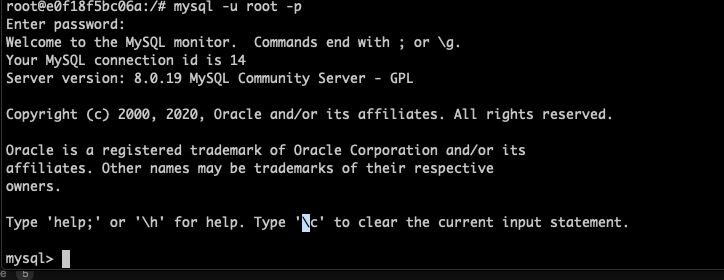

#Mentoring_Web #DBMS

사실, 대충은 다 아는걸 걸려버려서 과제가 다르긴 한데, 나도 정보를 좀 정리할 시간은 필요하니까 여튼 하는김에 기록도 좀 해본다.

인류는 컴퓨터로 정보를 관리하기 위해서 파일을 만들었다. 파일은 여러가지 장점이 있어 지금도 사용되고 있고 미래에도 사용될 것이다. db도 결국은 그 정보를 파일에 저장한다
정보가 증가하고 다양해지면서 파일만으로는 입/출력과 저장이 어려워졌다. 이러한 문제에서 데이터베이스라는 물건이 등장한다.

1970년, 관계형 데이터베이스라는것이 ibm에서 개발된다. 이 이론에 기반해 여러가지 제품들이 출시되었고, 지금도 최고의 강자로 군림하고 있다. 데이터를 표로 정리할 수 있고, 정리한 데이터의 검색, 정리등을 훨씬 안전하고 편하게 할 수 있다.

MySQL은 오픈소스이면서 관계형 db의 주요한 기능들을 모두 갖추고 있는 준수한 솔루션이다. 웹이 성장하면서 웹개발자들은 웹페이지를 통해 표현할 정보를 저장할 데이터베이스를 찾는 과정에서, 오픈 소스였던 Mysql은 훌륭한 제품이었고, 웹과 함께 성장해 지금은 많은 서비스를 지배하고 있다.

우선 할일이 없어서 mysql 자체는 미리 깔아놨었다. 도커에 대해 설명한 글은 다른 폴더에 있다. 여튼 mysql 자체는 세팅이 되어 있으니, 다음으로 넘어가자.

리빙포인트) 나중에 게시판 세팅할 때 우분투 이미지에다가 깔아서 써라. 그때 다시 셋업하면서 도커쪽 문서도 업데이트 되지 않을까 싶다.

MySQL의 구조를 한번 보도록 하자. 3개의 구성 요소가 있다. 데이터를 기록하는 테이블 (스프레드시트와 비슷한 표 구조) / 많은 테이블들을 정돈하기 위해 연관된 테이블을 그룹지어 연관되지 않은 테이블과 구별하는 데이터베이스(스키머) / 스키마들이 저장되는 데이터베이스 서버 3가지로 나누어진다.
mysql을 설치한 것은 데이터베이스 서버를 설치한것이고, 이를 통해 데이터를 다루는 것이라고 할 수 있다.

데이터베이스 서버 > 데이터베이스(스키마) > 테이블이라고 생각하면 된다.
데이터베이스의 효용중 첫번쨰는 보안이다. 파일 시스템은 한번 뚫리면 모든 파일이 공격 대상이지만, 데이터베이스는 자체적인 보안 체계를 가지고 있어 안전하게 데이터를 보관할 수 있고, 권한 등록을 통해 여러명의 사용자를 등록할 수 있다.
 
서버 열심히 접속하는 영상도 있는데, 이거 하는것도 위에 사진에 잘 나와있다. 일반적으로 root는 관리자다. 모든 권한이 뚫려있기 때문에, 중요한 시스템에는 별도의 사용자를 만들어 필요한 권한만 넣은 후, 필요할 때만 root를 사용하는 것이 좋다.
리빙포인트) root 비밀번호 rootroot로 설정해놨다.
이제 데이터베이스 서버의 접근은 성공했다. 데이터베이스로 넘어가자.