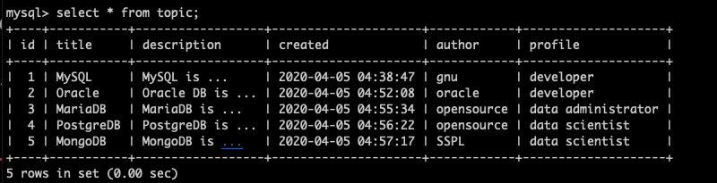

#Mentoring_Web #DBMS

CRUD에 대해 배운다는데, php때 다 배웠다. 이제 이걸 php와 db를 연결하는 것이 문제인 것 같다.
팁인데 create read update delete 중요한 순서대로 둔거다. 데이터가 존재하지 않는다면 읽기는 필요가 없고, 데이터의 존재 여부와 성관 없이 수정과 삭제는 없을 수도 있다.
어떤 데이터베이스를 만들어도 이 맥락에서 create와 read를 처리하는 것이 최우선이다. 

데이터를 추가하는것을 create라고 한다. query를 알긴 아는데, 이걸 실습을 안하고 수업만 들어서 써본 적은 없을 것 같다. Insert into table_name (column) values (value)

show table; 이라는 명령어로 테이블을 볼 수 있다.

desc table_name; 명령어로 colomn들의 속성을 볼 수 있다.  

create부터 시작하자. insert 명령어를 이용해 쿼리에 row를 삽입할 수 있고, 시간 옵션에 now를 사용하면 현재 시간을 적을 수 있다.

다음음 read다. select 명령어를 사용해 저장된 데이터를 읽을 수 있다. 지금은 데이터에 *을 입력해 테이블에 있는 모든 colomn을 읽어온 것이고, 테이블의 위치는 from으로 지정한다. 데이터가 많아졌을 때는 조건을 이용해 일부 데이터만 가져올 수 있다. 조건을 제시하려면 where를 입력하면 된다. . 이런식으로 insert를 이용해 데이터를 작성할 수 있다. 

데이터가 증가했을 때 조건을 이용해 일부 데이터만 가져온 모습이다. 

5개의 데이터를 입력한 모습이다. select와 insert는 다른 명령어와 다르게 엄청나게 많이 사용되므로 알아두고 사는게 정신건강에 이로울 것이다. 

읽기에 집중해서 이야기를 해보자. 데이터 추가, 삭제, 수정은 명령이 간단하지만, 읽기는 복잡해 질 수 있다. 알듯이 모든 데이터를 불러오는 것은 select * from table_name; 으로 하면 된다. 이를 통해 스프레드시트에서 할 수 있는 모든 동작을 할 수 있다.
근데 우리는 항상 모든 데이터를 불러올 필요는 없다. 특정 row / colomn만 불러 올때도 있을 것이다. 특히 데이터의 양이 많아졌을 때 모든 데이터를 불러오는 것은 재앙을 일으킬 것이다.
일부 colomn만 불러오고 싶을땐 * 대신 colomn의 이름을 적어주면 된다.
원래 select 뒤에는 colomn의 목록이 나온다. from은 생략도 가능하다.

where을 통해 불러올 데이터의 조건을 설정할 수 도 있다. 

데이터를 정렬하기 위한 기능도 있다. order by 이후 colomn과 asc, desc를 작성해 순서대로 정렬할 수도 있다.

limit 조건을 이용해 개수를 제한시킬수도 있다.
이러한 기능들을 통해 어떤 데이터를 가져올지 설정할 수 있게 된다. 가장 중요한 것은 select문을 “필요에 따라 잘” 사용하는 것이다. 그래서 select를 사용하는 방법을 잘 알아야 한다. 근데 수업에서 모든 것을 알고 챙겨가기 보다는, 맥락을 통해 모르는 것을 알아내는 능력을 얻는것이 좋다.

이제부터 수정이다. update table_name set colomn = 수정할 내용 where 조건;의 형식으로 문법이 사용된다. 수정할때 조건을 설정 안하면 모든 설정이 바뀔 수 있으니 where을 통해 조건을 지정해주는 것이 중요하다. 

제대로 수정이 된 모습이다. update는 처리가 간단하고, 사용양이 많진 않으니 필요할 때 찾도록 허저, 그리고 where 안쓰면 지옥간다.

이제 삭제로 가보자. delete from table_name where 조건; 의 형식으로 사용할 수 있다. 여기서도 조건을 설정하지 않으면 데이터가 다 삭제되니 주의하도록 하자.

잘 삭제되는 모습이다. 조건 안쓰면 커리어가 삭제될 수도 있으니 주의하도록 하자.

일단 기능적으로 알건 대충 다 알았다. 기틀이 생겼으니 필요할 때 마다 살을 붙여가며 사용하면 된다. 기술을 만나면 그것의 본질과 혁신을 구분해 보면 좋다. 관계형 데이터베이스에서 본질은 database, 혁신은 relational, 관계형이다. 데이터베이스면 공통적으로 가지고 있는 본질이 특징이고, 데이터베이스라면 CRUD가 가능할 것이다. 관계형 데이터베이스만이 갖는 특징은 혁신일 것이다. 이제부터 관계형 데이터베이스가 다른 데이터베이스와 구분되는지에 대해 알아보아야 한다.

혁신은 여러가지 복잡성들이 있기 때문에 어렵다. 내용 자체가 다소 어려울 수 있으니 내용이 어렵다고 느껴져도 이상하진 않지만, 작년에 배워서 A+맞았던게 지금 와서 어려우면 지능의 수준을 의심해보는 것도 괜찮다. 그냥 데이터베이스에서 생기는 문제를 해결하기 위한 방법이 관계형 데이터베이스일 수 있다. 

하여튼 이제부터 관계형 데이터베이스가 무엇인지 알아보도록 하자.