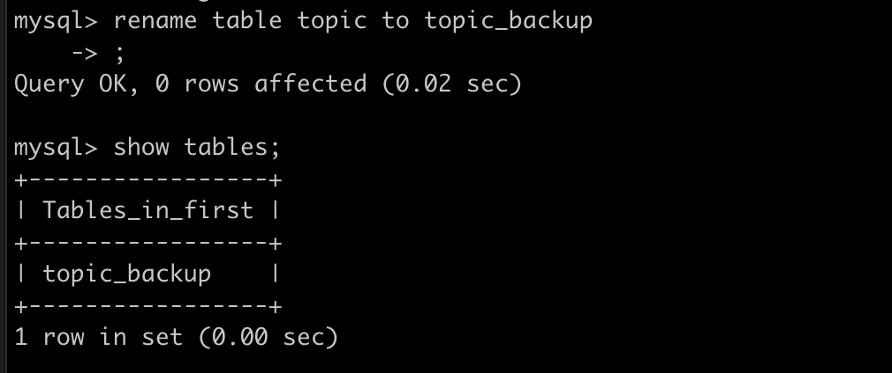
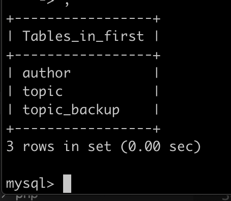
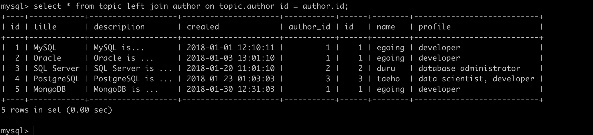
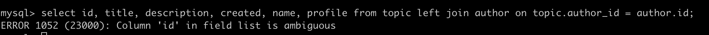
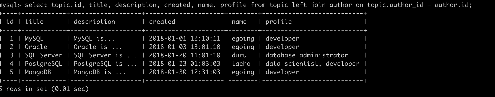
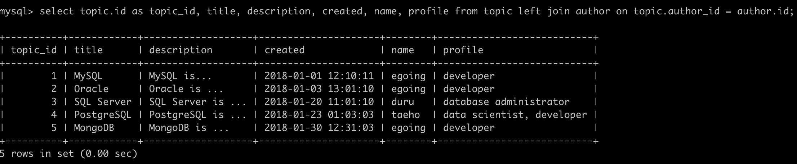
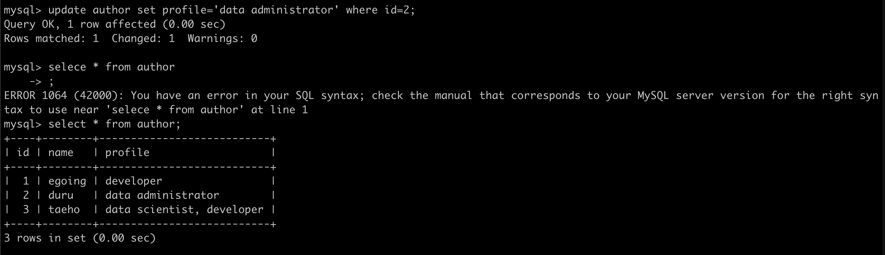
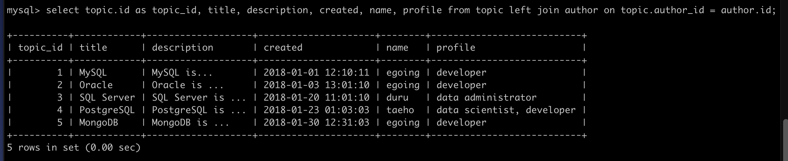

#Mentoring_Web #DBMS

이제부터 관계형 데이터베이스가 무엇인지 알아보도록 하자. 스프레드시트를 이용해 관계형 db의 필요성을 알아보자.

데이터가 중복해서 등장하는 경우가 있다. 데이터가 중복되고 있다는 사실 자체로도 개선할 사실 있다는 것을 보여준다 .행이 무수히 많아진다면, 중복적으로 사용되는 데이터의 양은 기하급수적으로 많아지고, 경제적, 기술적인 손해가 된다. 그리고 중복적으로 사용하는 데이터는 동시에 수정도 불가능하다. 용량이 크고 데이터가 많아진다면, 중복된 데이터가 “같은” 데이터라는 것을 확신할 수도 없다. 이러한 문제는 해결할 수 없다.

우리가 만든 데이터베이스에서 가장 큰 중복이 발생하는 것은 author부분과 profile 부분인데, 이를 조정해보도록 하자. 우선, author과 profile을 포함한 테이블을 새로 만들어야 한다. 그리고 id를 부여하고, topic 글에 중복되던 author와 profile을 id값 하나로 대체한다.

이렇게 바꾸게 되면, 게시글에 있는 작성자 id를 통해 작성자의 정보를 알게 되는데, id값 하나로 작성자와 자기소개 내용의 중복이 사라지게 되고, 같은 작성자의 내용을 수정하였을 때, 수정사항이 한번에 반영될 수 있다. 따라서 경제설이 늘어나고, 유지보수의 편의성이 증가하게 된다. 그리고 id값을 통해 같은 이름을 사용하지만 다른 사람을 구분할 수 있게 된다.

큰장점이 생겼지만 단점도 있다. 테이블을 분리하게 되면 하나의 표로 볼 때 있었던 하나의 표로 볼 수 있는 직관성이 떨어지게 된다.하지만, 관계형 데이터베이스에서는 하나의 표처럼 합쳐진 표처럼 볼 수 있게 된다.

지금까지 하나로 만들었던 테이블을 두개로 분할하자. 그리고 그 두가지를 합쳐서 보여주는 join이라는 기능을 사용해보자. 직접 하는건 사실 중요하지 않으니 그냥 코드 카피앤 페이스트 
해라. 근데 난 해볼거임 ㅋ.

우선 백업 테이블을 하나 만들자. 원래 있던 테이블의 이름을 바꿔둔다

뭐 특별한게 있을줄 알았는데 그냥 테이블 새로 만들고 데이터 넣는거라 그냥 복붙했다. 삶을 좀 편하게 살 필요도 있다.
핵심은 author를 author_id로 만드는 것이다. 그리고 author 테이블을 생성해서 연결해주는 것이다. 글을 담는 테이블에 작성자에 대한 정보가 존재하므로, 순서상 쓴 사람이 먼저 존재하고, 그 다음이 본문 테이블을 만드는 것이다. 
다음은 join을 이용해 관계형 db를 알아보자. join을 통해 분리된 테이블을 읽을때 하나의 테이블처럼 읽을 수 있도록 해준다. 

테이블과 테이블을 조인하기 위해서는, 어떤게 필요한지 생각해보자. 두개의 테이블이 결합하는데 있어서 결합꼴에 있어서는 author_id와 id가 같은 값이다. 따라서 mysql에게 author_id와 같은 값을 author의 id 테이블에서 붙여 사용하라고 하는 것이다.  따라서 author_id와 author의 id 값이 같을 것이다. 

author_id와 author 테이블의 id가 겹쳐지기 때문에 중복을 제거하기 위해 표시할 colomn을 표기했지만, 에러가 난 모습이다. 왜냐하면 선택한 colomn중 id값은 author와 topic에 모두 존재하기 때문에, 어떤 것을 선택해야 할지 mysql은 모르기 떄문이다,. 그러니까 이럴땐 테이블을 지정해주어야 한다. 

잘 나오는 모습이다.

이렇게 쓰면 topic의 id라는 사실이 조금 더 명확해진다.
정보기술에서 중복을 제거한다는 것은 정말 중요하고, 많은 기술들이 단지 중복을 제거하기 위해서 존재한다. 댓글을 저장할 테이블도 추가되는 등의 중복의 경우가 늘어날 떄, 이는 점점 더 큰 중복 제거 효과를 낳는다. 모든 테이블이 식별자 값을 포함하고 있다면 join을 통해 테이블을 연결할 수 있다.

author에 있는 데이터를 수정할 시 데이터를 읽어들일 때 모든 데이터에 수정값이 반영되는 모습이다. 하나를 바꾸면 전체를 바꿀수 있다.

관계형 db뿐만 아닌, join만 깊이 들어가도 날 샌다. 그정도 복잡성이 아닌 이정도에서 마무리하니 필요하면 구글신에게 물어보도록 하자. 

인터넷과 데이터베이스의 관계를 좀 알아보자. 정보의 바다인 인터넷 위에서 데이터베이스를 사용할 수 있게 되면, 굉장히 큰 파급력을 낼 수 있다. 얼버무리면서 지나갔던 database server로 돌아가자. server가 무슨 뜻인지는 알거다. 그전에 우선 인터넷 얘기를 좀 해보자.

인터넷이 작동하기 위해서는 최소 2대의 컴퓨터가 필요하다 .인터넷의 의미는 각자 흩어져 있는 컴퓨터들이 인터넷으로 연결되면서 컴퓨터간의 사회가 만들어진 것이다. 한대의 컴퓨터가 갖고 있는 한계를 초월하게 되었다는 의미이다. 한대의 컴퓨터는 정보를 다른 컴퓨터에게 요청, 다른 컴퓨터는 그 요청에 대해 정보를 응답하게 된다.

이런식으로 인터넷 위에서 동작하는 것은 정보를 요청하고, 응답하는 두개의 역할로 이루어진다. 정보를 요청하는 쪽을 client, 정보를 제공하는 측을 server라고 한다. 인터넷은 클라이언트가 데이터를 요청하고, 서버가 데이터를 응답하는 형식으로 이루어진다.

클라이언트와 서버 관계는 인터넷을 이해하는 핵심적인 열쇠라고 할 수 있다. 우리가 Mysql을 설치하면, 2개의 프로그램이 동시에 설치된다. 하나는 db client, 하나는 db server이다. server에는 실제로 데이터베이스가 저장되고, client를 통해 server에 점속할 수 있다. 지금까지 데이터베이스 서버처럼 다뤄왔던 것은 사실  클라이언트고, 직접 서버를 다룰수는 없다.

여러가지 클라이언트가 있는데, 그중에 mysql workbench를 쓰면 gui 환경에서 데이터 환경을 다룰 수 있는데 쓰지마라. Gui 쓰면 지옥간다. 데이터베이스 클라이언트라는 개념을 알기 위해서만 사용하고, 이를 통해서 개념에 대해 좀 더 자유로워지면 된다. 

우리의 목표는 이해하는것이 아닌, 익숙해지는 것이라고 할 수 있다. 그 익숙해짐을 위한 방법이 이해와 암기라고 할 수 있다. 가까이 하다보면 데이터베이스도 웹브라우저처럼 익숙해 질 수 있다.

mysql client에 대해 이야기 좀 해보자.  기본 client는 mysql monitor이다. mysql 서버가 설치될 때 같이 설치되서 어디서나 사용할 수 있고, gui가 아닌 텍스트 명령어를 통해 명령을 입력하는 프로그램이다.

많은 서버 컴퓨터들이 서버 자원을 일 자체에 투입하기 위해 gui 환경에서 실행하게 된다. 그러나 mysql moniiot은 큰 장점을 가지고 있지만, 명령어를 기억해야한다는 단점이 있긴 하다. 검색 엔진이 발달하면서 모든 것을 기억할 필요는 없어져 이 중요성도 없어지긴 했다.

gui와 cui 기반의 프로그램들은 각각의 장단점이 있기 때문에, 각각의 장점을 취합해 사용하는 것이 좋다는데 한 99.0423%의 확률로 cui를 사용하게 될 것이다.

workbench는 약간 교양강의 보는 느낌으로 보는게 좋을 것 같다. 이러한 gui 기반 클라이언트가 존재한다는 사실만 알고 있으면 될 것 같다. 근데 gui 기반의 클라이언트를 사용하더라도, sql에 대한 체계가 없다면 사용할 수 없다, 중요한 것은, mysql server가 있고, client가 분리되어있으며, 다양한 client를 사용할 수 있다는 것이다.

모든 웹 애플리케이션, 모든 앱과 모든 데이터 분석 시스템들은 본질적으로는 모두가 mysql client라고 할 수 있다.

또다시 강의가 끝났다. 두개의 선택지가 있다던데 지금까지 배운걸로 현실의 문제를 해결하는 선택지 따위는 나한테 애초부터 없었다. 더 많은 것들을 배워야한다. 사실 배우는것도 아닌, 지금까지 배워왔던 것들을 떠올리고, 정리하는 과정이라고 할 수 있겠다. 지금까지 배운것들만 해도 충분히 혁신적이지만, 나아가자.

리빙포인트) 성능상에 문제가 생긴다면 index라는 키워드를 찾아보자.

리빙포인트) 현실의 데이터는 다양한 면모가 있기 때문에, 어떻게 데이터를 효율적이고 잘 정리할 수 있을것인지에 대한 정규화등의 옵션들이 있다. 나중에 데이터들이 많아짐에 따라 테이블을 만들때 고민이 된다면 Modeling을 찾아보도록 하자.

리빙포인트) 백업하는 건 굉장히 중요하다. 백업의 기본적읹 정의는 데이터를 복제해 독립된 공간에 보관한다는 것이다. db에서 백업과 관련된게 생각이 날땐 mysqldump나 binary log에 대해 찾아보도록 하자.

리빙포인트) 클라우드라는 서비스가 있다. 남의 서버를 임대해서 사용하는 것을 클라우드 컴퓨팅이라고 할 수 있다. 원격 제어를 통해 다루게 되는데, mysql 자체를 서비스하는 경우도 있다. 필요할 때 켰다가 필요 없으면 끄면 된다. 그리고 엔지니어가 열심히 갈리고 있기 떄문에 사고날 확률도 적으니까, 현대 기술의 산물을 즐겨보도록 하자. 백업도 알아서 해줘서 개꿀이다.

리빙포인트) 현대에 db 자제를 사용하는 경우는 많지 않다. 수 많은 데이터가 데이터베이스를 기반으로 데이터를 다룰 것이다. 포르그래밍을 하며, 각자 사용하는 언어에서 mysql을 통해 데이터를 던져줄 수 있는 방법을 찾도록 하자.