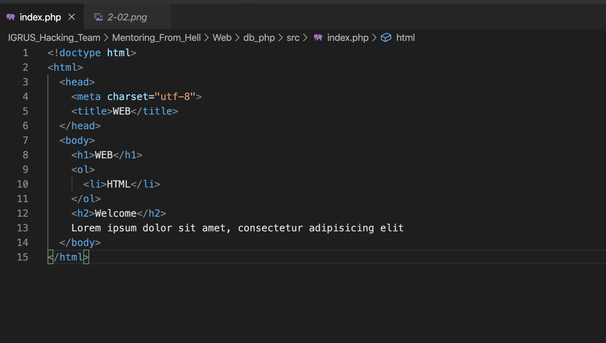
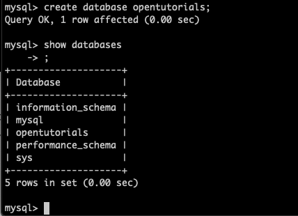
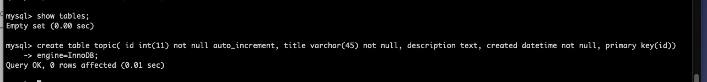
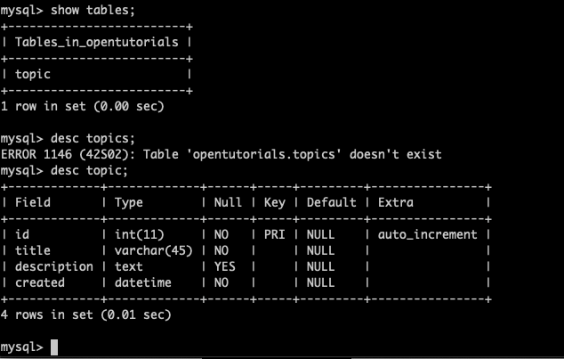
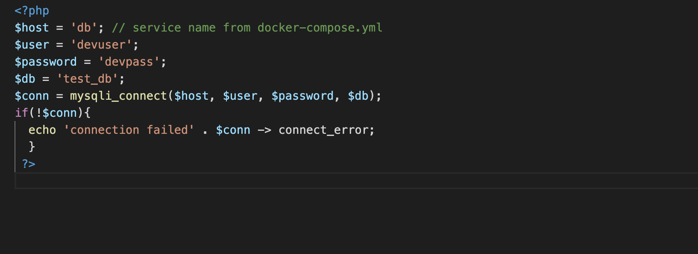
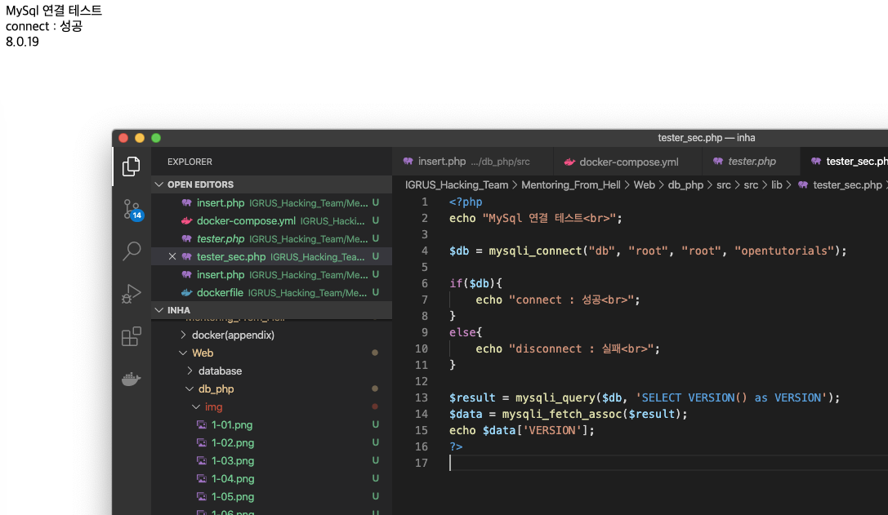
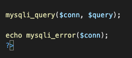
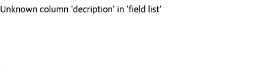
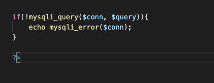
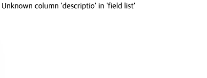

#Mentoring_Web #DB&PHP

PHP에서 우리는 문서를 파일로 만드는 방법을 배웠다. 이는 충분히 혁명적이었고, 생산성이 비약적으로 향상했지만, 우리는 이후 또다른 문제를 마주쳤을 수 있다. 파일이 더 많아졌을 때 등의 문제는 아직 있을 수 있고, 글쓴이의 이름, 작성시간 등을 저장하고 싶을 수도 있다.
PHP에서 받는 정보를 Mysql에 저장하면, 파일 시스템을 이용할 때 보다 더 혁명적인 체계를 얻을 수 있게 될 것이다.

우선 php와 mysql의 작동 원리를 좀 살펴보도록 하자. 원리가 아닌, php와 mysql이 어떤 상호 작용을 하는지가 지금 중요하다.

우선 사용자가 index.php라고 주소를 입력하면, 웹 브라우저는 그 웹서버에 요청을 하고, 웹 서버는 확장자가 php인 것을 확인하고 php라는 프로그램에게 이 처리를 넘긴다.  php는 이 파일에 사용된 php 문법에 따라 해석하고 동작하게 된다. 여기까진 그냥 php의 작동법이다.
차이점은, 이전에는 데이터를 파일에 저장했지만 지금부터는 mysql에 데이터를 저장할것이다. php는 주어진 함수를 통해 Mysql 서버에게 쿼리문을 던지고, 데이터를 응답 받으면 php는 이를 통해 html 코드를 완성해 웹 서버에게 넘기고, 웹 서버는 이 html을 웹 브라우저에게 넘긴다.
서버에는 웹 서버, php, mysql이 설치되어 있고, 3가지 소프트웨어는 각각의 장점을 공유하게 된다. 웹이 갖고 있는 접근성, db의 데이터 관리 효율성 두가지의 장점을 합친 웹 어플리케이션을 php를 통해 만들 수 있다는 것이다. php 는 웹이라는 부품과 db라는 부품을 결합하는 미들웨어라고 할 수 있다.
php는 쿼리를 mysql에 전달하고, mysql 로부터 정보를 받아 사용하게 된다. 이를 보면 php가 mysql서버에 대해 클라이언트처럼 보이게 된다.
데이터베이스에서 제거하면, 홈페이지에서도 사라지고, 홈페이지에서 제거하면 데이터베이스에서도 사라져야 한다. CRUD 모두 마찬가지로, 홈페이지에서 하는 동작과 데이터베이스의 동작이 같아야 한다.

또 세팅을 해야한다. 또 말안듣고 도커를 이용한다. 세팅기는 [여기서](https://github.com/timbergrizz/Mentoring_From_Hell/blob/master/docker(appendix)/docker_setting_for_board.md) 보고 오도록 하자. 새벽의 개삽질을 볼 수 있다.
기본 환경 구축만 해놓고 자자.  웹쪽과 db쪽 준비를 좀 해야한다.

그냥 주어진 코드 쓰면 된다. 저게 뭔지 모르면 넌 사람이 아니라 돌고래쯤 될거다.

도커님이 다행히 작동은 잘 해주신다.

그 다음은 mysql 세팅이다.  우리가 만드려는 웹 애플리케이션의 데이터베이스를 만들어야한다.

잘 만들어졌다.

이제 테이블을 만들 차례이다. id, title, description, created가 들어갈것이다. 각각의 데이터 타입과 primary key를 결정해라. id가 primary key로 결정되었고, 그러하다.
engine 을 설정하는 것은, mysql의 핵심적인 부분이 교체가능함을 보여준다.

셋업이 무슨 2시간씩 걸렸다. 이제 곧 해가 뜰것같다. 지금이라도 자야지.

이제 php와 mysql의 실제 연동 작업을 해보도록 하자.mysql 서버가 있다. 여기 db의 실제 데이터가 저장된다. 여기에 접근하기 위해서는 우리가 mysql monitor를 사용했다. Mysql server / monitor의 관계는 서버 - 클라이언트 관계이다.

세상에는 수많은 mysql 클라이언트가 있다. 그 중 하나가 php이다. php도 함수를 이용해 클라이언트로서 동작할 수 있다. Php도 sql을 통해 mysql으로 작업할 수 있다는 뜻이다. 이제 우리가 살펴볼 php는 mysql 서버의 클라이언트다 라는 것을 이해하도록 하자. 그래서 우리가 mysql을 다루기 위해 하는 것들을 php에서도 동일하기 적용해야 한다.

이제 php와 mysql을 연동하는 구체적인 방법을 좀 알아보자. php는 mysql에 접근하는 3개의 api를 제공한다. mysqli / pdo / mysql인데, php 공식 매뉴얼은 mysqli과 pdo를 추천한다고 한다.

pdo의 장단점을 알아보자. 이건 다른 관계형 Db를 사용할 떄 php 코드를 바꾸지 않고 db를 교체할 수 있다. 그러나 객체를 기반으로 한다.그래서 어려워서 지금 예시로는 mysqli를 쓸거다. 이것도 문제는 없지만 장기적으로 db가 교체될 가능성이 있다면 pdo를 사용하는것이 좋다

mysqli의 i는 improved이다. mysqli에는 두가지 방식의 인터페이스가 존재하는데 첫번째는 함수를 이용한 것, 두번째는 객체 지향이다. 아직 함수를 가르치지 않았다고 함수형을 쓴다고 한다. 객체지향이 뭔지 알면 객체가 더 권장된다.

지금부터 mysqli라는 api를 이용해 mysql을 제어해보자. Mysql monitor를 사용할때를 생각해보자. 실행하려면 명령어 mysql -uroot -p 를 입력하게 된다. 이를 통해 mysql은 root로 로그인하게 된다.
php도 동일하다. 우선 접속을 해야한다. mysqli_connect라는 함수를 쓴다. 이 함수의 구조는 모르지만, 이걸 호출하면 mysql 서버에 php가 접속될 것이다.
mysqli는 객체지향 방식으로 호출할때와 함수형 호출 방법이 다르다. 대괄호가 있으면 생략 가능하다. Host를 입력해야하는데, 지금은 서버컴퓨터와 php가 같은 컨테이너에 설치되어 있으므로 Localhost로 적으면 된다. 그 다음은 username과 password를 입력한다. 지금이야 실습이니까 비밀번호가 뭐든 상관 없는데, 실제 환경가서 이상한 비밀번호를 사용하면 직장이 이상해질 수 있으니 주의해야 한다. 비밀번호를 코드 내부에 위치시키는 것도 굉장히 위험하다. 이렇게 하지마라. 하지말라면 좀 하지마.
다음은 db의 네임을 적어야한다, 우리는 opentutorials라는 db를 사용하니 그걸로 접속하면 된다.

함수가 완성된 모습이다. 정말 접속이 되는지 확인해보자. 영상에서는 로그를 확인했는데, 우리는 설정을 안바꿔 확인할 수 없다. 접속을 하거나 쿼리를 할 때 로그에 기록이 남게되는데, 이는 기록에 남게 된다. 이런 저런 작업을 하면 우리 모르게 진행되는 쿼리들을 알 수 있다. 이때, 우리가 만든 php 코드로 접속을 하게 되면 mysql로 연결이 되는 것을 알 수 있다.
우리가 mysql monitor을 통해 접속하는 것과 php의 mysqli_connect 함수를 통해 접속한 것은 같은 역할을 한다는 것을 알 수 있다.
내부적으로 어떤 일이 일어나는지 궁금할 때 직접 Log를 통해 화면으로 출력하면 도움이 될 수 있다.
세팅이 꼬이고 꼬이고 꼬여서 그냥 예는 모둘화 시켜버렸다. 그냥 시작할때 끌어다 쓰는게 낫지. 어차피 나중에 모듈화 하겠지.

이 화면 보는데 반나절 꼬라박았다. 스트레스

접속을 했으니 이번에는 php를 통해 데이터를 한번 추가해보자. php를 이용해 mysql로 쿼리를 전달하려면, mysqli_query라는 함수를 사용하게 된다.  절차식 형식에선 link, query라는 인자를 받게 된다. link에는 mysql에 연결한 결과를 갖는 변수를 집어넣고, 두번째 인자에 sql문을 입력하면 된다. sql이 넘어가 작동하게 된다.

데이터가 잘 들어갔는지 확인해보는데, 연결은 되는데 쿼리 전달이 안된다. 나한테 왜 그러는지 모르겠다 . 이럴때 뭘 잘못했는지 알아보기 위해 error 명령어도 있다.
우리가 코딩을 하다보면 에러가 생기는데, 이제 이 문제에 가까이 다가가기 위한 방법들을 알아보자. 

첫번째는 우리가 웹사이트의 코드에 입력한 쿼리를 mysql monitor에 입력해보는 것이다. 쿼리문에 에러가 있다면 이걸로 찾을 수 있다. 이걸 내가 딱 30분만 일찍 들었으면 진작에 에러 찾고 넘어갔을건데. 일단 한국말은 좀 끝까지 듣자.

mysql monitor를 통해 에러를 알아낸 것 처럼, 코드상에서 에러를 발견하는 법도 있다. mysqli_error() 함수를 통해 연결된 Mysql에서 출력된 오류 값을 얻을 수 있다. 

의도적으로 아까와 동일한 오류를 일으켰고, 오류 메시지가 잘 출력되는 모습이다. 어떠한 에러가 발생했을때 에러에 대한 정보를 얻을 수 있다.

mysqli_query() 함수는 전달에 실패했을 때 false값을 반환한다. 이를 통해 에러가 발생했을 때 조건문을 통해 왜 에러가 발생했는지 출력하는 코드를 만들 수 있다. 정보를 읽는 등의 데이터를 사용할 땐 mysqli_result를 반환하고, 다른 경우에는 True가 반환된다.

정상적으로 작동하는 모습이다.  

개발 과정에서 에러를 echo로 출력하는건 괜찮지만, 이걸 절대 서비스할 때 출력하면 안된다. 이를 출력하는것은, 공격자에게는 중요한 정보가 될 수 있다. 예를 들면 테이블의 구조라던가, 테이블의 이름등을 가질 수 있다. 이를 통해 공격 방법을 생각할 수 있기 때문에, 내부의 정부를 외부로 절대 노출하지 않도록 한다. 파일을 저장하는 방법 등으로 사용하는 것이 좋다.

connection의 오류는 mysqli_connect_error()등의 함수로 에러를 찾아낼 수 있다.
