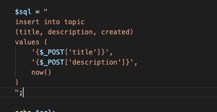
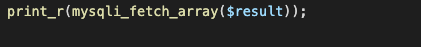

#Mentoring_Web #DB&PHP

지금까지 mysql과 php를 연결하는 api인 mysqli를 사용하는 법을 배웠다. 이를 통해 데이터를 Create하는 시스템을 구현해보자.
글 쓰기 기능으로 연결되는 기능부터 만들자. a태그를 이용하면 된다. 링크를 만들었으니 파일도 만든다. Php 공부할 때 만들었던 작성 프레임을 재활용하자. 어차피 과정만 파일에 저장하는 것에서 database에 저장하는것으로 바뀌므로, process 부분만 바뀔것이다.

method를 post로 설정하는 거 잊지 말자. 
이제 데이터를 생성하는 과정을 담당하는 create_process.php 파일을 만들 차례이다. 우선 post 방식으로 데이터가 잘 전달되는지 확인하자.

잘 된다. 이제 mysql에 접속해 데이터를 입력해 저장하는 것까지 해보자. 우선 연결은 바로 가져왔다.

sql문을 따로 변수로 작성했다. 이때 현재시간은 mysql의 시간과 맞춰주기 위해 NOW()로 설정한다. 사용자에게 날짜 입력을 받으면 문제가 발생할 수 있어 mysql의 시간을 사용해야 신뢰할 수 있다.

sql문까지 작성을 했으니 데이터베이스에 올리는 과정이 필요하다. 우선 연결과 연결 확인은 가져와서 신경 안써도 된다. 전달만 하면 된다. mysqli_query()로 전달을 하자. 
리빙포인트) root를 실 사용자로 이용하는건 굉장히 위험한 일이다. 공격당할때 위험해지므로, 필요한 권한만 있는 사용자를 만들어 사용해야 한다. 명령시엔 그게 실제 서비스 영역이 아닌지 항상 확인해라. 확인 안하고 날리면 인생이 날아갈 수 있다

쿼리문이 정상적으로 전달되어 db에 잘 저장된 모습이다. 
데이터가 정상적으로 저장되지 않았을 때 문제가 발생했다는 메시지를 띄우고, 오류 메시지를 파일로 저장해보자.

문제 발생시 에러메시지를 띄우는 조건문을 만든 모습이다. 어떤 에러가 있었는지는 apache의 로그에 저장된다.  나중에 필요하다면 찾아봐라. Php error_log로 찾을 수 있다.
절대로 사용자에게 에러 메시지를 보여주면 안된다.
mysqli라는 api를 이용해 데이터를 저장하는 것을 해보았다. 하지만 아직 부족한 부분들이 많다. 특히 sql을 직접 작성한다면 공격의 대상이 될 수 있다.
사용자가 입력하는 정보를 신뢰하지 마라. 순진하게 사용자가 입력한 정보를 모두 sql을 넣지 마라. 서비스에 사용할 땐 이 말을 명심하라.

CRUD에서 Create 다음은 뭐다? Read다. 이제 읽기를 알아보도록 하자. 글 목록이 나오고, 본문이 나오려면 그 데이터를 가져와야 한다.
sql문중 데이터를 읽는것과 관련된 것은 select문이다. 이번시간의 주인공은 따라서 select이다. 연결을 모듈화 해놔서 함수만 하나 쓰면 된다.
우선 샘플 데이터를 좀 만들자

만들어놨다. 이걸 이제 읽어와 보자. 이를 위해선 select문을 전송해야 하니 변수로 select문을 작성하자.
select문에서 가장 위험한 요소 중 하나는 모든 데이터를 가져오는 것이다. 데이터의 양이 많아지면 서버가 감당할 수 없어진다.
query를 생성했으니 이걸 전달하자.

우선 데이터를 가져오는 코드를 짰다.  근데 전달받은 데이터를 확인하니 객체이다. 객체에는 여러가지 정보가 있다. 이를 통해 여러가지 추정을 할 수 있다. topic탭에 행들이 담겨있지 않고 행들이 담겨 있다는 사실을 알 수 있다. 이제 mysqli_query 의 속성을 알아야 한다.
mysqli_query는 select문과 같이 읽기와 관련된 값은 mysqli_result라는 객체를 반환한다고 위에도 얘기 했다. 뭐가 중요한지 알아보자. 우선 결과의 개수가 나온다, 확인해보자

실행 결과 4개의 행이 존재했다는 의미있다. 행이 5개였으면 5가 찍혔을거다. 어따 쓰는지는 몰라도 나중에 쓸일이 있을거니까 단서 목록에 모아두도록 하자.

이제 가져온 데이터를 php에서 활용해보자. php와 데이터베이스는 완전히 다른 언어이기 때문에 db를 php에서 활용하기 위해선 php의 데이터 타입으로 전환하는 과정이 필요하다. 이를 위한 api가 mysqli_fetch_*류의 함수이다. 이 함수들은 php에서 사용 가능하도록 데이터를 가져온다. 
우리는 array가 익숙하니 이걸로 가져오자. mysqli_fetch_array 의 문법을 살펴보면, 인자로 아까 결과로 받은 result 객체를 인자로 갖는다. 여튼 이렇게 php에서 사용하도록 변환한 데이터를 print_r() 함수를 통해 한번 살펴보자. 

이 정보로 해석을 해보자.  mysqli_fetch_array() 함수를 사용하면 배열이 반환되고 / 실제 db에 저장되어 있는 데이터는 4건인데 첫번째 행의 데이터만 보여준다 / 값들이 두번씩 반복된다. 첫번째는 값의 자리수, 두번째는 colomn형이 나온다. 이를 통해 우리는 데이터를 선택적으로 가져갈 수 있다. 결과의 자리수나 colomn의 데이터 둘 중 하나를 이용해 데이터를 가져올 수 있다. colomn의 이름을 통해 가져오는 형식을 연관배열, 자릿수를 통해 가져오는 배열은 연관배열이라고 한다. 연관배열이 더 직관적이므로 좋다.

이런 식으로 배열을 통해 db의 하나의 행을 가져와 웹브라우저의 출력할 수 있게 할 수 있다. 하나의 행을 가져올땐 이렇다. 그렇다면 행이 여러개일땐 어떻게 해야할까?

이제 여러개의 로우를 가져오는 방법을 알아보자. mysql_fetch_array()의 또다른 특성은,  실행할 때 마다 result가 가리키는 쿼리문의 결과를 하나씩 배열로 return한다.

실행할때마다 행이 아래로 내려가는 모습이다. 더이상 출력할 데이터가 없으면 null을 반환한다.
이러한 경험을 종합해 추론을 할 수 있다. 이러한 mysql_fetch_array()함수는 한번 실행할 때 마다 한행씩 출력하고, 더이상 출력할 데이터가 없으면 null값을 출력한다는 것이다. 매뉴얼을 보고 확인을 할 수 있다.

만약 데이터를 삭제해 더이상 호출할 수 없는 코드가 존재하거나, 추가했음에도 자동으로 추가되지 않을 수 있다. 데이터가 바뀌었다고 로직이 바뀌는 것은 프로그래머에게 수치이다. 그러므로 우리는 반복문을 통해 이 문제들을 해결할 수 있다. while문에 대한 설명을 좀 들어보자

php는 while문을 만나면 우선 조건문을 실행시킨다. 조건문이 참인 경우 주어진 코드를 순차적으로 실행시키고, 더이상 실행시킬 수 없으면 다시 조건문을 실행시킨다.
대입 연산자는 오른쪽 값을 왼쪽에 대입하면서 대입연산자의 양항 전체를 우항의 값으로 바꾸어준다. 
php에서는 false == NULL이다.  이렇게 우리가 하려는 부품들을 모두 모았다. 이제 반복문으로 중복을 제거하고 데이터를 변화시켜도 하나의 로직으로 작동하도록 만들어보자.

조건문도 "실행"시킨다는 사실을 기억하자. mysqli_fetch_array()는 데이터의 값을 가져와 변수 result_arr에 담는다. 이 식 전체는 그 값 자체가 될것이다. php에서는 어떠한 값이 거짓이거나 null이 아니면 모두 참으로 간주한다. 따라서 조건문이 “실행”되고, 명령어들이 실행되고, 명령어들의 실행이 끝나면 다시 조건문이 “실행”되게 된다. 더이상 출력할 값이 없어지면 null이 나오고, null운 false로 간주되기 때문에 조건문이 false로 결정되며 반복문이 종료된다.

정말 설명 잘해주셨다. 이쯤되면 메모장 아이콘에 그려진 곰도 알아먹고 깃허브 데스크탑 아이콘에 있는 고양이도 알아먹을거다.

이제 배운것들을 써먹어보자. 우리의 결과물에 이를 반영해 데이터베이스의 내용을 반영한 결과를 합성해보자. 우선 글 목록부터 처리해보자.

지금까지 만든 데이터들을 재활용해 만들면 된다. 

코드를 만들 때, php는 php끼리, html은 html끼리 모아주는 것이 좋다. 그렇게 하면 코드의 가독성이 조금 더 늘어난다.
그리고 이제 링크를 걸어야 한다. 

목록 텍스트를 작성하는 부분을 수정해 링크가 걸리도록 작성한 모습이다. 끝부분은 공간이 부족해 생략. id도 잘 구현되고 있는 모습이다.
수면 패턴이 개아작나면서 지금 정신을 제대로 못차리고 있는데,열심히 하자.

이제 게시판의 글을 읽도록 만들어주면 된다. 우선 또 query를 던지고, 리턴받고, 받은 리턴을 배열로 바꾸는 행위를 하면 된다. 그리고 제목과 본문을 잘 표시해주면 된다. 

리빙포인트) id를 통해 데이터를 가져오는데, 초기화면애는 id가 존재하지 않고, 따라서 오류가 난다. 그러니까 조건문을 통해 id가 존재할때만 query를 통해 질문하도록 해야한다. 조건문에서 조건을 isset으로 줄 수 있는데, 어차피 메인 페이지에 id 자체가 존재하지 않아 null값이 소환되기 때문에 그냥 id로 넘겨도 된다. 
그리고 제발 강의 끝까지 좀 들어라. 시간이 남아나는거면 몰라 지금 시간 타이트한데 왜 니가 트러블슈팅을 하고 있어 좀
그리고 조건문의 else로 초기페이지의 값을 설명해도 좋지만, 미리 기본값으로 초기 페이지의 값을 설정하고 설정하는것이 더 좋다.

여하튼 코드가 완성되었다. 의도한 일들은 모두 정상적으로 작동하는 모습이다.

또, 새로운 글을 작성하면 자동으로 목록에 추가 되는 모습이다.

굴울 샹송허눈 컨에도 목록과 인덱스로 가는 링크를 적용해주자.