#Mentoring_Web #DB&PHP

보안과 관련된 이야기로 시작해보자. html을 그냥 웹 서버에 올리면 보안 이슈는 거의 없다. 그냥 일방적인 정보 전달 그 이상도 이하도 아니기 때문이다.  그런데, 사용자로부터 정보를 받는 순간부터 문제가 발생한다.
사용자로부터 받은 정보는 오염됐을 가능성도 있고, 그때부터 보안이란 이슈가 중요하게 대두되었고 db와 연결되어 발생하는 이슈들이 생긴다.

보안과 관련된 문제는 크게 두가지로 갈린다. 첫번째는 들어오는 정보에서 문제가 되는 정보를 막아내는 것, 하나는 저장된 정보중 노출되면 위험한 정보가 사용자에게 노출되지 않도록 하는것이다. 사용자에게 입/출력하는 과정에서 모두 보안적 이슈가 존재한다.
입력에서 문제가 되는 데이터를 차단하는 것을 필터링 / 저장되어있는 정보를 사용자에게 표시할 때 발생할 수 있는 문제를 차단하는 것을 이스케이핑이라고 한다.
이번 주제는 어떤 공격 방법이 있는가도 중요하지만, 공격 방법들에서 어떠한 패턴이 사용되는지를 알아야 한다. 어떠한 패턴들에 대한 조치를 해두면, 거의 대부분의 공격을 막을 수 있다.
보안에 관련된 습관들만 챙겨둔다면 발생할 수 있는 문제의 상당한 부분을 막을 수 있다. 이번시간에는 중요한 이야기들을 해보자.
보안의 첫 원칙은 사용자가 입력하는 정보를 철저히 불신하는것이다. 어떻게 불신하느냐가 문제이다. 그 불신의 기술을 살펴보자.

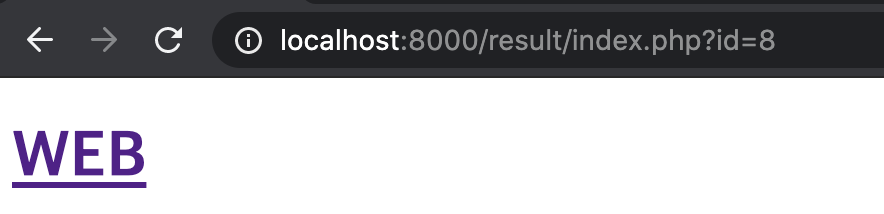

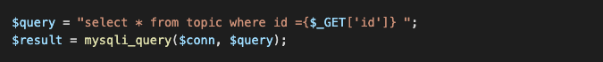

첫번째로 주소의 parameter값이다. 이 주소는 사용자에 의해 임의의 값이 들어갈 수 있다. 파라미터를 통해 sql문을 입력하게 되면, 이 주소의 파라미터는 query로 메시지를 전달하게 되고, 의도하지 않은 동작을 일으킬 수 있다. 불신하자.

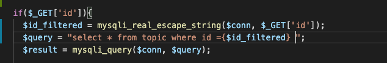

공격의 원리는 나중에 생각하고, 문제가 안생기는 방법을 찾자. Mysqli api중 real_escape_string()이라는 명령어가 있다. 이는 sql injection 공격에서 문제가 될 수 있는 특수 문자들을 그냥 문자로 바꿔버리는 역할을 한다. 이 방법을 통해 sql injection 공격을 막을 수 있다.

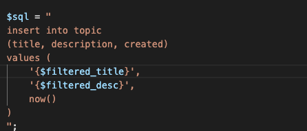

글을 입력받는 과정에서 제목과 내용을 통해서도 injection 공격이 들어올 수 있다, 동일한 방법으로 사용자의 데이터를 직접 받고 있는 create_process 파일에서 특수 문자 입력을 막으면 된다. 이름에 굳이 filtered_등의 표현을 사용하는 것은 변수의 정체를 인지하기 편하기 때문이다.

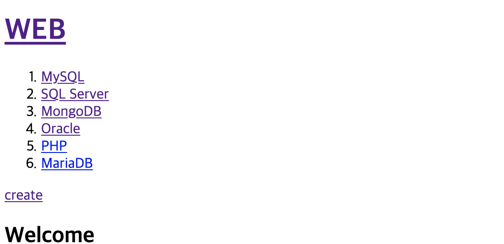

수정 이후에도 정상적으로 작동하는 모습이다.

이제 sql injection의 작동 원리를 좀 알아보도록 하자. 공격 방법을 알아야 효율적인 방어 방법도 알 수 있다.

Sql injection애 주로 사용되는 기호들이 있다. 우선 주석이 있다. — select * from topic;이라고 하면 아무 일도 일어나지 않는다. —을 앞에 붙이면 뒷 행의 명령어는 비활성화 된다.
중요한 정보가 저장되어 있는 db가 있다고 생각해보자. 이때 주석을 통해 데이터에서 유출되면 안되는 중요한 데이터를 제외하고 선별적으로 뽑으려는 옵션을 무시하게 되면 중요한 데이터를 유출할 수 있게 된다. 그리고 우리는 데이터를 입력할 때 자동으로 입력하게 한 값을 이러한 공격을 통해 임의의 값으로 바꿀 수 있다.
mysqli_multi_query()는 복수의 쿼리문을 실행 시킨다. 하지만 sql injection등의 보안적 문제가 존재한다. 이때, real_escape_string()명령을 통해 특수문자가 모두 무시되면, 주석등의 옵션을 사용할 수 없게 되어 보안적으로 안전해진다고 할 수 있다.
real_escape_string()는, 사용 가능한 특수 문자를 escape문으로 만들어서, 기능이 없이 그냥 문자 자체로 남게 한다. 이는 공격의 의도가 있던 코드가 그대로 DB 본문 안으로 흘러들어가게 한다. 타입으로 지울수도 있다고 한다.
root 계정은 모든 sql 게정의 비밀번호를 조회할 수 있다. 그리고 새로운 유저를 만들 수 있다. Sql injection을 통해 공격자가 user를 생성하고, 거기에 관리자급의 권한을 줄 수도 있다. Sql 서버는 운영체제에도 명령을 내릴 수 있기 때문에 굉장히 큰 문제가 생길 수 있다. 
사용자가 입력하는 모든 정보를 불신해라. 다 불신해라. 끊임없이 이러한 문제를 방어하는 방법을 찾아 자신의 시스템을 지켜야 한다.

이제 escaping을 한번 해보자. xss를 막는 것이 목적이다. Xss 뭔지 모르면 넌 사람새끼가 아니다.  Xss는 웹페이지에 js 코드를 주입해 의도치 않은 동작을 하게 할 수 있다. 심각한 경우는 쿠키 등을 훔칠수도 있고, 다른 사람의 정보를 유출할 수도 있다. 자세한건 php 문서를 참고하자.
script 태그를 만드는 것이 문제라면 태그를 못 만들게 하면 된다. php에는 태그를 만드는 괄호들을 변환하는 함수인 htmlspecialchars()가 있다. 이제 애플리케이션에 적용해보자. 사용자에게 입력받은 정보는 모두 이 작업을 해주어야 한다.

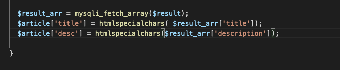

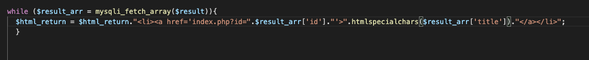

입력 받은 데이터중 사용자들에게 출력 될 만한 부분을 모두 오엽된 정보가 유출되지 않게 처리를 해준 모습이다.

모든 정보 시스템은 입력/저장/출력이 있을 수 있다. 이때 이것에 대한 공격의 의도를 차단하는 방법을 생각해보자.

어떤 정보 시스템이든 CRUD로 이루어져 있다고 한다. 이제 CR을 했으니 UD를 해보자.
우선 수정 버튼을 만들고 수정 페이지를 만들자.

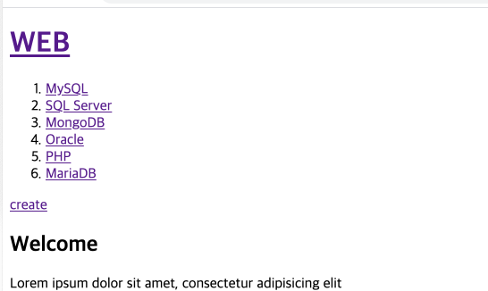

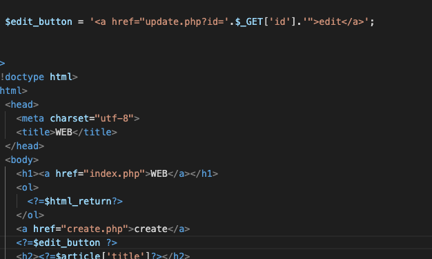

수정 버튼은 get 방식을 통해 parameter도 넘겨줘야 하고, 초기 페이지에서 표시 되면 안된다. id가 없을땐 수정 버튼은 비활성화되어야 한다. 여튼 잘 만들어진 모습이다.

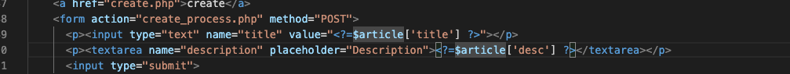

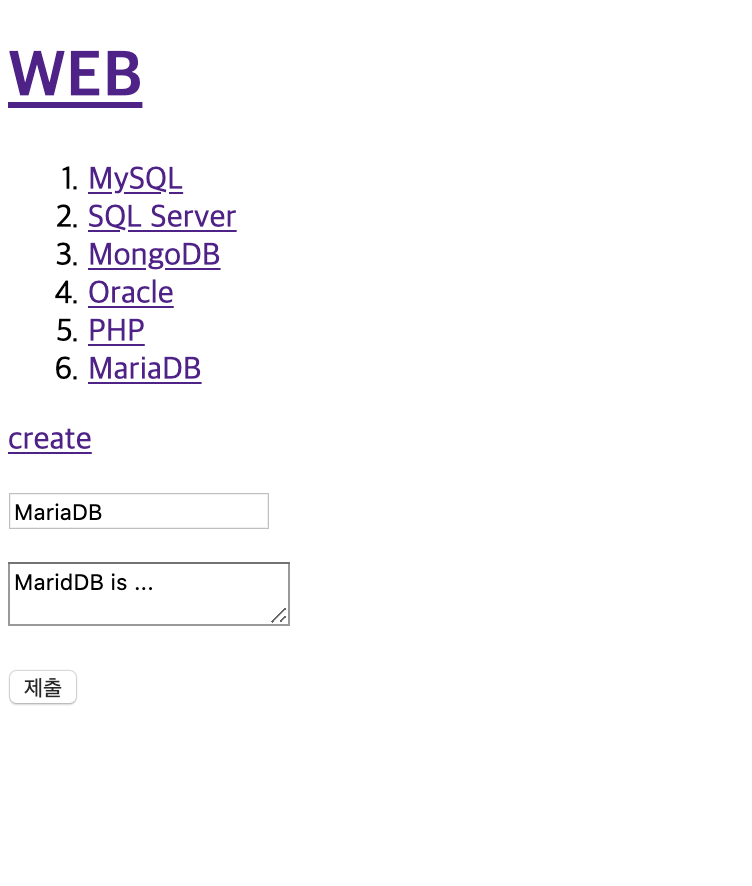

update.php를 만들자. create.php와 비슷하기 떄문에 또 우려먹도록 한다. create에는 특정 글에 대한 정보가 필요 앖고, edit에는 특정 글에 대한 정보가 필요하다. 글의 제목과 내용은 article이라는 배열에 담겨 있다. 제목과 내용에 이 내용들을 기본값으로 들어가도록 하자.

이제 submit을 눌렀을 때 어떤 작업을 하는지 생각해보지. submit을 눌렀을 때 우선 update를 처리하는 php 문서로 전달되어야 한다. update를 위해서는 문서의 정보에 대해 알아야 하므로 , form에서 hidden 형식으로 id 값도 전달을 해야한다.

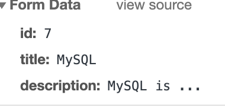

id도 잘 전달되고 있는 모습이다. 이제 update_process 파일을 만들자. 필터링을 할때, 필터링을 거치고 나서도 id값은 항상 정수여야 하므로, settype 함수를 통해 이를 설정해 줄 수 있다. 

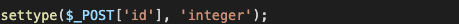

사실 정수화 시키고 나면 real_escape_string은 의미가 없지만, 여러번 한다고 손해볼건 없으니 그냥 쓰자

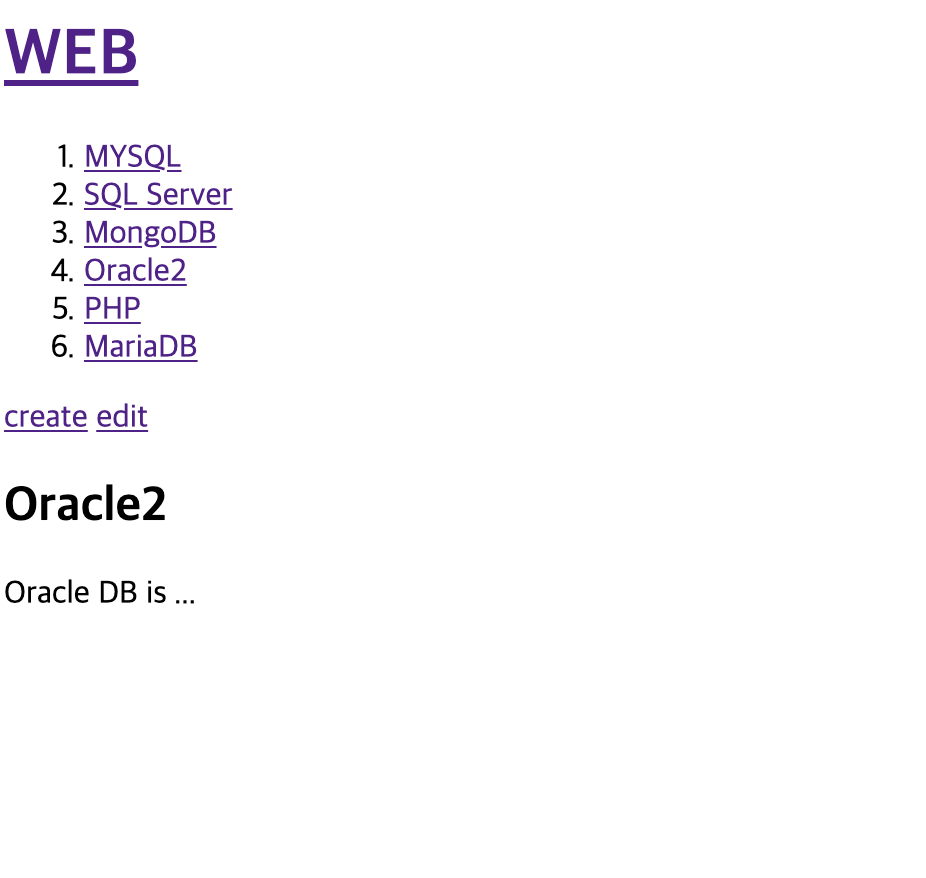

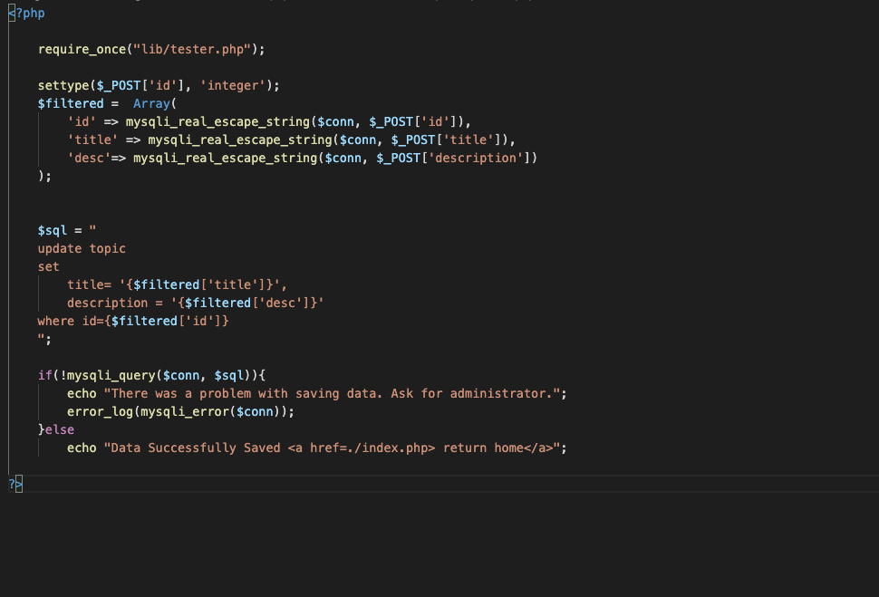

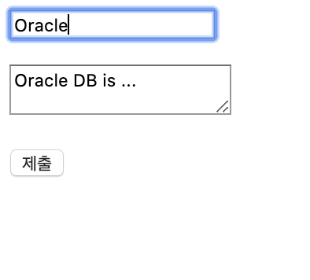

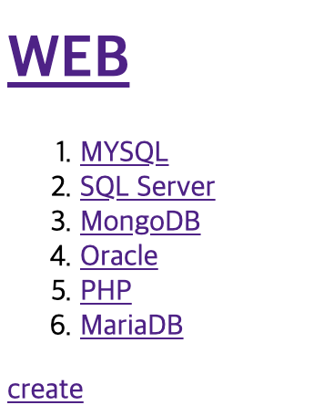

어쨌거나 정상적으로 업데이트가 잘 되는 모습이다.
이제 CRUD의 마지막인 Delete, 글을 삭제해보자, 삭제를 구현하기 위해서는 우선 삭제 버튼이 필요하고, 삭제 버튼은 update처럼 특정 글이 선택되었을 때만 사용 가능해야 한다. 그리고 삭제에는 따로 페이지가 필요하지 않다
제목 / 글 수정이나 작성을 할때 데이터가 post 방식으로 전송된다. 근데 이 페이지로 가는 길은 url parameter를 이용하는 get 방식이다. 실제 데이터를 변경하는 작업에서 데이터를 전송하면 무조건 post 방식으로 은밀하게 전송해야 한다.  Get 방식으로 삭제 링크를 전달하게 되면 굉장히 위험해 질 수 있다. 

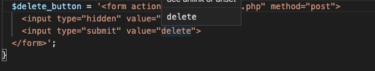

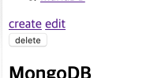

post 방식으로 전달하기 위해 form 태그를 이용해 delete 기능을 만든 모습이다. 디자인이 조금 달라도 신경 쓸 필요 없다. 어차피 저런건 css로 수정 가능하다.
process파일은 굉장히 간단하다. 그냥 id를 받아와 sql르 쿼리만 날려주면 된다.

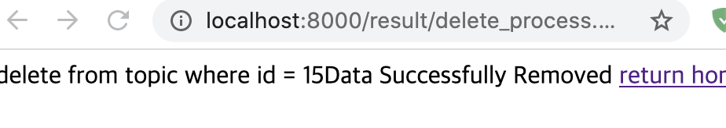

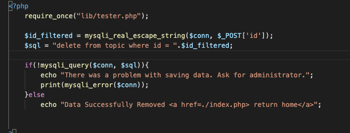

정상적으로 작동하는 모습이다 이제 crud가 모두 작동하는 모습이다. db를 사용하여 이 작업을 처리하면서 안전해지고, 성능이 좋아지고, 여튼 좋은건 다 된다.