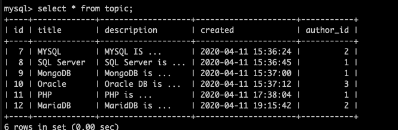
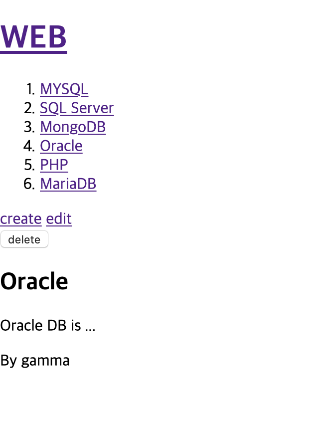

#Mentoring_Web #DB&PHP

이제 관계형 데이터베이스를 도입해보자.지금까지는 db에 대해만 집중해서 수업을 진행했다. DB는 CRUD라고 하는 4가지 데이터 기능을 가진 솔루션이라고 할 수 있다. 관계형 DB는 우리가 아직 살펴보지 않았다. 지금까지 배웠던 것만으로도 충분하지만, 본질을 넘어서 혁신으로 다가가보자.

관계형 의미는 DBMS 필기에 열심히 써놨으니 나중에 심심하면 그거 봐라. 거의 똑같은 이기를 한다. 본문과 작성자의 테이블을 분리하고, 본문에 작성자의 id를 저장하고 분리된 두개의 테이블을 연결해 하나의 테이블처럼 볼 수 있도록 하는 것이다. Left join 쓰고 on으로 본문 테이블의 author_id 열과 작성자 테이블의 id 값이 같다는걸 부여하면 된다.

이렇게 만들어진 DBMS를 백엔드로 해서 앞단은 어떻게 보여지게 되는지가 달라지는 지점이다. 이제 글에 저자에 대한 표시가 되고, 저자의 목록이 담긴 페이지가 존재한다.  글을 작성하게 되면 예전과는 다르게 저자를 선택할 수 있고, 글을 생성하면 저자가 기록되는 모습을 볼 수 있다. 저자 이름을 수정하면, 수정된 저자가 작성한 글의 이름이 모두 바뀐다

혁신을 도입하면 애플리케이션의 복잡성이 기하급수적으로 증가하게 된다. 그러하다.

데이터베이스부터 좀 살펴보자. 저자의 id를 추가해보자. 저자 이름을 본문 테이블에 그대로 넣을수도 있지만, 이때 중복이 발생하게 된다. 그리고 동일한 데이터를 수정하는 것도 블편해지게 된다.

우선 저자의 테이블을 만들고 샘플 데이터를 좀 넣자. 그리고 본문에  author_id 열을 추가하자. 이를 위해서는 기존 테이블의 구조를 바꿔야하는데, alter table 명령을 사용한다 적당히 author id까지 지정좀 해주자.

추가된 id로 join까지 해본 모습이다.

현재 우리에겐 저자, 글 2개의 테이블이 있다. 따라서 애플리케이션 차원의 변화도 있어야 한다. 이제 author 테이블의 이름도 글 밑에다 적어줄거다.

작성자를 표시하도록 수정한 모습이다. 우선 join을 통해 본문과 작성자 테이블을 묶어서 import했고, 이를 통해 작성자 이름도 출력했다.

파라미터에 id가 없을때, 즉 디폴트 페이지에서는 안뜨도록 조금 수정했다

토픽과 author를 합성하는 방법을 만들었고, 이제 글을 만들때 작성자를 표현하는 식도 작성해보자. 우선 create 페이지에 저자 정보를 표현해야 한다. 그러기 위해선 우선 사용자가 어떤 저자가 작성한 글인지 선택할 수 있도록 해야한다.

정상적으로 작동하는 모습이다. 

데이터를 process로 넘길 때 author.id를 같이 넘기기 위해 value를 같이 넣어준 모습이다. 하지만 process_create에서 받은 정보를 처리하지 않았기 때문에, 이를 처리하도록 설계를 해주어야 한다.

리빙포인트) select에도 name 지정해주어야 한다.

어쨌든 create_process에서도 sql문을 통해 글 작성시 author_id가 전달되도록 해주었다. sql문에서 정상 작동하니까 아마 문제 없을것이다. 없어야한다. 이번주에 버그 픽스잇은 좀 그만하고싶다.

다행히 정상작동 하는 모습이다.여튼 지금까지 두개의 테이블을 연관시키는 방법이었다
관계형을 배워도 다시 CRUD로 돌아가게 된다. 이제부터 다시 CRUD라는 뜻이다.

table과 table 사이에는 table의 식별자를 매개로 연결해준다는 것을 이해해야한다. 그리고 글을 읽어올 때 sql문을 출력해보면 식별자를 매개로 마치 하나의 테이블처럼 볼 수 있다는 것이다.
이제 일을 수습해보자. 저자를 관리하는 페이지를 만들자.

우선 저자의 목록을 표현하는 페이지를 만들자. index에 저자 관리로 넘어가는 링크부터 만들자.

또다시 index.php를 재활용해보자. table은 뭔지 아셔야 해요. 모르면 너만 모르는거야. 여튼 table태그를 통해 목록을 출력하는 것은 성공했다. 

filtering까지 해준 모습이다. 
이제 저자 테이블에 열을 추가하는 법을 알아보자. 같은 페이지에서 처리하는 법을 알아보자. 

우선 폼을 만들었다. 이제 실제 작동하는 php를 만들어야 한다. 

create_process를 재활용한 모습이다. 용도가 유사하면 로직이 비슷하고, 로직이 비슷하면, 비슷한 로직을 변형해 코드를 완성시킬 수 있다. 이를 모듈화하는게 중요하겠지만 여튼 정상작동한다

리빙포인트) header 함수는 거지같다.
이제 CR을 했으니 UD를 해보자. 우선 UD부터 하자

수정을 같은 페이지 안에서 해주고 싶다. 따라서 author.php를 조금 수정했다. 우선 update 버튼을 누르면 author 페이지로 id값을 전송하게 했고, 조건문으로 id값이 있으면 저자 수정을, 없으면 새로 만들기를 하도록 하였다. 

이제 작동하는 과정을 만들어보자. 코드가 계속 쌓이다 보니까 비슷한 기능의 코드를 통해 순식간에 재활용해 만들 수 있다.

이제 삭제를 구현해보자. 저자를 표현하는 테이블의 form을 통해 delete 버튼을 추가하고, 링크를 걸자. 왜 이런식으로 하는지 모르면 문제가 있다

코드는 역시 재활용이다. delete_process 파일에서 거의 제거하는 테이블만 바꾸면 된다.

정상적으로 작동한다. 드디어 끝났다. 인줄 알았는데 삭제 이전 확인 과정은 하나 만들면 좋으니까 하나 만들어보자.
js 쓰랜다.

onsubmit 속성을 사용하면 submit으로 작성했을 때, js 코드가 실행되게 했다. 

삭제 이전 물어보고, 확인하지 않으면 삭제되지 않는 모습이다. 그러하다. 
저자를 삭제할 때, 저자가 작성한 글을 모두 삭제하개 제작할 수도 있다. 

이런식으로 author_id를 통해 작성자의 모든 게시글을 제거할 수 있다. 이러한 삭제 문법을 사용할땐, 절대 사용자의 입력을 믿지 마라. DB를 배우다 보면 trigger라는 기능이 있다 이를 통해서 특정행이 삭제되면 연관된 행이 자동으로 삭제되도록 할 수 있다.

또 끝났다. 얘기를 좀 해보자. 너무 공부만 하지말고, 여러가지 방법으로 써먹어 보면 좋지만, 그래서 로그인 기능이 탑재된 게시판 만들어오라는 과제가 왔다. ㅋㅋㅋㅋㅋ
지금까지 배운 것들로 여러가지 해본 뒤, 무언가가 더 필요해질 때 더 새로운것을 해야한다. 그때까지 새로운 것을 공부하기 보다 지금까지 배운것들로 무언가를 만들어 보아라,

db로 검색 기능을 구현하고 싶을 것이다. form으로 만들 수 있고, 성능이 부족하게 된다면 색인에 대해 한번 찾아보도록 하자. 색인은 언제든지 걸 수 있다.
mysqli라는 api를 지금까지 사용했지만, 다른 DBMS를 사용하려면 모두 바꿔야 하므로 다양한 DBMS를 사용해야 한다면 PDO를 고려해보도록 하자.그 외에 여러가지 라이브러리가 있다.
DBMS를 안전하게 저장하는 것이 중요하다. 클라우드 컴퓨팅을 제공하는 대기업들이 있는데, 이러한 DBMS는 편리한 점들이 많고, 비용을 절감할 수 있고, 운영상에 유리한 점들이 많다.

중요한 것은 우리의 마음의 소리를 묵살하지 않는것. 불편한 것이 있다면 이것을 무시하지 말고 이 불만은 해결하는 방법을 찾아야 한다.