#Mentoring_Web #PHP

2-1~2-6

1990년 웹이 처음 등장하면서 웹페이지로 정보를 표현하고 전달할 수 있게 되었고, 이에 따라 혁명이 일어났다. 웹이 등장하고 처음엔 html으로 충분했지만, 이를 수동으로 만들고 따로 관리해야 하는 문제가 있었고, 컨텐츠를 웹사이트 관리자만 만들 수 있다는 문제가 있었고, 이러한 문제들을 해결하기 위한 백엔드 기술들이 발달하기 시작했다. 
1995년 PHP가 등장한다. 이는 웹페이지를 자동으로 생성하게 해준다. 컨텐츠를 만들어 php에게 넘기면 php는 이를 자동으로 html으로 자동으로 만들어준다. 

이 수업이 중요한 이유는 이 수업 이후로 나오는 것을 공부할 필요가 있는지 판단의 기준이 될 것이기 때문이다. 

우리가 마주할 수 있는 문제에 대해 알아보자. 우리가 html에서 만든 4개의 웹 페이지로 이어진 웹 페이지에 리스트는 3개이다. 이 리스트를 충분히 많은 수라고 생각해보자. 이 상황에서 하나의 리스트를 추가한다고 하면, 기존에 있던 모든 페이지의 리스트에 새로운 페이지를 추가해야 할 것이다.

웹사이트의 규모가 커질 수록 복잡성, 생산성의 한계를 직면하게 된다.  이러한 상황에서 백엔드 기술이 적용된다면 행복해질 것이다.
php 코드가 적용되어도, 웹 사이트에 변화는 없다. 하지만, 웹사이트가 구동되는 과정에서 큰 차이가 발생하게 된다. 
3개의 페이지를 1개의 파일료 표시하고 있다. 그리고 id 값에 따라 웹 페이지가 달라지게  된다. 이것이 php가 하는 역할이다.  이렇게 1억개의 웹페이지도 한번에 관리할 수 있게 된다. 
새로운 페이지를 만들고 싶다면 데이터 폴더에 파일만 추가하면 바로 모든 웹페이지에 반영이 된다. 이러한 기술은 규모가 큰 웹페이지에 컨텐츠를 추가하는 것이 굉장히 간단한 일이 된다. 

맥에는 php도 깔려있다. 아파치 서비스만 활성화 해주면 된다
php는 단독적으로 실행되는 프로그램이 아 아파치라는 시스템의 확장 기능으로 사용되는 기능으로, 아파치를 활성화하면 php도 활성화 된다.
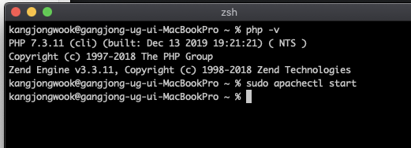

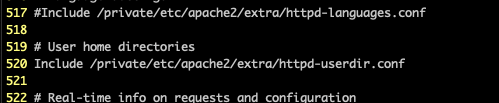

웬만하면 시키는 대로 하자. 삶이 귀찮아진다.
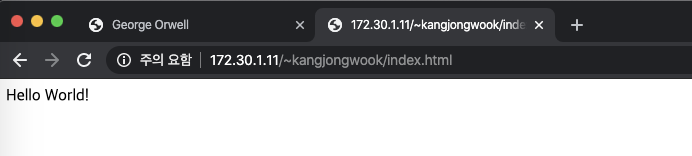
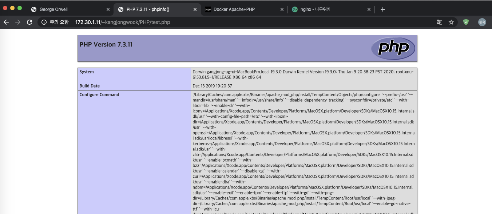

docker를 세팅해보려다가 일단은 포기한다. 더 했다가는 삶이 귀찮아진다.

php를 동작하는 방법을 바꾸는 법
에러 출력 활성화 (에러메시지에 시스템에 관련된 정보가 다수 포함되어 있으므로 실제 서비스때는 끄기)
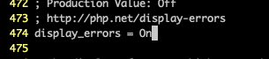

파일을 수정하다 보면 리로드를 해도 반영이 안되는 경우가 있다.
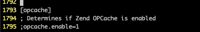
opcache는 php의 성능을 높이는 기분, 활성화되어있으면 빠르고 리소스를 덜 잡아먹을 수 있다. 실 서버에서는 설정을 활성화하는게 좋다. 앞에 세미콜론이 써있다 -> 작동 안한다는 뜻이다.
로그 파일은 나중에 찾아야겠다 
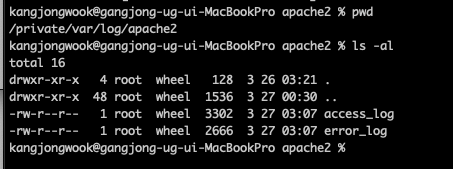
구글에 검색하면 다 나온다. 꾀 부리지 말것.

php란 무엇인가?
웹 브라우저가 주소창에  index.html을 요청하면, 웹 서버에서 주소를 보고 웹 서버가 직접 처리해 서버 컴퓨터에 설치되어있는 htdocs라는 디렉토리에서 html을 보내준다.
만약 index.php를 요청한다면, 웹 서버는 직접 처리하지 않고 확장자가 php인 파일을 PHP라는 프로그램에게 위임하고, php는 htdocs라는 디렉토리의 index.php 파일을 해석해서 php 언어의 문법에 따라 해석해 html파일을 찍어낸다. 그렇게 만들어진 html 파일을 웹 서버가 웹 브라우저에게 전송하고, 이를 웹 브라우저가 해석하면서 통신이 끝난다.

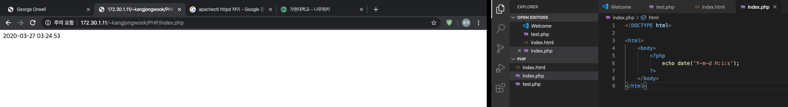
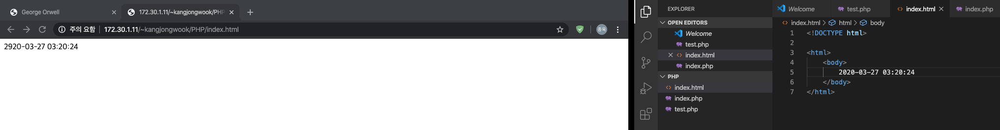
html의 경우 브라우저에서 받아온 파일과 서버에 존재하는 웹 서버 파일이 정확히 같다.

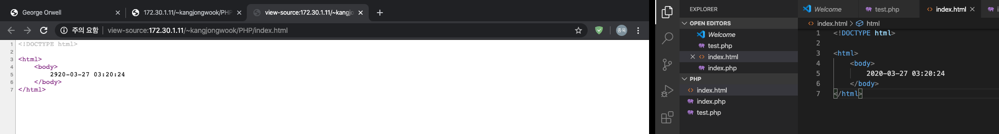
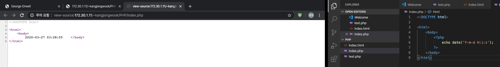
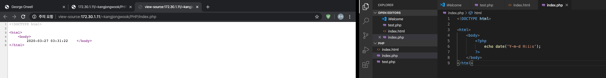

받아온 소스코드와 서버에 존재하는 파일은 다르고, 리로드 할 때 마다 코드가 “동적으로 “ 바뀌게 된다.
php 파일에 적힌 코드는, 현재 시간을 출력하라는 코드를 php 문법에 따라 작성한 것이고, 따라서 웹 페이지가 리로딩 될 때 마다 시간이 동적으로 달라지고 있다. 

html을 요청한다면, 파일을 그대로 읽어 그대로 전송해 줄 뿐이라, 한번 만든 페이지는 언제나 같은 페이지를 보여준다, 그러나 php를 요청 받으면 웹서버는 php에 이 요청을 위임하고, html은 그냥 두고 <?php라는 태그가 등장하는 순간부터 php로 해석해 php 문법에 따라 해석해 동작한다. 
주어진 코드는 현재 시간을 출력해 웹 페이지로 만들고, html로만 만들어진 코드를 웹 서버에 제공한다, 이 코드를 웹 서버는 웹 브라우저에 제공한다. 
php는 동적이다. php 문법에 맞게 필요한 작업을 생성하면 php는 이 동작을 수행해 만들어진 html 페이지를 웹 서버에 제공하게 된다. 
<?php 안쪽에선 php로 처리되고, 이 바깥에서는 php가 아닌 것으로 처리된다.

프로그래밍 언어를 사용하는 것은, 데이터를 어떠한 의도에 따라 처리하기 위함이다. 그렇기 때문에, 프로그래밍을 배우는 것은  그 컴퓨터 언어가 어떤 데이터 형식들을 제공하는지 알아가는 과정과, 그 데이터 타입 별로 어떻게 처리하는 벙법을 언어가 제공하는지 알아가는 과정이다.

integer, float -> 수를 표현하기 위한 타입
string -> 문자를 표현하기 위한 타입

컴퓨터라는 기계는 계산을 하는 사람, 계산을 하는 기계라는 의미, 컴퓨터가 등장하면서 그 직업들이 사라짐. -> 컴퓨터는 계산을 위해 고안됨.
어떻게 숫자를 표현하는 지를 배우는 것은 컴퓨터의 역사 관점에서 당연할 수 있다.

integer  정수(딩얀)
float  실수(소숫점이 있는 실수)

echo와 print는 똑같은 것으로 취급해도 된다.  문법적인것은 일단은 무시.

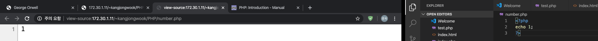

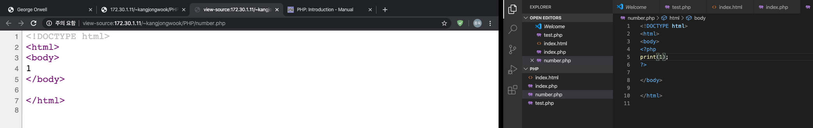
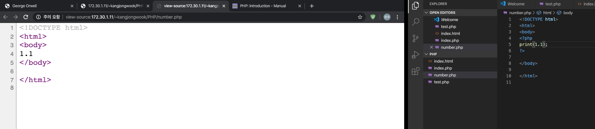

숫자를 연산하는 방법

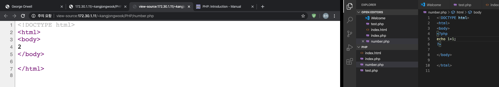
여기서 사용된 +를 연산자, operator라고 부른다. 연산자 중 더하기는 왼쪽의 있는 값과 오른쪽에 있는 값을 더해 하나의 값으로 바꾸는 연산을 한다. 따라서 최종적으로 표현되는 값은 하나의 값인 2이다. 1+1은 숫자 2의 표현식이다.
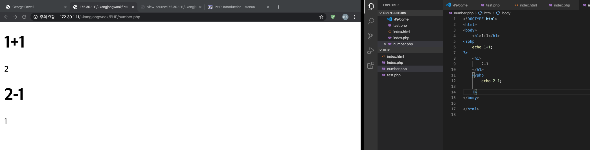
같은 방식으로 - 연산자도 사용할 수 있다. - 연산자는 좌측에 있는 값에서 우측에 있는 값을 빼 하나의 값으로 바꾸는 연산이다. 

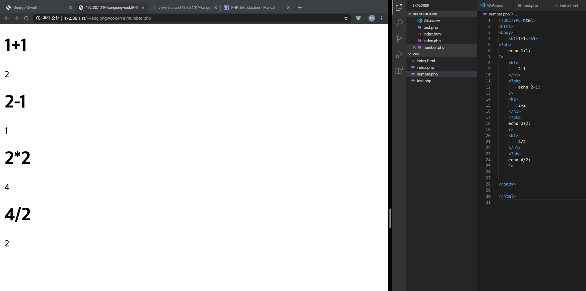
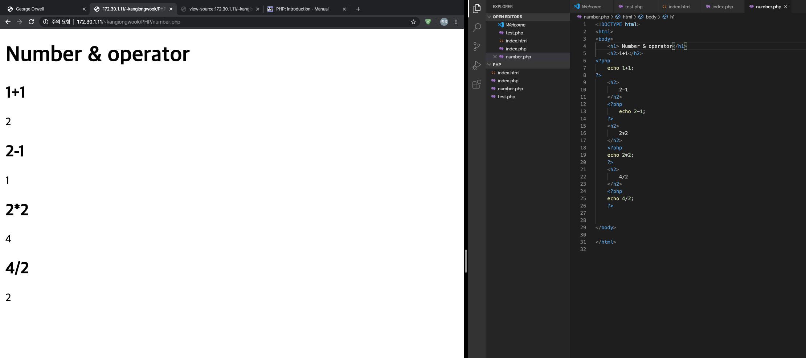
이렇게 수학적인, 산술적인 꼐산에 사용되는 연산자를 산술 연산자, Arithmatic Operator라고 읽는다.

PHP에서 문자를 표현하는 방법
인류는 숫자로 컴퓨터로, 기계로 표현하고 이를 계산하는 데 공을 들였고, 이를 성공하면서 새로운 장이 열렸다. 그러니 인류는 숫자를 시작해서 자신들이 가진 다양한 정보를 컴퓨터로 표현하고자 했다. 따라서, 숫자 다음으로 문자를 공부했 을 것이다. 

string - 문자가 모여있다는 의미에서 사용하는 표현. char을 안쓴다. 한국어에서는 문자열
literal - 어떤 데이터를 그 언어에서 표현할 떄 사용하는 기호들, single quoted, double quoted가 기본적.

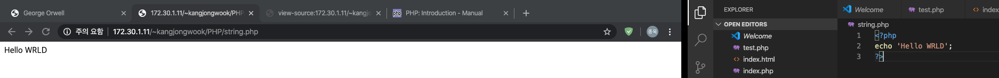

single quotes
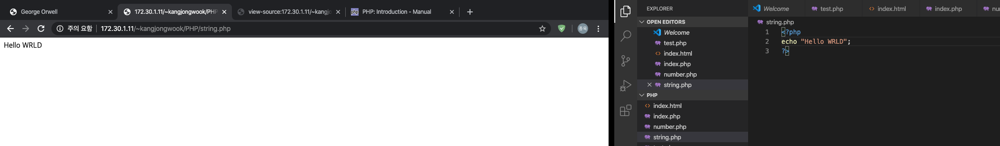
double quotes
작은 따옴표러 시작했으면 작은 따옴표로 끝내고, 큰 따옴표로 시작했으면 큰 따옴표로 끝내야 한다.
문장 내에서 큰 따옴표를 사용하고 싶다면 작은 따옴표를 사용해야 하고, 문장 내에사 작은걸 쓰고싶다면 큰 따옴표를 사용해야 한다
아니면 약속된 기호의 약속을 해제시키는 방법, escaping이 잇다.
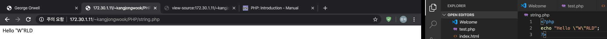
. > string에서 좌항과 우항을 결합하기 위해 사용하는 연산자.
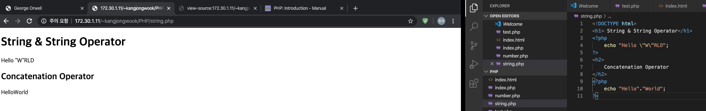
어떤 문자열을 가지고 글자 수를 확인해보거나, 기타 등등의 함수도 있다.
변수
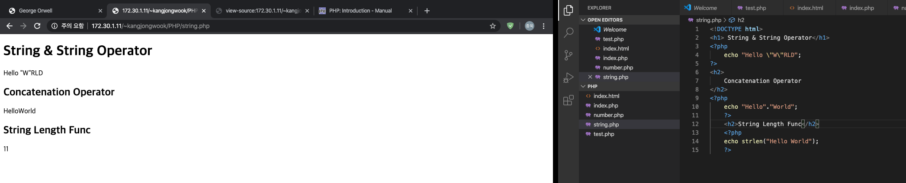

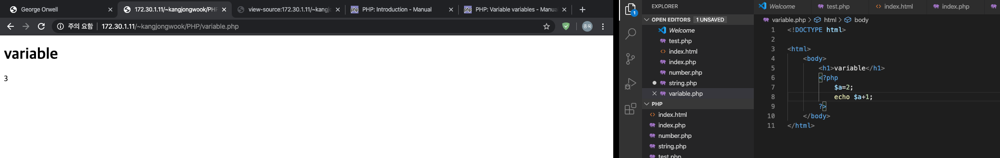
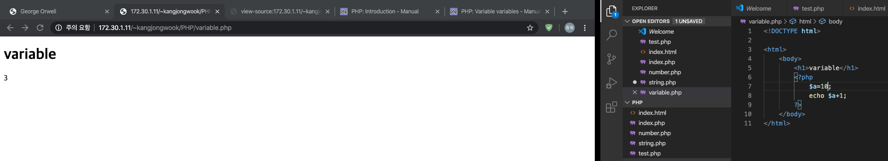
주어진 코드에서 변수는 $a이다. php에서는 변수 앞에 반드시 $를 붙인다. 
변수를 왜 쓰는가? 왜 안쓰는가를 설명하는 것이 더 빠르긴 하다. 
에디터에서 lorem이라는 것을 입력하면 무작위의 텍스트를 입력해준다.
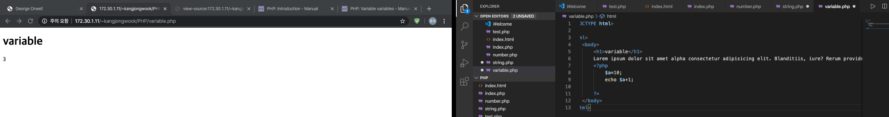
이 텍스트의 무작위의 위치에 alpha라는 단어를 삽입했고, 코드가 충분히 길다고 하자. 그리고 alpha라는 데이터가 큰 데이터라고 하자. 매일같이 이 데이터를 바꾸라고 하는 것은 굉장히 불편할 것이다.

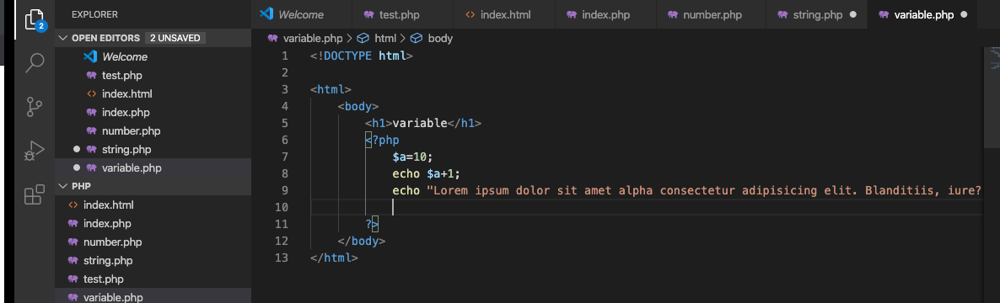
이러한 상황에서 alpha라는 데이터를 한번에 바꾸는 것은 불가능하다. 그러나 바뀌는 부분만 변수화 시킬 수 있다. 

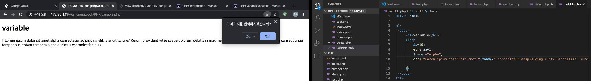
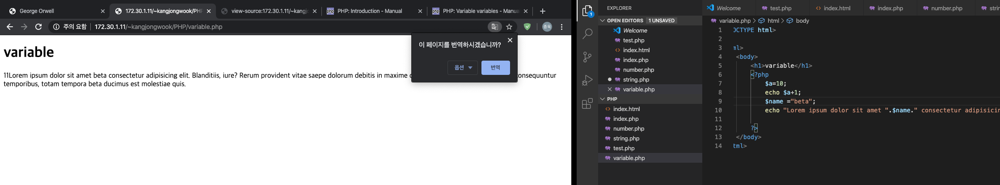
이러한 변수화를 통해 데이터의 교체가 획기적으로 빨라질 수 있다.

