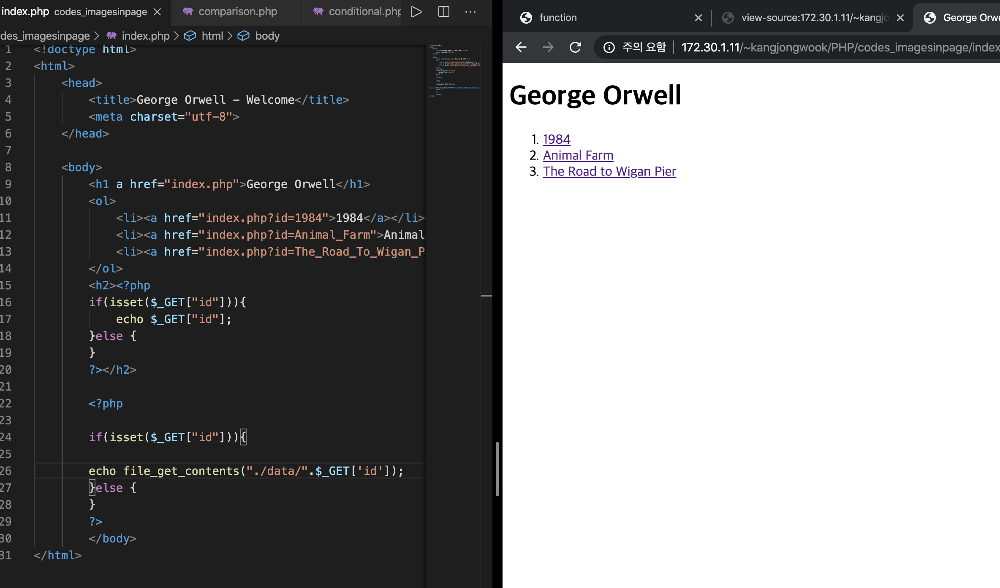

#Mentoring_Web #PHP
2-9 ~

컴퓨터 프로그램이라는 말 속에는 순서라는 의미가 깊숙히 자리 잡고 있다. 일을 한다는 것은 그 일을 이루고 있는 작업들, 그 일을 시간 순서 따라 하는것이 일을 구성하는 핵심이라는것이 제작자의 주장이다. 컴퓨터에서도 이것이 동일하게 적용된다. 컴퓨터로 일을 한다는 것은 컴퓨터가 가진 기능은 우리의 목적 / 시간 순서에 따라 수행하는 것이다.

우리가 하는 일들 중에서는 반복적인 일, 피하고 싶은 일이 있고, 이러한 일들을 자동화하고 싶어진다. 이를 자동화 하기 위해 엔지니어들은 프로그래밍 언어를 만들었다.
그래서, 코드를 위에서부터 아래로 써가면 시간에 따라서 그 코드가 가리키는 기능이 실행된다.

이것 말고도 두가지의 중요한 기능을 고안해 냈다. 조건문과 반복문인데, 조건문은 시간의 순서에 따라 코드가 실행되다가 조건에 따라 서로 다른 시간의 순서의 흐름에 따른 작업이 실행되도록 하는 것이고, 반복문은 시간의 흐름에 따라서 어떠한 조건에 만족할 떄 어떠한 작동을 반복적으로 실행하도록 하는 것이다.
조건에 따라 -> 조건문, 반복 -> 반복문
조건문과 반복문은 시간의 순서의 흐름을 제어한다는 의미에서 제어문이라고도 부른다.

조건문으로 할 수 있는일을 살펴보자. 우리가 만든 웹 페이지 중 파라미터 없이 index.php에서 적절한 홈 페이지가 나오게 하고, 파라미터가 있을때 파라미터에 맞는 웹 페이지를 출력하고 싶다면, id값에 적당한 본문이 나오는 기능을 부여하고 싶다. 이러한 걸 해결할 수 있으니까 다음으로 넘어가자.

조건문을 살펴보기 전에 Boolean이라는 데이터 타입과 비교연산자를 배워야한다. 이 두개는 그 자체로는 큰 의미가 없지만, 조건문에서 큰 의미를 갖는다.
boolean은 참/거짓 2개의 데이터 타입으로 이루어진다. 타입 자체는 의미가 없고, 비교연산자와 관련되었을 떄 의미가 있다.

var_dump는 문자의 형식을 알려주는 함수이다. 개발하는 과정에서 많이 사용하게 된다.

1+1이라는 표현은 좌항과 우항을 더한 값이 수라는 데이터 값이 된다. 비교 연산자를 이용해 양 변의 값을 비교한다면, True 아니면 False라는 부울 값으로 결과가 나오는 함수
가 된다. 

비교 연산자는 불리언이라는 데이터값을 만들고, 불리언은 참과 거짓으로 이루어져 있디.

php의 조건문 if / else / else if
if (표현식) statement

컴퓨터 프로그래밍의 가장 기본은 시간 순서에 따라 동작한다는 것이다.

아무 의미 없는것을 배치했지만, 의미 있는 함수들을 배치함으로서 혁명적인 일들을 할 수 있다, 그러나 우리가 조건문을 사용하면, 이 흐름을 바꿀 수 있다.

if는 조건문의 결과가 true라면 중괄호 내의 코드가 실행되고, false라면 실행되지 않는다.
else는 조건문 결과가 False라면 else의 중괄호 내 코드가 실행되고, true라면 실행되지 않는다.

중괄호에 따라 실행되는 문장이 제어되기 때문에 이를 “제어문”이라고 한다.

조건문의 활용
변수의 정의 여부를 확인하고 boolean으로 결과를 출력하는 함수 isset

리빙포인트) data 파일에 작성된 html 태그도 잘 적용된다.

따라서 id값이 없을떈 else가 잘 실행되고, id값이 존재하면 Id에 연결된 타이틀이 잘 출력된다.
아무리 복잡한 프로그램도 시간에 따라 실행된다. 조건문과 반복문으로 모두 표현할 수 있다.

반복문이 없을때 우리는 어떤 문제를 겪게 되는가? 반복문을 활용한 우리의 문제를 해결

우리가 만든 웹 페이지는 메뉴에 따라 적절한 페이지를 자동으로 생성하고 있다. 우리가 만약 새로운 페이지를 생성한다고 생각해보자. 이때 글 목록에 추가되지 않으므로, 이를 수동으로 추가해야 한다. 이를 자동으로 하려면?
데이터가 바뀌었다고 애플리케이션의 코드를 바꿔야 하는것을 부끄럽게 여겨야 한다.
글 목록이 데이터 폴더에 파일이 추가되면, 자동으로 목록에 파일을 추가해주는 것이 우리의 목표이다.
우리가 뭘 하고자 하는지를 논리적으로 설명하는것이 중요하다.
우리의 목록은 data 디렉토리에 있는 파일의 목록을 가져오고, 이 파일을 이용해 li와 a 태그를 이용해 글 목록을 만드는 것이다.

php 에서의 반복문과 조건문은 표현이 동일하다.  expression과 statement는, expression은 값이 오는것이고, statement는 실제 작동하는 문법이 온다. 이 두가지가 프로그래밍 언어의 대부분을 구성한다.
while문의 expression도 boolean이 온다. 참이면 작동하고, 거짓이면 작동하지 않는데, 참이어서 작동할 때 마지막 statement가 끝나면 다시 expression을 작동하고, 이 과정이 반복된다. 그래서 이 반복문은 조건이 만족되는 동안에 statement라는 부분이 반복적으로 실행되기 때문에 loop라고 부른다.  

이렇게 여러번 반복해야하는 상황을 while문을 이용해 조정할 수 있다.

조건문이 항상 참인 경우, 무한 루프에 걸릴 수 있다. 상황에 따라 필요할 수도 있지만, 일반적으로 웹에서는 샤용하지 않는다.
while문은 3번 실행된다.
반복문이라고 하는 것은 조건을 만족하는 동안에 중괄호 내부를 반복적으로 실행 할 수 있도록 하는 문법이다.

배열이라는걸 배우고 가자. 파일 리스트는 가져와야지 반복문과 배열은 별개로 배우면 의미가 없다.
우리가 집을 사면 처음에는 집에 만족하겠지만, 시간이 지나면 수납공간에 관심이 생긴다. 짐이 많아지면 복잡도가 높아지기 때문이다. 따라서 정보량이 많아지고, 이러한 정보량을 처리하기 위해 수납 공간을 얻기 위함이다.
프로그래밍도 마찬가지다. 처리하는 데이터가 많아짐에 따라, 이 데이터를 정리정돈하고자 한다. 복잡성이 늘어나다보면 감당이 되지 않아, 그저 그런 프로그램이 되게 된다. 그 정리정돈을 위한 수단이 “배열”이다.

이러한 표현을 사용하면, books라는 변수는 배열을 담고 있게 되는 것이다.  이 표현은 배열을 표현하는 표현식인 것이다.
배열을 배운다는 것은, 다섯번째 데이터 타입을 배운다는 것이다.
닫는 방법을 알았으니, 꺼내는 방법을 알아야 한다. 데이터는 0번부터 count 된다는 사실을 알아두자.

배열이라는 것은 데이터를 순서대로 담는것, 담으면서 번호가 부여되고, 이 번호를 통해 데이터를 불러올 수 있다.
이 배열에 얼마나 많은 데이터가 담겨있는지 확인하는 함수는 count()이다.

이 배열에는 총 4깨의 데이터가 담겨있다.
배열의 값을 추가하고, 지우고, 중간에 추가하고, 랜덤하게 섞어버리는 기능도 있다.
배열의 끝에 데이터를 추가하는 함수는 array_push이다.

삭제하거나, 중간에 추가하거나, 기타 등등의 기능은 필요할 때 직접 검색을 통해 알아보자. 공식 문서에서 관련 함수를 보며 추론하거나 질문하여 알 수 있다.
하나하나 열거하며 공부하려 하면 삶이 피곤해진다.

문제를 해결할 때 우선 내가 해결하고자 하는 문제의 해결 방법에 대한 조각조각의 생각을 해야할 필요가 있다.

우리는 data 디렉토리 안의 파일을 하나하나 알아야하고, 각각의 제목을 li와 a를 이용해 생성해야 한다.

학교에서 만나게 되는 문제와 현실에서 만나게 되는 문제는 다르다. 시험에서의 두가지 감정은 첫번째는 자신감이다. 두번째는 패배감이다. 그러나 현실에서는 내가 해결할 수 없거나, 인류가 해결할 수 없는 문제가 많다. 어떠한 문제는 1분, 어떤문제는 1년, 10년, 평생을 사용해 해결해야 할 수도 있다. 그러므로 문제를 적대시 하지 말고, 문제와 같이 살아간다는 느낌으로 살자.

디렉토리에서 파일의 리스트를 가져오는 함수의 이름은 scandir()이다. 입력값으로 directory를 필수적으로 받고, 배열을 반환한다.

새 함수를 사용할 때 수단과 방법을 가리지 않고 그 함수에 대한 이해를 높여 사용하자.

file_list라는 배열에는 5개의 파일이 담겨 있다.
배열은 "서로 연관된 데이터를 담을 떄" 사용된다.

위에 .과 ..은 약속된 디렉토리다. .은 현재 디렉토리, ..은 부모 디렉토리를 의미하는데 scandir은 이것까지 모두 스캔한다. 일단은 없다고 치자
이 안에는 패턴이 존재하고, 이 패턴이 “반복되고” 있다. 따라서 반복되는 부분을 반복문을 통해 모든 코드를 코딩한것과 같은 효과를 낼 수 있다.

공교롭게도, 우리가 원하는 수와 반복문에 expression에 사용되는 수가 같아 이를 같이 활용할 수 있다.
미리 만들어보는 바람에 대입이 됐지만, count를 사용해 while문이 작동할 횟수와 파일의 개수를 맞추어 줄 수 있다, 만약 while문이 작동할 횟수가 정해져 있을 때, 파일이 추가되었다고 하자.

새로운 파일이 추가되었음에도 파일의 개수가 정해져 있어,  목록에 추가되지 않은 모습이다.

counter를 이용하면 목록에 잘 추가 된다.

a태그까지 사용해 하이퍼링크까지 걸어준 모습이다.

.을 counter의 숫자를 조정해 무시해줬지만, scandir 함수가 항상 우리한테 배열의 0번과 1번을 의미 없는 값으로 줄거라고 확신할 수 없다. 근본적인 방법을 찾자. 리스트 내부에서 값의 내용이 .이거나 ..이 아닌 경우에 코드가 실행되도록 하면 된다.

이렇게 조건문과 비교연산자를 통해 .과 ,,을 무시해줄 수 있다.

단순한 문법과 어휘로 의미를 만들어 내는 것도 충분히 수련될 필요가 있다. &&연산자 쓰는 허세같은건 필요 없다는거다

이렇게 된다면 우리가 수업을 시작하기전 목표했던 모든 사항을 달성했다. 항목을 추가하면 리스트에도 추가 되고, 리스트에 연결된 링크를 눌렀을 때 본문이 자동으로 연결되며,  링크가 연결되며, 삭제했을 때도 리스트에서 자동으로 제거 된다.

지금 시간은 새벽 3:33 잠온다
