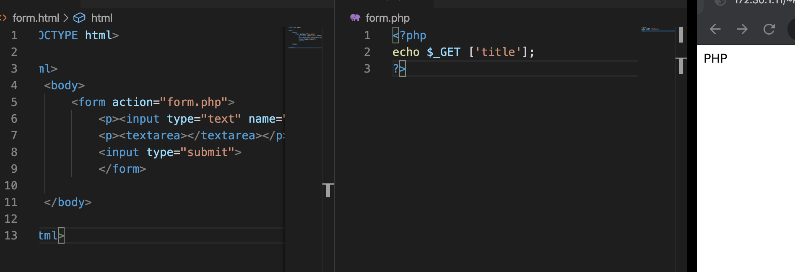
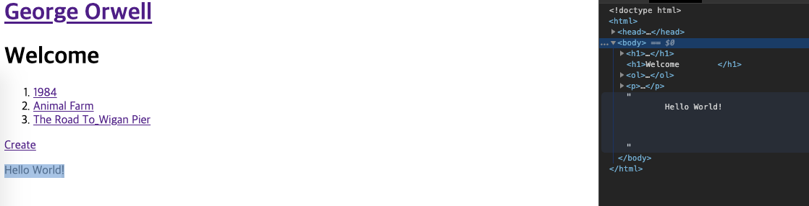
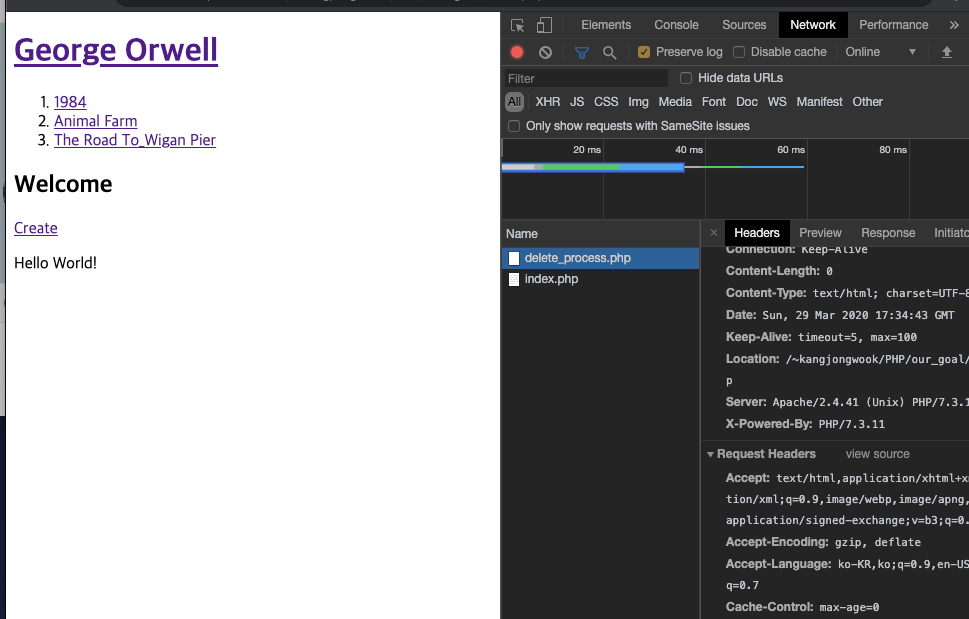
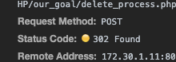

#Mentoring_Web #PHP

2-18~
함수라는 새 단원이 시작되었다. 가자.

함수는 두가지 측면이 있다. 내가 만든게 아니라 php에 내재되어 있어 사용할 수 있는 함수, 내장함수(Built-in Function)와 직접 만든 함수가 있다. 우리도 이제 함수를 만들어 볼 거다.

우선 우리가 우리의 상황을 함수를 이용해 어떻게 향상 시킬 수 있을지 생각해보자. 그냥 코드를 보았을 때 함수의 기능을 인식할 때 인식의 직관성이 떨어질 수 있다. 이 직관성을 높이기 위해 함수를 직접 만들면, 우리가 어떤 기능인지 직접 이름을 부여할 수 있다.

그리고 똑같은 기능을 다시 사용하고 싶다면, 그 함수를 다시 호출하면 된다. 굉장히 간단해진다.

우리는 기계가 아니다. 인지능력이 감당할 수 있는 한계가 있기 때문에, 복잡성을 낮추어야 한다. 코드가 복잡해지고 기능이 많아질 수록 복잡도를 낮추는데 집중하게 된다. 그것의 핵심엔 함수라는 것이 놓여있다. 객체라는 것을 배우게 되어도, 함수로 구성되어 있다.

함수의 기본 형식 1
사용자가 만든 함수는 user-defined function이라고 한다. 기본적인 골격을 공식 가이드에서 가져오쟈.
php는 function이라는 문자를 작성하면, 지금부터 함수를 정의할 것이라고 여긴다. 그 뒤의 문자는 함수의 이름으로 여긴다.
php는 중괄호 속 코드를 보고, 그 함수가 호출되었을 때 실행할 코드로 여긴다. 그리고 함수의 이름과 소괄호가 나오면, 함수를 호출하는 것으로 생각한다. 그리고 호출된 함수를 실행한다.

함수가 실행해야할 코드가 충분히 길다고 하자. 그 코드를 직관적으로 바로 해석하는것은 불가능하다. 따라서 함수를 통해 직관성을, 즉 함수의 이름을 통해 함수의 기능을 알 수 있는 능력을 만족시킬 수 있다.
함수로 정의를 하면 반복도 편리하게 할 수 있다. 그리고 반복적으로 사용되었을 때, 함수의 중괄호 속만 수정한다면 함수가 사용된 모든 부분에서 자동으로 수정이 된다.

함수에 입력값을 주면, 함수가 입력값에 따라 작동하도록 개선할 수 있다.

두개의 입력값을 받아, 입력받은 두개의 값을 더해 출력하는 함수이다.
basic이라는 함수는 항상 똑같이 작용하는 함수이고, sum은 입력값에 따라 동작하는 코드가 달라지는 함수이다.
함수에서 입력 받기 위해 설정한 변수를 매개변수(parameter variable)라고 하고, 입력한 실제 값을 argument라고 한다.

함수에 입력값이 있으면, 출력값도 있을 것이다. 출력값에 대해 알아보자.
sum이라는 함수는 2가지 기능이 있다. 두개의 매개 변수를 더하고, 출력하는 것까지 기능에 포함되어 있다. 그러나 함수를 출력하는 기능까지 추가하면, 파일을 저장하거나 다른 용도로 사용하고 싶을 때 사용 가능성을 제한해버린다. 따라서 함수를 만들 때 중요한 관점이 있다. 하나의 함수에는 하나의 기능만 담는다는 것이다.

sum2를 만들었을때, 두 수의 합을 표현하는 표현식을 반환하고 싶은 것이다. 그렇게 하면   여러가지 함수에서 범용적으로 사용할 수 있게 된다.

권한 충돌나서 file_put_contents는 사용 못했다.
return이 사용되면 함수는 종료되고, 뒤에 나오는 내용들은 아무 의미가 없어진다.
작동 원리를 살펴보면, 함수에 매개변수로 데이터가 오고, 이 데이터를 매개변수를 통해 연산한 후, return을 통해 표현식을 반환한다. 함수를 실행한 결과는 표현식이 된다
함수의 형식을 배웠으니 우리의 웹페이지에 도입을 해보자. 우선, id에 따라 title에도 제목을 부여하고자 한다.

동일한 코드를 반복적으로 사용하는 것은 비효율적이다. 그리고 코드에 오류가 있을 때, 수정을 하는것이 더 어려워진다. 따라서 이 코드를 함수로 묶을 것이다.

이러한 방법으로 함수를 이용해 단순성과 반복성을 충족해줄 수 있다. 어디서 함수가 호출되었든 항상 동일한 코드가 실행되고, 함수 내부의 명령만 수정하면, 함수가 호출된 모든 부분에서 코드가 개선된다.
리빙포인트) <?만 쓰고 php를 안쓰시면 당연히 작동을 안한다.

다른 모든 기능을 함수화 시켜서 작동하는 모습이다. 잘 작동한다.

함수를 사용하면 같은 기능을 무수히 많이, 더 간단하게 사용할 수 있어진다.
함수를 배워 가는 과정에서 여러가지 함수를 접하게 되고, 이를 통해 함수에 대한 풍부한 이해를 얻게 될 것이다.

이제 php에서 알고 있어야 할 문법적인 내용은 스스로 공부할 내용을 제외하면 다 공부 했다고 할 수 있다. 맥락적으로 알면 된다. 이제 하산하자.
우리가 만든 웹 애플리케이션을 조금 더 개선해 현대 웹의 기능을 모두 갖춘 세련된 애플리케이션을 만들어보자.

지금까지는 데이터 디렉토리에 파일을 추가하려면 파일 시스템에 직접 접근해 추가했어야 한다. 글을 파일 시스템에 접근하는 사람만 작성하는 경우에는 괜찮으나, 사이트에만 접속 할 수 있는 사람에게는 부족할 수 있다. 이제 우리가 할 것은, 웹을 통해 글의 작성을 받는 기능이다. 글을 웹에서 작성하면, 데이터 디렉토리에 파일이 추가 되고, 목록에도 추가되며, 수정 버튼을 누르면 이 모든게 수정되고, 글을 삭제하면 파일도 삭제되며 첫 페이지로 이동하는 페이지를 만드는 것이 우리의 목표이다. 이에 따라 사이트의 방문자도 컨텐츠를 만들 수 있는 기능을 만드는것이 우리의 목표다

정보 시스템을 만든다고 하면, 글을 쓰는것과 그 글을 화면에 표현하는 것을 본질적으로 우리가 확인해야 할 것이다.
Create / Read / Update / Delete가 정보 시스템에서 가장 중요한 요소들이고, 이를 어떻게 해야하는지 확인해야 한다.

CRUD중 Create 부터 살표보도록 하자. 우선 사용자의 정보를 서버쪽으로 전송할 때 사용하는 from에 대해 앏아보자.
사용자로부터 정보를 입력받는 태그가 있다. Input이라는 태그고, type 속성으로 속성을 제시하면 텍스트 상자가 만들어진다. Placeholder 태그는 박스에 대한 정보를 표시하는 역할을 한다.(글을 입력하면 사라진다.)

정보를 전송하고 싶으면 type을 submit으로 설정한다.

그러나 이런다고 진짜 전송이 되진 않는다, 어디로 보내줘야 하는지를 알려주어야 한다. 따라서. form이라는 태그가 필요하다

이제 form.php로 데이터가 보내지지만, 파일이 존재하지 않는다. 그러면 form.php을 만들어보자

$_GET이 대괄호를 사용했다는 사실을 통해 배열이란는 사실을 알 수 있다. 숫자 대신 문자로 이름을 제시하는 배열도 있다. 이를 연관배열이라고 한다.

새로고침 하면 여튼 잘 작동한다

이젠 본문을 작성하기 위해 조금 더 큰 텍스트 상자를 만들어 보자. 이 텍스트 상자를 textarea 태그로 만든다.

name 속성도 추가해주면 url이 이렇게 바뀐다.

제목과 본문을 표현하도록 만든 코드이다.

우리가 만든 form이라는 태그는 form 태그 내부의 입력값들을 name의 속성값을 이름으로 해서 submit 버튼을 누르면 Form 태그의 action 속성이 가리키는 url로 웹브라우저가 url을 바꾸고, 그 url에 정보를 제공하게 된다.
이러한 맥락에서 사용자의 정보를 url parameter로 만드는 태그를 form이라고 생각할 수 있다
php에서 파일을 추가하는 함수의 이름은 file_put_contents 이다.

사용자가 이제 제출 버튼을 누르면, 데이터를 서버쪽으로 전송된다. 전송할 떄 url에 parameter가 포함되는 방식은 좋지 않은 방식이다. 주소를 그대로 복사하거나 기타등등의 상황에서 의도치 않은 작동을 할 수 있기 때문이다. 따라서 데이터를 작성하거나 데이터를 제거할 때 url parameter를 사용하면 안된다.  대신, 주소에 따라 id가 바뀌어야 할 때는 url parameter를 사용해야 한다. Url parameter는 북마크에 저장하거나 정보를 공유할 때 적합한 방식이다. 
url을 이용하지 않고 은밀하게 데이터를 전송하게 해야한다. 그러려면 form에서 전송할 방법을 속성으로 정해주면 된다.  이를 지정하는 속성은 method 속성이다.

Method 속성을 이용하면 주소에 parameter가 사라진 모습이다.

검사에서 headerdml form data를 통해  parameter가 전달된 모습이다.

post로 데이터가 제시되었으므로 $_get이 아닌 $_post로 받아야 한다. post 타입읁 보이지 않게 작업하기 때문에, $_post로 php가 받아온다고 약속이 되어있다.

주소가 바뀌지 않았고, Form Data가 잘 전달된 모습이다. $_post로 데이터를 받아왔기 때문에 사용자가 form.html이 form.php로 전송한 정보를 사용할 수 있게 된 모습이다.
만약 form 태그에서 method 특성을 생략한다면, 기본값이 get이다. 근데 우리는 이걸 Post로 바꿔준거다.  get을 사용할 땐 url parameter로, post를 사용하면 다른 방법으로 전달된다.

이제 form을 우리 애플리케이션에 적용해보자.
우선 create라는 목록을 추가하자.

index.php를 재활용 하도록 하자. 코드가 비슷하다. 우선 본문을 출력하는 함수만 날리고 형태를 만들자.

아직 create_process를 만들지 않았기 때문에, 작동되지 않는다. 이제 만들자.

잘 작동하고 있다. 이 지점은 현대 웹 앱이 이전의 웹 앱과 다른 점을 보여주는 것이다.
이제 글을 제출했을 때, 생성된 페이지로 사용자를 이동시켜 제출했을때 흰 화면과 나오는 상황을 없애보자.
php가 가진 기능중에 redirection이라는 기능이 있다. 사용자가 create_process로 왔지만, 여기서 다른 페이지로 보낼 수 있다. 이 기능을 하는 함수는 header이다.

리빙포인트) 세팅 이상하게 한 다음에 그 세팅 반영 안해놓고 왜 안되지 고민할거면 그냥 제발 똑같이 따라해라.
여튼 이렇게 하면 자동으로 만들어진 페이지로 오기 때문에, 유저의 불편함이 줄어든다.

다음은 crud중 update, 수정이다. 그 두가지를 합성해 할 수 있는것들이다. 이제 create 옆에 update를 추가하자. Update 기능은 home에서는 작동하면 안된다. 특정 글을 선택했을 떄만 작동해야한다.

isset은 존재여부에 대해 boolean을 반환하기 때문에 expression에 isset만 작성해도 상관 없다.
그런데 우리는 update를 할때 수정하려는 내용이 어떤지 알아야 하고, 이를 위해서는 ㅑd값을 전달해야 한다.

이렇게 하면 id가 전달된다.
리빙포인트) <?php echo를 사용하는것과 <?=를 사용하는 것은 같다.

update.php도 만들자. index.php를 우선 재활용해야한다.
우리가 생각해봐야 할것은, create.php에 있는 form 태그를 우선 복사하자. 그리고 수정을 하려면, 우리가 사용하고자 하는 저 form 내부에 본문의 내용과 제목이 작성되어있어야 한다. 그리고 우리는 제목과 내용을 불러오는 함수를 이미 마련해두었다. 이 속성이 value이다.

내용이 잘 불러와지는 모습이다.
우리가 글을 생성할때는 create_process.php로 보냈지만, 수정은 update_process.php로 보낼것이다.
내부적인 작동을 생각해보자

만약 제목을 바꿨다면, data 디렉토리의 파일명을 바꾸고, 본문 내용을 넣으면 된다.
파일 이름을 바꾸는 함수는 rename()이다.  근데 우리가 원래 파일명을 전달해주지 않고, 바꿀 이름만 전달했기 때문에 이전 파일 이름을 update.php에서 전달해주어야 한다. 그럴땐 input 태그의 type 중 hidden이라는 속성을 사용하면 된다.

사용자에게 이전 제목을 노출하지 않는 것이 목표였기 때문에 목표에 맞게 보이는 것에는 달라지는게 없다. 그러나 php 파일로 전달되는 정보가 달라진다. value에 현재의 id값을 주면 수정 
전 제목을 전달할 수 있다.

이전 제목도 함께 잘 전달된 모습이다.

전달받은 파일을 통해 update_process.php도 정상적으로 작동하는 모습이다.
이제 파일명을 수정했으니, 수정된 파일의 본문을 기록하면 된다. file_put_contents를 이용하자.

정상적으로 작동하는 모습이다. .은 왜 붙었지? 내가 붙였구나.
이제 돌아가는 리다이렉션을 create_process에서 재활용해오자.

정상적으로 잘 작동하는 모습이다
리빙포인트) 제발 무언가를 하기 전에 저장이라는걸 좀 하도록 하자. 저장을 안해서 실습을 무슨 5번씩은 하는것같다.

대부분의 정보 시스템은 CRUD로 이루어져 있고, 여기서 벗어나지 않는다는 사실을 다시 한번 기억해보자
이제 CRUD의 마지막 Delete, 삭제를 해보자. 삭제도 id값이 존재할 때 가능해야하므로 edit와 같이 id값이 존재할때 작동하게 배치하자.

delete는 CRU와 다르게 form을 거칠 필요가 없다.

이제 remove_process를 만들자. Php에서 파일 제거에 사용하는 함수는 unlink()이다.  이제 이 함수를 이용해 id값으로 전달받은 파일을 지우면 된다.

정상적으로 작동하는 모습이다.
그러나 여기서 끝내면 안된다. delete라고 되어있는데, 링크만 클릭하면 데이터가 제거되고, 이는 굉장히 위험한 방식이다. 링크를 방문하면 삭제가 되는것이 아닌, delete를 눌렀을 때 post 방식으로 받도록 해야한다.

form과 submit을 이용해 post 방식으로 데이터를 제거하게 설계하였다. ui는 이질적이지만, css를 배우면, 링크를 버튼으로 바꿀수도 있고, 버튼을 링크처럼 만들수도 있으니 걱정하지 말도록 하자.

데이터를 받는 방식도 post로 설정해주자.

정상적으로 post 방식을 통해 데이터가 제거되는 모습이다.

우리가 만든 코드들을 효율적으로 개선해보도록 하자. 이를 refactoring이라고 한다. 기능을 유지하되, 코드가 보기 좋게 유지보수에 편리하게, 중복된 코드를 제거하는 등의 작업을 한다. 처음부터 이상적인 코드를 짤 순 없기 떄문에, 코드를 개선하는 과정을 거쳐 나가야 한다,

우리의 코드에 어떤 문제가 있는지 살펴보자. Index, create, update에 모두 내용이 같은 함수가 여러번 선언되었다는 점에서 기분이 나쁘다. 만약 index에서 함수를 수정해야한다면 우리는 나머지 파일들에도 수정사항을 따로 반영해야 한다. 굉장히 비효율적이다.

좋은 코드를 만드는 아주 좋은 실천방법은 중복을 제거하는 것이다. 다른 말로 정리 정돈과 관리되어 있다고 한다. 
우선 재사용할만한 코드와 로직을 정리해 둔 것을 도서관, library라고 한다. 이를 축약한 lib라는 폴더를 만들고, 이안에 print,php를 만들고 중복적으로 선언된 함수들을 여기에 넣자.

이제 우리의 웹사이트는 동작하지 않는다. 그럼 index.php에게 print,php가 안에 있는
것처럼 php에게 시키면 된다.  

require를 이용해 print.php를 로드하면, 다시 정상적으로 작동하는 모습을 볼 수 있다. 이제 이걸 함수가 사용된 모든 파일에 적용하자.
 form 부분에 if가 적용이 안되어서 delete 버튼이 나오고 있었다. 수정 완료

모두 정상적으로 잘 작동하는 모습이다. 
이제 print.php의 함수를 수정하면 모든 페이지에서 수정되는 엄청난 효과를 얻을 수 있다.

index파일과 update, create파일은 파일의 근본이 같기 때문에, 함수를 제외하고도 많은 부분이 중복되어 있다. 이 중복되는 부분을 모듈화 시켜보도록 하자. library에는 재활용하는 로직들을 저장하고, 보여지는 코드들은 또 따로 보관하는 경향이 있다. 보이는 부분을 view이름의 새로운 폴더를 만들고, 반복되는 아랫부분을 모듈화 시켜보자.

모두 정상적으로 작동하는 모습이다. 두줄밖에 안되는걸 굳이 할 필요한건 없지 않지만 공통적인 내용 추가에 유리해진다. 윗부분의 목차까지도 중복이 있다. 새로운 파일로 만들어 다시 중복을 제거하자.

모두 정상적으로 작동하는 모습이다.
코드에는 항상 인과관계가 드러날 필요가 있다. 그러나 선언 과정에서 중복된 선언은 피해야 할 필요가 있다. 따라서 공통적인 선언들은 상위 파일에 선언해야한다.

php에서 한번 만들어진 함수는 재정의될 수 없다. 따라서, 발생한 문제를 해결하고 직관성도 해결하기 위해 require_once라는 함수를 이용한다.  처음 require_once가 실행되고 다시 실행되려고 하면, php가 두번 호출된 것을 무시하고, 에러가 발생한다. 항상 require_once로 쓰는게 정신건강에 이로울것이다.

이제 정상적으로 작동된다.

이번시간에는 보안에 대한 이야기를 생각하자. 수업의 내용으로만 만들어진 사이트를 중요한 온라인 서비스에 사용하면 안된다. Php 애플리케이션을 공부하면서 현실의 복잡성은 무시한 수업이기 때문에, 이 상태로 세상에 내놓으면 문제가 엄청나게 생긴다.
그리고 지금 하는 이야기가 우리가 직면할 보안적 문제의 70%를 방어하는 방법이다.

첫번쩨 해킹 사례는 cross site scripting (XSS)라고 한다. 간단히 웹사이트에 스크립트 태그를 주입하는것이다.  간단히 update에 들어가서 스크립트를 삽입하면 된다.

조금 더 심각한 문제도 있다. 현재 사용자를 의도치 않게 리다이렉팅하는 것이다.

자동으로 구글로 연결된다.
이러한 것은 깊지 않은 이야기지만, 굉장히 심각한 문제를 일으킬 수 있다. 로그인을 대신한다던지, 권한이 없는 행위들을 하는 등의 행동을 할 수 있다.
php가 가지고 있는 함수 중 XSS를 방지하는 함수가 2가지가 있다. 첫번째는 htmlspecialchars이다.

왼쪽을 바라보는 꺽쇠를 entity로 바꾸는 것이다. 외부에서 입력한 정보를 모두 htmlspecialchar로 받아야 한다.

외부에서 들어오는 입력을 모두 htmlspecialchars로 처리해 자바스크립트가 작동하지 않는 모습이다.
![](라

핵심은, 사용자가 입력한 정보를 모두 불신하라는 것이다.
다음에 발생한 문제는 url을 이용한 공격이다.  url을 통해 디렉토리에 접근해 공격하는 것이다. 만약 루트 디렉토리에 중요한 정보가 있을때, 공격자가 루트 디렉토리에 접근해 데이터를 가져갈 수 있다.

위 상황은 상위의 상위 폴더의 데이터를 접근하는 모습이다. 파일 시스템을 사용할땐 조심해야 하는 이유이다.
php의 명령 중 basename이라는 함수가 있다. 파일의 경로에서 파일명만 추출해주는 함수이다.

basename을 이용하면 부모 디렉토리로 접근하려는 텍스트가 제거되고 있다. 따라서 basename을 통해 부모 디렉토리로 접근을 막아 크래킹을 하지 못하게 할 수 있다.

부모 디렉토리로의 접근이 차단된 모습이다. 다른것들은 잘 작동한다.
이러한 것도 보안적인 문제가 발생할 수 있는 사례이고, 이런 경우 이런걸로 문제를 해결할 수 있는 사례 중 하나라고 할 수 있다.
또다른 보안 위협들을 살펴보자
보통 삭제 명령을 내리면, 그냥 삭제를 하겠지만, 악의적인 의도를 가진 경우 상황이 달라진다. 최대한의 정보를 수집하려 한다. 개발자 도구에서 검사를 열고, 네트워크에서 preserve log를 설정하면, 서버와의 통신 기록을 계속 저장할 수 있다.

이를 통해 파일을 삭제할 때, delete_process라는 파일을 호출한다는 것을 알 수 있다. 그리고 form data로 id값을 받고 있다는 사실을 알 수 있고, 전송 방식은 post라는 방식을 사용한다는 것을 알 수 있다.

이를 통해 공격자는 post 방식을 통해 delete_process에 id값을 제시해 의도치 않은 삭제를 유도 할 수 있다. 이 또한 부모 디렉토리의 접근을 막는것과 같은 방법을 사용할 수 있다.

이제 data 폴더를 제외한 디렉토리에서 삭제 명령이 불가능해진다.
눈 감으면 코베간다는걸 알고 있자. 보안을 굉장히 신경써야 한다. 중요해진 시스템이라면 도움을 받아야 할 수 있다.

ui와 api에 대해 이야기해보자.
ui는 user interface의 약자, 애플리케이션을 사용하는 사람들이 시각적으로 접하는 모든 것이다. 사용자는 ui를 통해 시스템을 조작하고, 시스템이 제공하는 정보를 볼 수 있다.
api는 application programing interface의 약자이다. 우리가 사용한 함수, 태그들을 api라고 할 수 있다. 애플리케이션을 만든다는 것은 프로그래밍 언어의 문법에 따라서 기반이 되는 시스템이 제공하는 api를 호출하는 것이라고 할 수 있다.
api는 부품이고, 언어의 문법은 부품의 결합을 통해 새로운 것을 만들어 내는 것이라고 할 수 있다.
우선 최소한의 문법과 최소한의 api를 이용해서 효율적이지 않고 아름답지 않더라도 무언가를 만드는 프로젝트를 했으면 좋겠지만, 다음단계는 정해져있고 나는 따라가기만 하면 된다. 열심히 하자.

앞으로 어떤 문제를 겪게 되고, 어떤 방식으로 해결할지를 좀 알아보며 끝내자
우선 php의 api에 대해서 좀 살펴보자.  우리는 api를 사용하지 않고 아무것도 할 수 없고, 이걸 공부하는건 선택이 아닌 필수다.

php.net의 documentation에 들어가 적당한 언어를 선택하면 여러가지 것들을 볼 수 있는데, Function Reference라는 부분이 있다. PHP는 객체지향을 처음에는 갖고 있지 않았지만 차후 도입되었기 때문에, php의 API는 대체로 함수의 형태로 제공된다. Function Reference 목록을 보면 php의 기능성을 파악할 수 있다.
그중 암호화와 관련된 cryptograpy extensions는 암호화등과 관련이 되어 있다. 정보기술에선 굉장히 중요한 부분이다
php로 만들어진 앱들은 php가 기본적으로 제공하는 api에 갇혀있다. 나중에 뭐가 있는지 알아두면 인생에 도움이 될거다

php composer라는 것도 있다. 패키지 관리자라고 할 수 있다. 패키지는 우리가 만드는 소프트웨어 안에서 사용되는 부품같은 소프트웨어라고 할 수 있다.  다른 사람이 만든 소프트웨어를 부품으로 조립해 소프트웨어를 만드는 것이 현대 소프트의 기본이다.  Composer는  패키지를 사용할 때 발생할 수 있는 번거로움들을 줄여주고, 유지보수의 편의성을 높여준다.

그 다음 이야기는 우리의 이야기이다. 우리는 파일 시스템을 이용해 파일을 저장했다, 파일 시스템의 장점은 쉽다는거지만, 파일 시스템의 대체제인 DB의 장점이 너무나도 커서, 단점들이 생긴다. dbms는 정보를 생성할 때 마다 사용자가 궁금해 할만한 정보를 기록할 수 있다. 데이터베이스를 사용하면, 천재적인 엔지니어들이 만든 역작을 그냥 쓸 수 있다.  파일 시스템을 데이터베이스로 대체하면, 기능적으로 그대로 유지하면서 dbms가 갖는 환상적인 기능들을 사용할 수 있게 된다. 현대적 웹 앱에서는 dbmsr가 당연하다.

앱이 커지다보면 불특정 다수가 글을 쓸 수 있고 삭제할 수 있다. 이에 대해 권한을 부여하고 싶어질 수 있다. Cookie라는 기능이 있는데, 이를 통해 이용자를 구별할 수 있다. cookie와 더불어 session이라는 기능도 이용할 수 있다.

현대의 애플리케이션은 각각의 사이트들이 직접 회원 관리를 구현하기보다, 다른 거대 기업들의 인증 시스템을 사용하는 경우가 많다. 이런걸 사용하면, 회원 가입이 손쉬워지고, 정보들을 대기업에 저장된 데이터로 바로 가져올 수 있어 회원에 대해 중요한 정보를 최소한으로 저장할 수 있기 때문에. 보안에 대한 리스크가 줄어든다. 그러나 종속된다는 점이 단점으로 작용할 수 있다. 이러한 것은 타사 인증, federation authentication으로 검색하면 찾아볼 수 있다.

파일을 업로드하고 싶다면, 검색을 해보자. 찾아서 구현해라.
강의 끝.
KEEP POUNDING