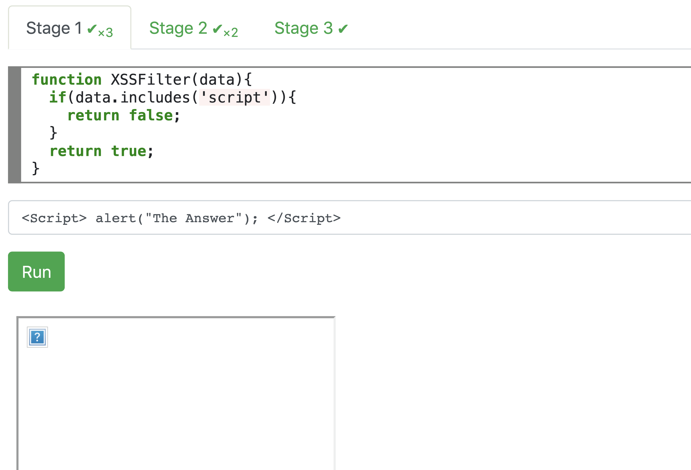
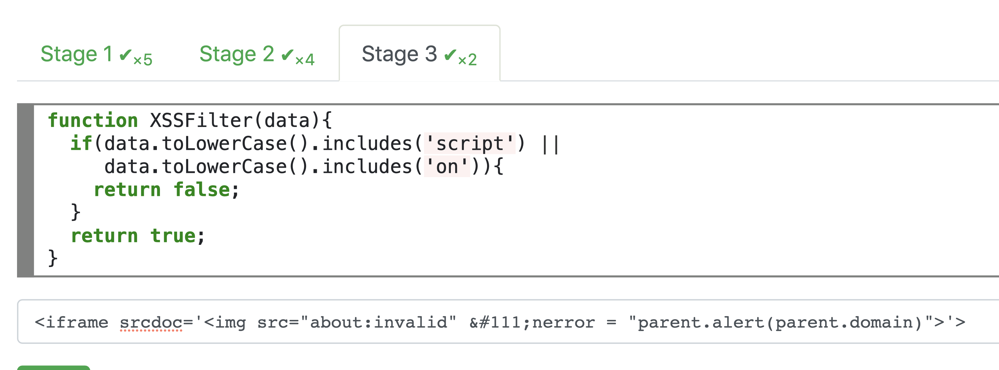
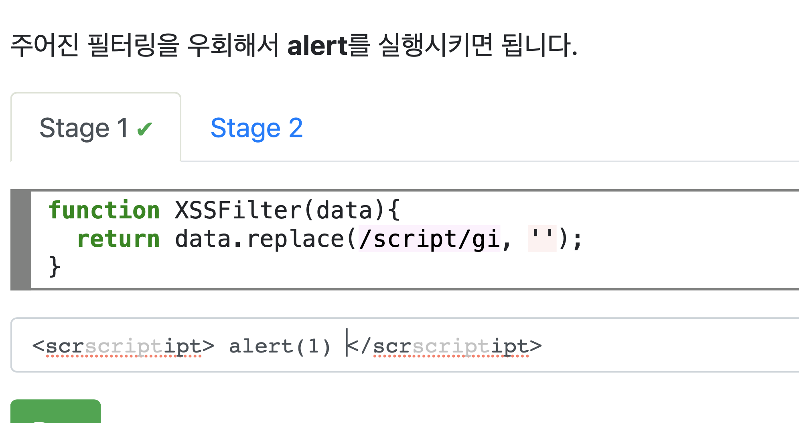
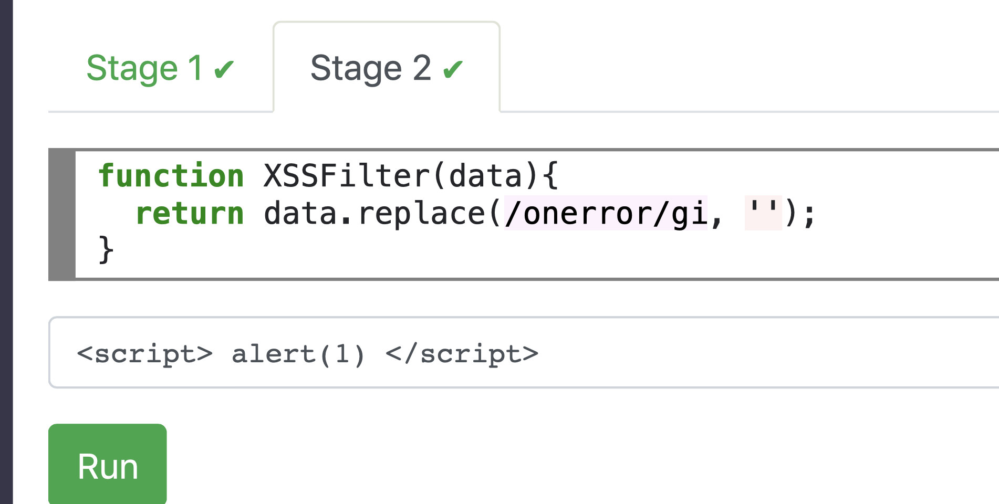
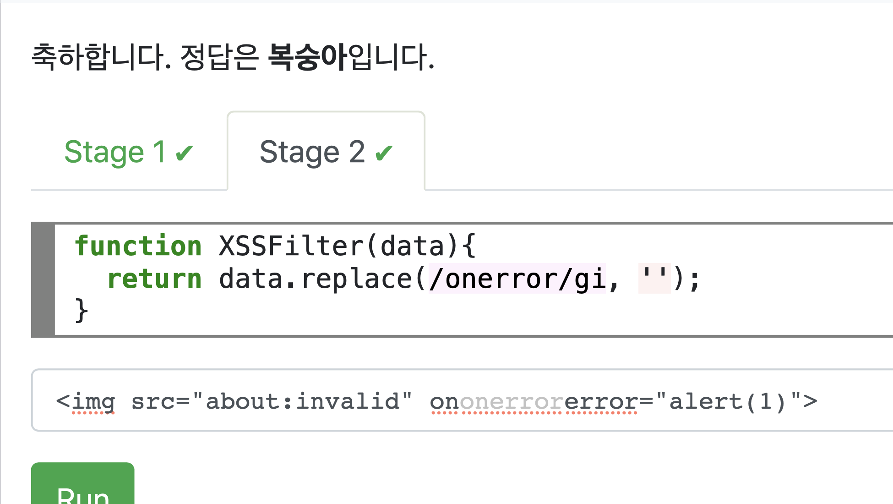
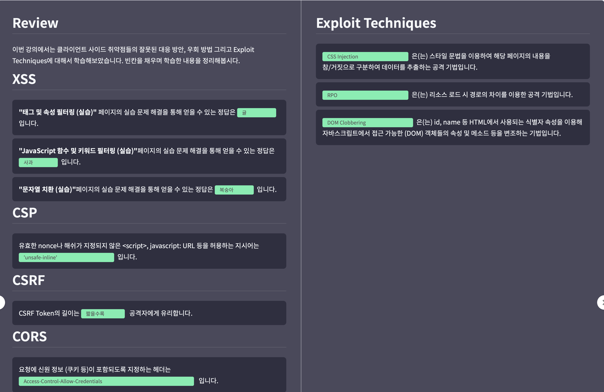

#Mentoring_Web #DreamHack

4강을 들으러 가보도록 하자. 클라이언트 사이드의 공격을 방어하는 방법이 잘못된 경우를 알아볼 것이다. 그러하다.

XSS부터 알아보자, XSS 방어에는 다양한 방법이 존재하는데, 가장 확실한 방법은 사용자가 HTML태그나 속성을 입력 못하게 하고, 이 입력들을 평문으로 취급하는 것이다. 그러기 위해 태그들에 사용되는 특수문자를 escape 처리 하고, 클라이언트에서 DOM의 textContent 또는 createTextMode를 사용해 HTML 태그 등이 해석되는 것을 방지하면 된다.

그러나 글을 작성할 때 서식등을 허용하고 싶을땐, HTML 태그를 허용하는게 가장 쉬운 방법일 거다. 이를 위해 화이트리스트 필터링이 권장되었지만, 이 방어가 제대로 이루어지지 않는다면 이를 우회하여 공격할 수 있다.

이러한 공격이 복잡해지는 이유부터 알아보자. HTML은 SGML이라는 언어를 기반으로 만들어졌는데, SGML은  마크업 언어를 일반화하던 표준이고ㅡ 따라서 다수의 마크업 언어와 호환되도록 각종 요소를 매개 변수로 자유화했고, 따라서 기존 / 현재 마크업 어어 다수가 SGML 언어의 일종이 된다. HTML은 사용자의 문서 작성 편의를 초점으로 든 기능들이 생기거나 유지되며 문법이 복잡해졌고, 이에 따라 인터프리터의 구조도 정교해졌다.

이 과정에서 브라우저 전쟁을 거치면서 표준 없이 태그등이 늘어갔고, 표준화가 정립되기 전까지 쌓여왔던 이 기능들은 현재 쌓이지 않거나 불편함을 야기하는 레거시가 되었다. 이러한 규칙들은 쌓여 인터프리터 제작에 어려움을 더했고, HTML의 일부 기능을 비활성화 하려는 XSS 필터들 역시 예외가 아니었다.

HTML에서 JS 코드를 실행하거나 페이지를 변형하는 방법이 여러가지 있고, XSS 필터는 이러한 공격을 모두 막아 웹 페이지의 보안을 유지해야 한다. 웹이 발전하면서 안전하지 않은 코드를 실행 시킬 수 있는 방법도 같이 증가하고, 보안을 위해 XSS 필터는 안전하다고 알려진 마크업만 허용해야 한다.

그리고 일부 문자열을 바탕으로 필터링이 이루어지면 위양성, 위음성이 발생해 여과 자체에 문제가 발생하고 이에 따른 취약점이 발생할 수 있다.

JS를 실행하는 HTML element는 script 태그 말고도 많다. 스크립트를 포함할 수 있는 속성이 존재하고, 이벤트 핸들러를 지칭하는 on 핸들러가 대표적인 예이다.

많이 사용되는 이벤트는 onload, onerror가 있다. 예제 코드를 살펴봐라.

Element의 속성값 또한 html entity를 포함할 수 있어 본래 코드를 숨길때 사용될 수 있다. 단순히 태그나 속성을 바탕으로 필터링 하면 우회가 가능한 경우가 많다

— 대문자나 소문자만을 인식하는 필터 우회

— 잘못된 정규표현식이 사용된 필터 우회

— 특정 태그 및 속성에 대한 필터링을 다른 태그 및 속성을 이용해 우회

예제 3문제를 풀었다. 첫번째 문제는 대/소문자가 구분되어 문제가 발생한다. 따라서 다음과 같이 대문자 집어넣어 문제를 해결할 수 있다.

두번째 문제는 대소문자 구분을 없애 소문자로 공격하는 것은 막았지만, on 속성을 이용하는 것을 막지 않아 이를 통해 공격할 수 있다.

세번째 문제는 on속성과 script 모두 막혀있다. 이떄 HTML entity를 통해 우회할 수 있는데, iframe을 이용하여 우회할 수 있다. 이때,  iframe 내부의 스크립트에서 parent 객체로 작성하는 이유는, iframe 외부인 원본 페이지에 alert를 적용하기 위해서다. 그러하다.

정답은 귤이란다.

다음은 JS를 이용한 필터링 우회다. JS는 unicode escape sequence, computed member access등을 통해 코드를 난독화 할 수 있는 기능들이 포함되어 있고, 이를 통해 필터를 우회할 수 있다.. 이렇게 부호화를 시킬 수 있는 함수는 atob(base64), decodeURI(URI)등이 있다.

XSS 공격에 흔히 사용되는 구문들이 있고, 필터링을 우회하기 위해서는 이러한 구문들의 대체 예시를 알아두어야 한다. 이러한 문자를 부호화하는 기법들은 XSS 필터들이 주로 탐지하는 단어들을 언급하지 않아도 되고, 따라서 상당수 웹사이트를 공격하는 데 사용되어 왔다.

필터링 또는 인코딩 / 디코딩의 이유로 우회에 사용되는 특정 문자를 사용하지 못하게 하는 경우도 있는데, JS는 이를 우회하여 공격하는 방법도 잇따.

일반적으로는 따옴표들을 사용하거나 Template literals를 이용한다. 이때 이러한 표현을 사용하지 못할 때도 우회할 수 있는 방법이  당연히 있다. 필요할 때 직접 한번 봐야할 듯 하다. 여러가지 String의 함수를 사용하는데, 아마 유니코드를 한땀 한땀 다 변환하는 것 같다.

함수 호출도 일반적으로 괄호나 tagged templates 를 사용하는데,이를 사용하지 못할 경우,  js scheme등의 방법을 사용하는데, 내가 js를 아직 확실히 모르겠어서 나중에 다시 한번 살펴보아야 할 것 같다.

문제를 풀어보자, 첫번째 문제는 3개의 키워드에 제한이 걸려있다. Alert, window, document인데, 따라서 이를 직접 넣지 않는 방법을 찾아야 한다. 이는 this 를 이용해 해결할 수 있다, 다음과 같이 문제가 해결된다.

2번부터는 문제가 익숙하지 않은 함수와 문법등을 사용해 이해가 안된다. JS에 대한 학습을 하고 다시 봐야 할 것 같다. 그러하다.

의심되는 데이터의 입력을 거부하는 것이 아닌, 단순 치환을 하는 경우도 있는데, 이때 필터되는 문자열 사이에 또다른 필터되는 문자열을 넣으면 최종적으로 바깥의 필터 되는 문자열이 다시 나타나게 되어 필터가 무력화되고, 방화벽도 탐지 못하게 하는 방법도 있다.

대안 접근 방식으로 스트링에 변화기 없을때까지 지속적으로 치환하는 방식이 사용되는데, 특정 키워드가 최종 마크업에 등장하지 않도록 하는 데에는 효과적일 수 있지만 미처 고려하지 못한 구문의 존재, WAF 방어 무력화등은 동일하다.

세번째 예제다. 치환이 일회성 과정이므로, 치환이 되어 데이터가 사라졌을 때 다시 태그가 나타나도록 구성을 하면 되겠다.

다음 문제는 onerror를 못쓰게 하는데, 이거 그냥 script 태그 쓰면 되는거 아닌가?

문제가 약간 잘못 출제된 것 같다. oneror를 이용하도록 문제의 의도에 맞게 풀면 다음과 같은 익스플로잇이 나올것같다.

여튼 정답은 복숭아다.

HTML 마크업에서 사용 될 수 있는 URL들은 활성 콘텐츠를 포함할 수 있는데, 이때 javascript: 스키마는 URL을 로드할 때 js 코드를 실행할 수 있도록 한다. 브라우저들은 URL을 사용할 때 정규화를 거치는데, 이 과정에서 특수 제어문자들이 제거될 수 있다. HTML 요소 속성에서 엔티티를 사용할 수 있다는 점까지 이용하면 다양한 우회 기법을 이용할 수 있다.

JS에서는 URL 객체를 통해 URL을 직접 정규화할 수 있고, protocol, hostname 등 각종 정보를 춫출할 수 있다.

입력 검증은 디코딩 등의 전처리 작업을 마치고 최종적으로 사용되는 형태에서 이루어져야 하는데, 일부 웹 앱은 웹 방화벽 등 필터링에 의존하거나, 데이터를 개별 요소 추출 전에 전체 데이터에 필터를 가하는 경우가 있다.

웹 방화벽을 사용하는 앱의 경우 만약 POST 요청으로 데이터를 받는데 파라미터 값에 추가로 URL Decode를 가하면 방화벽에 XSS 필터링은 무효화된다. 마찬가지로 내부 앱에서 XSS 필터 검사를 하고 URL Decode를 가한다면 필터가 의미 없어진다. 이를 해결하기 위해서는 불필요한 인코딩을 줄이고, 앱에서 사용되는 인코딩 방식을 통일하는 등의 방법이 있다. 결론적으로 이중 인코딩을 못걸러내는 방법인데, 이거 지난번에 웹해킹 문제 풀다가 봤던거다. 기억 못하면 바보다.

삽입할 수 있는 코드에 제한이 있으면, 다른 경로에 실행할 추가적인 코드를 url fragment 등으로 삽입하고, 삽입 지점에는 본 코드를 실행하는 런처로 사용할 수도 있다. 아니면 쿠키에 페이로드를 저장하거나 import 같은 외부 자원을 스크립트로 로드하는 방법도 있다.

CSP는 XSS 공격 발생했을 때 피해를 줄이고 웹 관리자가 공격 시도를 보고받을 수 있도록 하는 기술이다. 웹 페이지에 사용될 수 있는 자원에서 위치 등에 제약을 걸어 공격자가 웹사이트에 본래 있지 않던 스크립트를 삽입하거나 공격자에게 권한이 있는 서버 등에 요청을 보내지 못하도록 막을 수 있다. 하지만 이러한 방법은 XSS를 완벽히 막진 못하며, XSS에 대한 자체적은 방어도 병행되어야 한다.

CSP 헤더는 1개 이상의 정책이 세비콜론으로 분리된 형태로 이루어져 있다. 정책 디렉티브는 지시어 종류와 1개 이상의 출처가 스페이스로 분리된 형태로 지정되어야 한다. 예시를 한번 봐두자.

만약 페이지가 동적 기능을 사용하지 않는 정적 웹페이지라면 CSP 정책을 HTML meta 태그로도 지정할 수 있다. 정적 웹페이지에서도 JS 코드에서 DOM 기반 XSS 공격이 발생할 수 있고, 이를 어느정도 방어할 수 있다. 동적 웹에서도 사용 가능한데 동적 콘텐츠를 이용해 CSP를 무력화 하지 못하도록 주의해야 한다.

CSP는 관용적으로 설정될 경우 공격자의 공격할 수 있는 포인트가 늘어나기 때문에, CSP 규칙을 가능한 한 세밀하게 설정하는 것이 좋다.

CSP를 이용하면 브라우저가 특정 웹 사이트에서만 자원을 불러오도록 제한할 수 있다. 만약 해당 웹사이트가 파일 업/다운로드 기능을 제공하면, 공격자는 해당 사이트에 스크립트 등을 업로드한 뒤 다운로드 주소로 대상 웹 페이지에 해당 자원을 포함시킬 수 있게 된다. 

이에 대한 해결책으로는 도메인 Origin 대신 해쉬나 nonce등을 이용하는 것이다. 웹 사이트 단위 자원출처 지정이 필요하면, HTTP 요청의 Accept 헤더를 바탕으로 현재 요청이 script 태그 등에서 기원한 것인지 확인해 요청 거부가 가능하다.

한편 JSONP API를 제공하는 서비스는 콜백 이름에 식별자를 제외한 문자를 거부해 추가적인 방어가 가능하지만, 가능하다면 JSONP 보다 CORS를 지원하는 API를 사용해라.

CSP의 nonce 속성을 이용해 도메인 / 해쉬 등을 지정하지 않아도 공격자가 예측할 수 없는 값을 태그 속성에 넣도록 해 XSS 공격을 방어할 수 있다. 이때 이 방어가 성공하려면 nonce값이 공격자가 알 수 없어야한다. 보통 매 요청마다 nonce값을 새로 생성해 이루어지는데, 만약 이를 생성하는 알고리즘이 취약해 결과 예측이 가능하면 공격자는 이를 유추해 스크립트를 삽입할 수 있다.
nonce를 사용할 때 헤더나 meta 태그가 캐시 되지 않는지 확인해야 한다. PHP나 CGI 계열 쓸때 더 주의해야 하는데, 스크립트들이 디렉토리처럼 추가적인 경로를 붙여 접근될 수 있기 때문이다.

만약 캐시 서버가 확장자 기반으로 캐시 여부 판단한다면 .css는 일반적으로 정적 파일이므로 동적 콘텐츠로 간주하지 않아 캐시에 저장할 수 있고, 이 경우 캐시 만료될때 까지 요청할때마다 같은 nonce가 들어와 이를 바탕으로 공격자가 취득할 수 있다. 콘텐츠가 캐시되어 서버측에 XSS가 일어나진 않으나, DOM XSS등 클라이언트 측에서 일어날 수 있는 공격에 취약해진다.

nonce값은 공격자가 예상할 수 없는 난수여야 하기 떄문에, 현재 시각등의 공격자가 알 수 있는 정보를 바탕으로 nonce를 생성하는게 아닌, 보안상 안전한 의사 난수 생성기를 이용하는게 좋다.

또 다른 문제는 base-uri를 지정하지 않아 발생한다. HTML에서 하이퍼링크를 상대 경로로 지정하면 브라우저는 마치 파일 경로처럼 현재 문서를 기준으로 주소를 해석하는데, HTML의 base요소는 상대 경로가 해석되는 기준점을 변경할 수 있도록 하며, a / form 등의 target 속성의 기본값을 지정하도록 한다.

만일 공격자가 공격 정보를 담은 마크업을 삽입하게 된다면, 추후 상대 경로를 사용하는 url들은 본래 의도한 위치가 아닌 공격자가 의도한 자원을 가리키게 되어 공격자는 이를 통해 임의의 스크립트 등을 삽입할 수 있게 된다. Base 태그의 href 속성을 사용하지 않으면 CSP의 base-uri를 none으로 설정해야한다.

임의 HTML 마크업을 삽입해 글을 올릴 수 있는 서비스가 있다 가정하자. 해당 서비스는 업로드 과정에서 필터링을 통해 href속성이 외부 링크면 내부 페이지로 이동해 경고를 하는 기능을 제공한다. 그러나 csp의 base-uri 지시어를 지정하지 않으면 base 태그를 이용한 우회가 가능해진다. 따라서 base-uri를 none으로 설정해 base 태그를 비활성화 해야 한다.

다음은 CSRF 방어에 있어 주의할 점들을 알아볼 것이다
CSRF 방어 중 CSRF 토큰은 같은 오리진에서만 접근 가능한 형태로 특정 토큰을 저장해 제3자가 아닌 사용자에게서 요청이 왔다는 것을 인증하는 방법이다. CSRF 토큰 값은 보통 HTML 폼의 hidden 필드로 입력되는데, 동적 요청으로도 사용 가능하다.

CSRF 토큰은 암호나 캡챠같이 추가적인 사용자 상호 작용이 필요없다는 장점이 있는데, 그래도 Authorization 같은 헤더를 설정해 통신하는 것에 비해 여러가지 보안 문제의 원인이 되곤 한다. 취약점이 발생하는 예시는 다음과 같다

— CSRF 토큰이 짧아 bruteforce 공격에 취약할 때
	-> 토큰의 길이 길게 해 해결

— 토큰의 길이가 충분하여도 공격자가 접근 가능한 데이터나 암호학적으로 안전하지 않은 의사 난수기를 사용하여, 토큰의 예측이 가능할 때.
	-> 공격자가 예측할 수 없는 데이터와 충분히 안전성이 보장된 난수 생성기 이용

— CSRF 토큰이 어떠한 경로로 제3자에게 노출되었을 때

다음은 CORS와 관련된 취약점들을 알아보아야 한다. CORS는 SOP의 한계를 극복하고 오리진 간의 자원 공유를 돕기 위해 postMessage, JSONP등의 기술과 함꼐 도입되었다.

SOP를 우회하기 위해서 설계된 물건이라 CORS를 잚소 사용하는 경우 사이트 간 공격이 가능해지는 취약점이 발생할 수 있다. 웹 상의 서비스 뿐만 아닌, 일부 P2P 파일 공유 소프트웨어에서 제어판을 웹 인터페이스로 제공되었을 때 취약점이 발생한 경우도 있다.

CORS 기술에서 발생할 수 있는 취약점은 크게 2가지가 존재한다.

— 현재 사이트에서 다른 사이트로 정보 유출(기밀성)

CORS는 모든 정보를 공개하는 Open API뿐만 아니라 특정 대상에게만 자원을 공유하는 사이트에서도 사용될 수 있다. 만약 다른 사이트로부터 CORS 요청을 받을 때 그 Origin에 대한 검사가 진행되지 않고 응답하거나 Origin에 제약이 없는 경우 사용자의 신원 등의 민감한 정보가 다른 사이트에 노출될 수 있다.

— 다른 사이트에서 현재 사이트 변조(무결성)

CORS 요청에서 신뢰할 수 있는 출처를 검증하지 않거나 CORS 응답을 그대로 사용할 경우 XSS 등의 보안 문제가 발생할 수 있다. CORS 기술 도입할 때 신뢰성에 대한 결정이 필요하고, 입력에 대한 방어 또한 병행되어야 한다.

postMessage API에서 발생하는 묹제들 부터 알아보자. 웹 초기에는 프레임과 창들이 자유롭게 서로의 코드를 호출하였으나, SOP 도입 이후 서로 다른 오리진끼리는 직접 리소스 공유가 불가능해졌다. 이를 해결하기 위해 오리진 횡단해 메시지를 주고받는 api가 개발되었다.

메시지 전송할 때는 대상 윈도우에 postMessage 메소드를 호출하며, 수신하는 윈도우는 message 전역 이벤트를 청취하여 메시지를 받을 수 있다

postMessage를 통해 message로 문자열뿐만 아니라 객체도 주고받을 수 있으나 보안을 위해 함수, dom 노드 객체, 프로토타입 및 get/set 속성 정보는 보낼 수 없다. 또한 전송되는 모든 객체는 복사되므로 송신 후 객체를 변경해도 수신하는 윈도에는 변경이 반영되지 않는다.

그러면 이를 사용할 때 취약점에 대해 알아보자. postMessage api를 사용하면 오리진을 명확히 지정하고 검증해야 한다. SOP를 우회해 자유자재로 다른 윈도우와 통신할 수 있도록 만들어진 API기 때문에 Origin 검사도 개발자의 몫이다. 특정 윈도우는 모든 Origin에서 오는 메시지를 수신할 수 있는데, 이때 이벤트 핸들러에서 오리진을 검사하지 않고 메시지 내용을 신뢰하면 취약점이 발생할 수 있다.

또, postMessage 를 사용할 때 기억할 점은 메시지를 보내는 대상이 웹 문서가 아닌 창이라는 것이다. 웹 문서는 출처가 고정되어 있지만, 장의 경우에는 사용자가 하이퍼링크를 방문하거나 스크립트가 다른 문서로 리다이렉트시켜 들어있는 문서가 바뀔 수 있는데, 이 상태에서 메시지를 보내면 본래 의도하지 않은 오리진으로 메시지가 누출될 수 있다.

postMessage의 두번째 매개 변수 targetOrigin에 대상 오리진 문자열을 명시하면 이 문제를 해결할 수 있다. 메시지 송신 시점에 오리진 검사해서 일치하지 않으면 송신 거부한다.  *로 설정하면 일치하지 않아도 전송되니까 쓰지마라. 권장하지 않는다는 말은, 꼭 필요한게 아니라면 웬만하면 쓰지 말라는 뜻이다.

JSONP는 JSON with Padding의 준말인데, CORS 기술 도입 전에 SOP 우회하려고 쓰였던 방식이다. API 제공자의 코드를 그대로 사용자의 웹 문서에서 실행하기 때문에 API 서버 공격당하면 그 API 쓰는 문서도 XSS에 취약해진다는 단점이 있어 신뢰할 수 있는 api 서버가 아니라면 사용하지 안흔ㄴ 추세다. 

JSONP API는 JSON API와 유사하나, 응답 데이터를 특정 콜백 함수를 호출하는 코드로 감싸고 요청시 스크립트로 포함시켜 동작하는 점이 다르다. 최종적으로 원래 문서의 함수를 호출하게 된다. 이 JSONP로 발생할 수 있는 취약점은 다음과 같다

— Origin 검사 부재로 인한 CSRF

JSONP는 GET 메소드에 의존하고, 이 특성상 CSRF 공격에 더 취약한 특성이 있다. 민감한 정보를 반환하거나 권한이 필요한 작업을 수행할 때 JSONP 요청을 처리할 때 마다 요청자의 오리진을 검사해야 한다. CSRF 토큰을 사용하는 방법도 있지만 리다이렉트가 존재할 때 토큰이 제 3자에게 노출되지 않도록 주의해야한다.

— 콜백 함수명 검증 부재로 인한 제공자 XSS

JSONP API 다수는 사용자가 콜백 함수명을 직접 지정할 수 있도록 하고 있는데, 만일 콜백명에 HTML 코드 등을 삽입한다면 브라우저는 이를 HTML로 인식할 수 있고, XSS 취약점이 발생할 수 있게 된다. 이를 막기 위해서는 콜백명에 필터를 적용하고, JSONP 요청을 처리할 떄 Accept 헤더에 text/javascript MIME 타입이 포함되어 있는지 검사하고, 설정과 헤더로 응답이 js가 아닌 다른 콘텐츠로 인식되는 경우를 방지해야한다.

—JSONP API 침해사고 발생시 사용자 XSS

만약 JSONP API가 침해사고를 당해 악의적인 응답이 들어오면, 이를 사용하는 모든 사이트는 XSS 공격을 받게 된다. 이는 JSONP의 가장 큰 단점으로 CSP를 사용하고 JSONP를 제공하는 웹 서비스를 신뢰하는 것 외에는 별다른 방법이 없다. CORS 정책 헤더 쓰는 이유다.

CORS 정책은 서버가 HTTP 응답 헤더를 통해 직접 허용하고자 하는 오리진을 지정할 수 있도록 하는 기술로, SOP와 JSONP의 한계를 넘기 위해 설계되었다. JSONP가 지니고 있던 문제를 해결해 타 서비스에서 유입된 스크립트를 실행하지 않고 타 웹사이트의 자원을 요청할 수 있다.

CORS 요청을 보낼 대 브라우저는 먼저 대상 웹서버에 OPTIONS 메소드의 pre-flight 요청을 추가로 보낸다. 이는 서버가 CORS 접근을 인식하고 지원하는 지 확인하는 과정이고, 헤더를 지원하지 않으면 CORS 표준과 맞지 않은 응답이 이루어저 요청이 중단된다. 지원하면 OPTIONS 요청 응답에 허용되는 오리진 등의 정보를 보내게 된다.

이때 헤더가 잘못 설정될 경우 다른 웹 페이지에서 모든 서비스가 접근 가능하도록 만들 수 있다.

웹이 발전하면서 웹 앱의 복잡도는 증가하고, 취약점과 공격방식은 다양회되었다. XSS 공격도 필터나 웹 방화벽들로 제한될 수 있지만, 이를 우회하는 여러 방법이 존재하고, URL 변조등 공격 벡터도 다양하다. XSS 취약점을 방지할 때 서버측 뿐만 아니라 클라이언트 또한 방어가 필요할 수 있다. XSS 공격과 연계될 수 있는 테크닉들을 알아보자.

— Relative Path Overwrite (RPO)

특정 URL의 하위 경로를 접근해도 같은 웹 페이지가 출력되는 것을 이용해 페이지에서 참조된 상대 경로 URL의 기준점을 바꾸는 공격.

PHP 등 일부 CGI 형태 웹 스크립트에서 스크립트명 이하의 경로를 지정해도 같은 페이지가 조회되나 상대 겸로 자원 참조는 달라지지 않는 경우를 이용한 공격이다.

예를 들어 Script 태그를 이용해 상대 주소를 입력할 때, 맨 앞글자에 /의 여부에 따라 경우가 존재한다. 앞에 /가 존재할 때는 최상위 경로부터 시작해 탐색하고, 로드하게 되고, 존재하지 않는 경우에는 현재 경로부터 시작하게 된다.

루트 디렉토리에 있는 문서에 저러한 스크립트를 작성하면, 같은 경로에 존재하는 같은 스크립트를 로드하는데, /가 존재하면 /app/main.js 으로 로드하지만, 존재하지 않는다면 /index.php/app/main.js의 형태로 요청된다.

두번째 같은 상황에서 경로를 조작해 해당 서버에서 원하는 스크립트 등이 해당 페이지에 로드되도록 유도해 공격에 사용할 수 있다.

이러한 RPO 공격을 방어할 수 있는 최선의 방법은 다른 스크립트를 참조할 때 절대 경로를 사용하고, 헤더등을 통해 HTML 페이지가 CSS나 JS로 해석되지 않도록 하고, 동적 웹 페이지 CGI 또는 변수를 확인해 RPO 공격을 탐지해 발견될 경우 처리 중단을 하는것이 좋다.

— DOM Clobbering

메일 수신자, 게시글 작성자 등 제 3자에 의해 HTML 마크업이 제공될 대, id나 name같은 속성을 이용해 js에서 접근할 수 있는 전역변수 공간 또는 객체 속성 공간상에서 원하는 이름으로 임의의 DOM 객체를 삽입하는 공격이다. 이를 통해 접근 가능한 개게들의 속성 및 메소드를 변조할 수 있다.

기존 브라우저는 스크립트 작성자의 편의를 위해 DOM 노드에서 자식 노드를 직접 접근할 수 있도록 해왔는데, 웹 개발자 입장에서는 편리한 기능할 수 있으나, HTML 마크업이 사용자나 제3자로부터 제공된다면 문제가 발생할 수 있다. 전역 변수 이름공간이나 요소 객체 속성은 미리 정의된 속성과 충돌할 수 있으며, 프로그래머가 예상했던 것과 다른 값이 반환되게 된다.

만약 웹 앱이 미리 정의되지 않은 전역 변수에 접근한다면 공격자가 입력한 요소로 대체되어 반환될 수 잇따. 또한 form 등의 요소에서 속성을 접근할 때 본래 속성값이 아닌 삽입된 객체가 반환되게 된다.

DOM Clobbering을 방어할 수 있는 가장 효과적인 방법은 간접적 메소드 호출 및 접근자를 사용하는 것이다. 변수 그대로 쓰지 말고 함수 호출해서 반환시키거나 하라는 뜻이다. 사용이 번거로워 잘 사용되지는 않는다.

그럼에도 부룩하고 서드 파티 라이브러리와의 상호 작용에서 취약점이 발생할 수 있고, 따라서 식별자 attribute를 제거할 수 있는 라이브러리들을 쓰는게 좋다.

— Template / DOM XSS

서버측 XSS 공격과 유사하난 JS에서 innerHTML 등 마크업을 해석하는 속성을 사용하거나 템플릿 라이브러리를 사용할 대 그 마크업 또는 템플릿을 제3자가 제공 가능할 때 이를 이용해 스크립트 등을 삽입하는 공격이다.

XSS 공격은 보통 서버에서 데이터의 검증 / 필터링 이 제대로 이루어지지 않아 HTML에 포함되어 발생하지만, 클라에서 발생할 수도 있다. DOM에서  innerHTML, outerHTML, insertAdjacementHTML 등은 스크립트에서 HTML 마크업을 삽입할 수 있도록 한다. 또한 다양한 자바 스크립트 라이브러리 또는 프레임워크는 코드나 식을 실행하고 그 결과를 문서에 표시할 수 있도록 하는 엔진을 제공한다.

이러한 마크업이나 템플릿을 제3자가 입력할 수 있다면 임의의 스크립트를 실행할 수 있게 된다. 이러한 DOM XSS를 방지하려면 innerHTML 같은 마크업을 해석하는 속성의 사용을 피하고, 부득이 필요한 경우 서버측의 XSS 방어와 같은 XSS 필터를 이용해 안전한 마크업만이 삽입되도록 해야한다. 템플릿을 사용하는 경우 마찬가지로 외부 입력을 템플릿을 사용하지 않는것이 좋다.

— CSS Injection

다른 태그는 못쓰고 style태그 또는 style 속성에 대해 변조 가능시 다른 태그의 속성값을 참/거짓 방식을 통해 알아내거나, HTTP 트래픽을 생성시키는 공격이다. Attribute Seletctor와 HTTP 요청을 생성할 수 있는 문법들을 이용해 현재 문서의 정보를 획득하거나, CSRF 공격으로 연계할 수 있다.

중요한 데이터가 페이지 내에 존재하며, css 문법을 사용할 수 있는 경우 CSS 인젝션을 통해 해당 페이지의 중요 정보를 획득할 수 있다.

마지막 퀴즈다. 끗