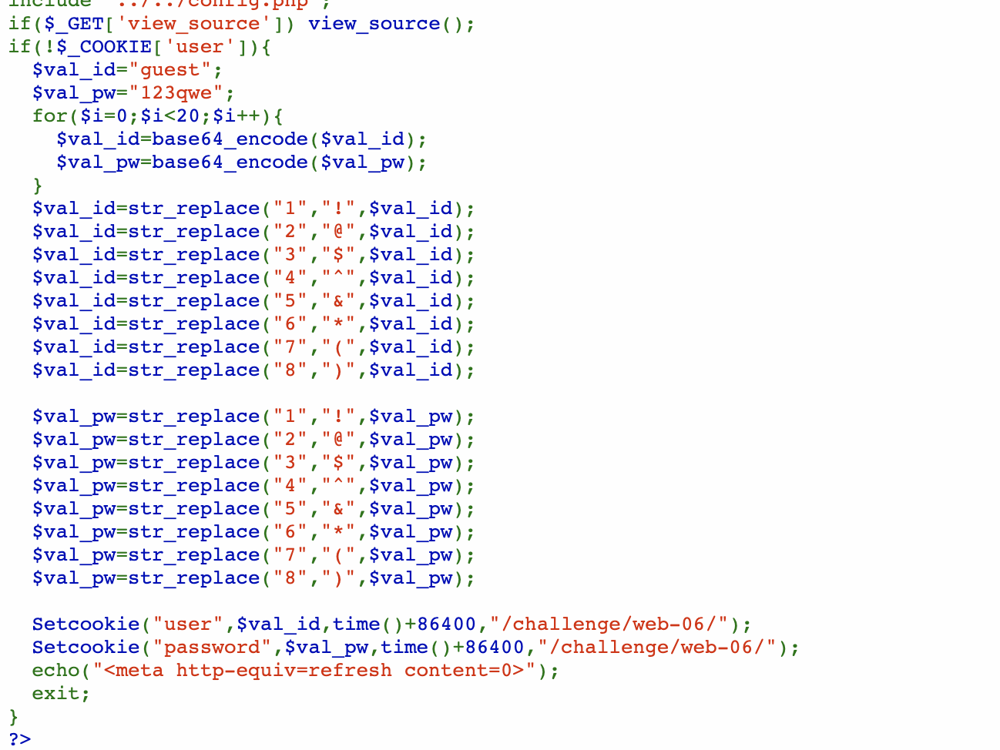
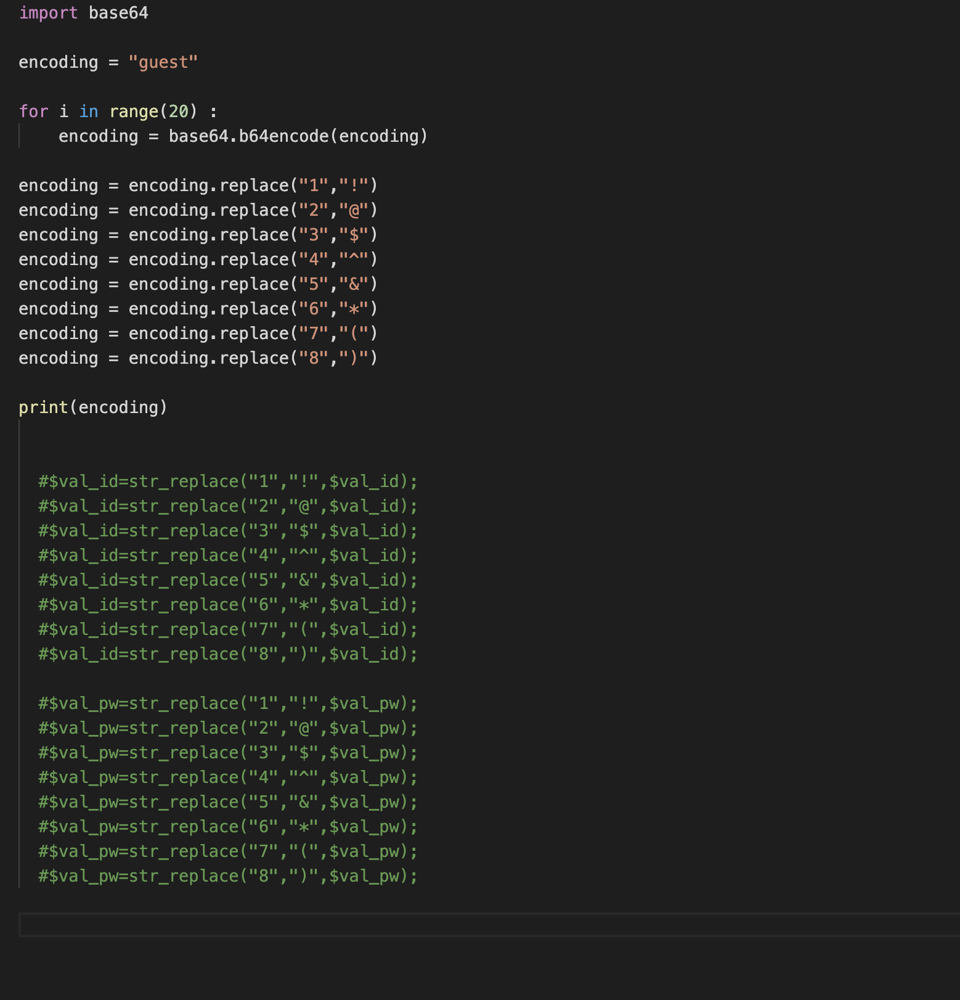
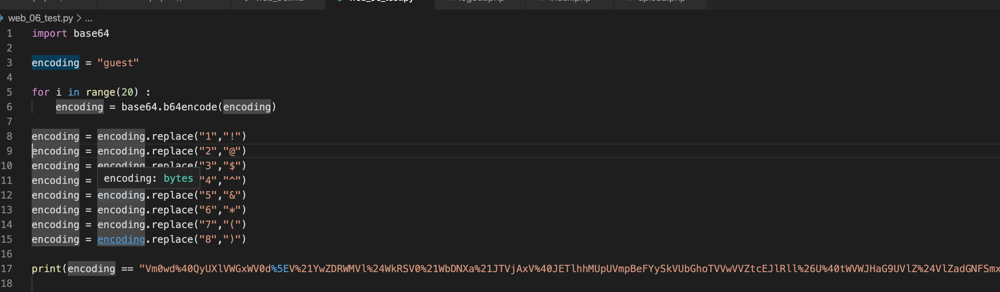
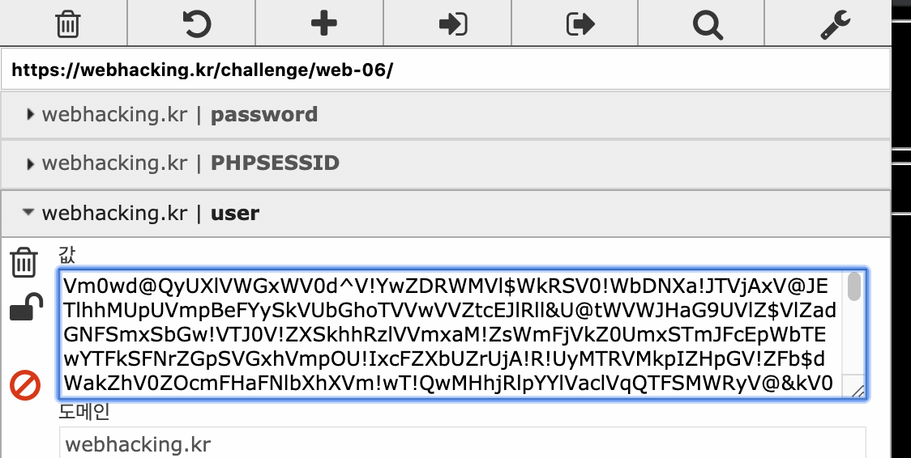
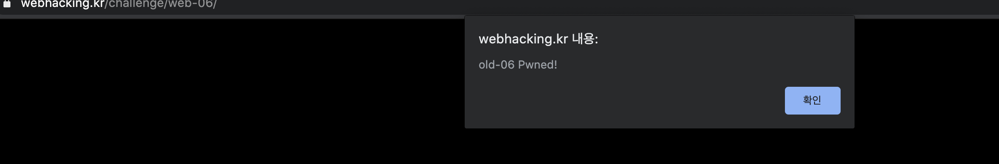
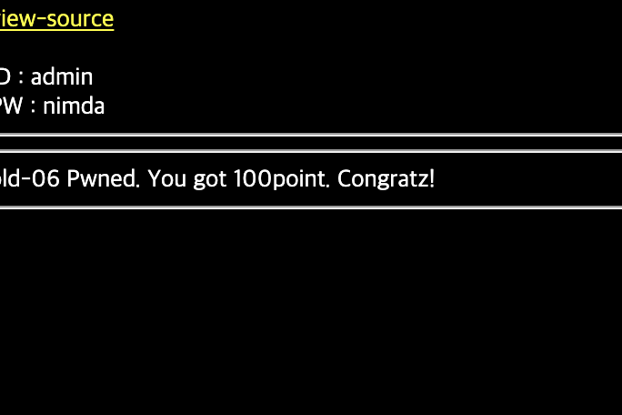

#Mentoring_Web #webhackingkr

6문제를 풀어야한다. 50점 1문제 100점 6문제라는데 50점짜리를 일단 못찾겠다. 가보자 

웹 6번으로 시작해보려 한다. Php 문제다. 가자.

우선 소스가 주어졌으니 한번 살펴보자.  우선 유저 데이터가 존재하지 않는다면, 디폴트값의 암호화를 20번 base64로 암호화하고, str_replace 함수를 통해 솔트 처리도 한다. 근데 문제는, 이게 user값이 존재하지 않을때만 이루어 지는 것 같다. 테스트 해보자.

주어진 계정이 admin일 때를 확인해보자.

우선 내 손으로 암호화하는건 귀찮으니까 파이썬으로 간단한 코드를 작성해보자.

20회 base64로 암호화 한 후, 주어진대로 문자를 대체하는 과정이다. 우선 신뢰성 확인을 위해 우리가 알고있는, 주어진 guest의 쿠키로 시행을 해보려 한다.

우선 테스트를 위해 원래 쿠키를 통해 guest를 대입해보았는데, 이게 뭐가 문젠지 데이터가 손상되어있었다. 그래서 계속 해보니까. 그래서 혹시 몰라서 admin과 nimda를 암호화와 솔팅 과정을 거쳐 대입해보니까 아주 잘 뚫린다.

이 화면 본다고 쓰잘데기 없는 짓을 2시간동안 했다. 썩을.