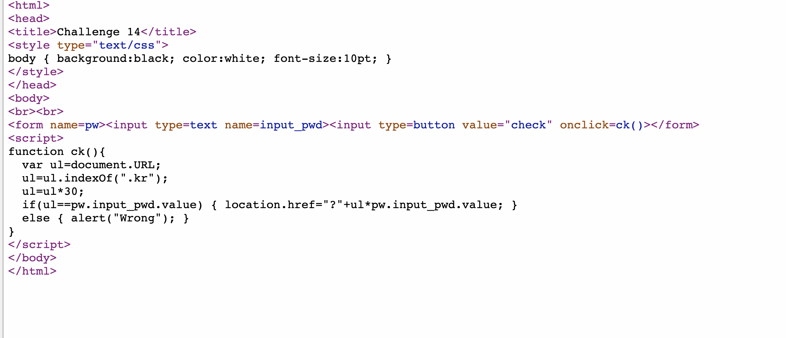
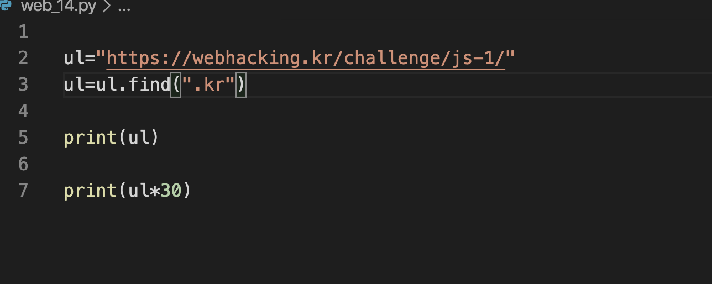
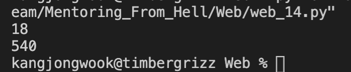
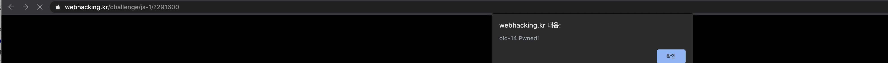

#Mentoring_Web #webhackingkr

14번이고, js문제다. 이번에도 열심히 해보자.

우선 코드부터 살펴보자. 입력을 받아서 함수 ck로 검증을 하는데, ck는 url을 받아와서, .kr이 존재하는 순서에 30을 곱한 값인 변수 ul과 입력받은 값이 같은지를 찾는다. 파이썬 코드를 이용해 ul의 값을 찾아보도록 하자.

ul의 값은 540일 것이다. 입력해보도록 하자. 두가지 방법이 있는데, 파라미터로 직접 입력하는 방법이 있다. 우선 텍스트 박스에 입력해봤는데, 텍스트박스로 입력하면 파라미터로 입력이 제대로 안된다. 직접 입력해보자. 이때, ul * pw.input_pwd.value이면 ul * ul 값이 파라미터로 들어가야 한다.

파라미터로 입력하니 정상적으로 문제가 뚫리는 모습이다. 그러하다.