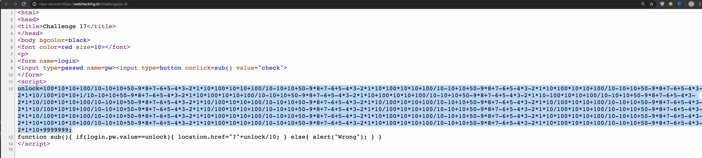
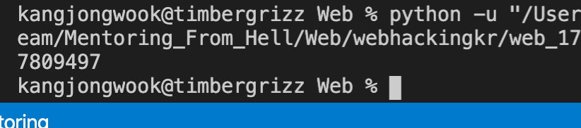
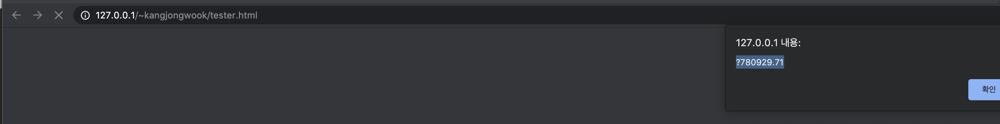
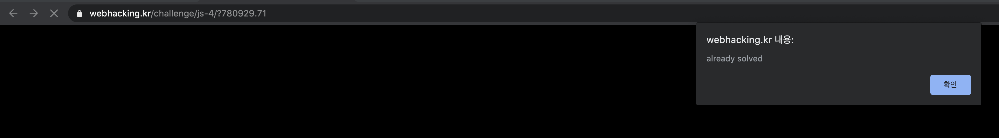

#Mentoring_Web #webhackingkr

17번 문제이다. 코드부터 보자.

우선 이상한 변수가 저렇게 나와있다. 저거랑 같은 수를 입력해야 또 문제가 풀리고, 파라미터로 10을 나눈 값을 입력하면 될 것 같다. 가자.

난해한 값인 척 해도 파이썬으로 해결 가능할 줄 알았다. 파이썬 형변환 나서 이렇게 입력하면 소숫점 다 날라가고 문제 안풀린다

Js 코드로 다시 확인해보니 다른 값이 나온걸 알 수 있다. 이제 넣자.

웬만하면 같은 언어로 문제를 풀도록 하자.