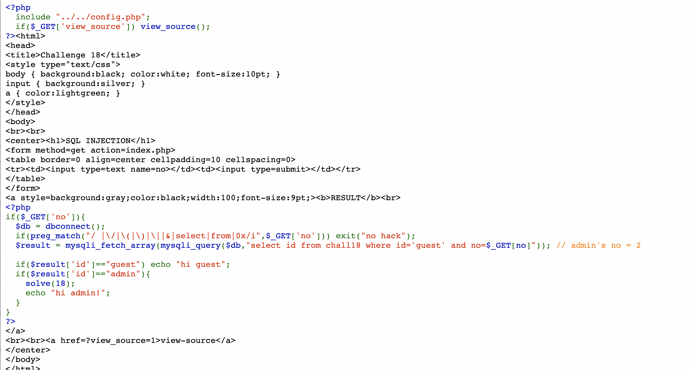
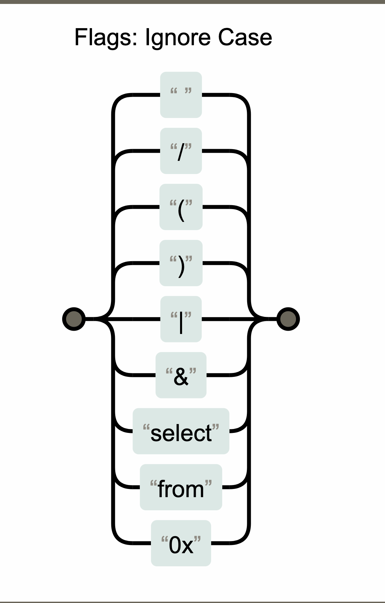
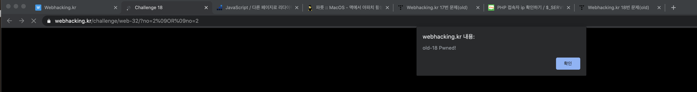

#Mentoring_Web #webhackingkr

18번 문제인데, SQL 인젝션 문제인 척 하는 PHP 문제이다. 이번에도 코드부터 보자,.

우선, get 형태로 바로 sql 문을 넣는것은 불가능하고,  preg_match를 우회해 쿼리를 넣는것이 목표다.

우선 정규식을 살펴보았다[. 모르겠어서 구글링을 해보니 해석해주는 사이트가 있었다. 처음 짰던 공격 코드는 스페이스바때문에 막히고 있는거같다. 이중 인코딩도 안되고 공백을 우회해서 넣거나 해야한다. 어떻게 하면 좋을지를 좀 생각해봐야겠다.

혹시나 해서 스페이스를 그냥 엔티티로 넣었는데 됐다…. 좀 단순하게 생각을 해보도록 하자. 우회를 꼭 이중으로 할 필요는 없다.