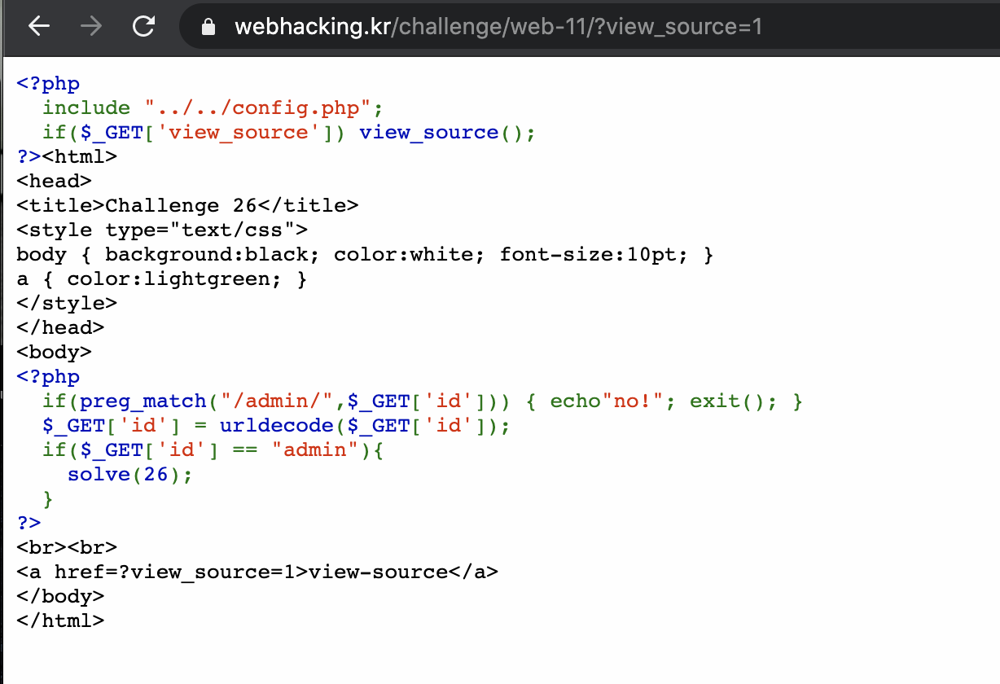
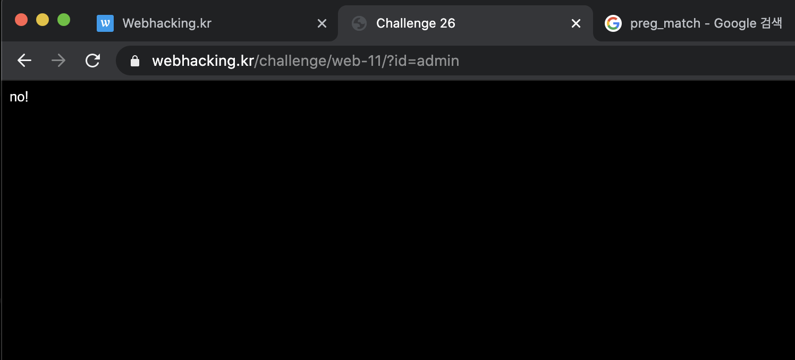
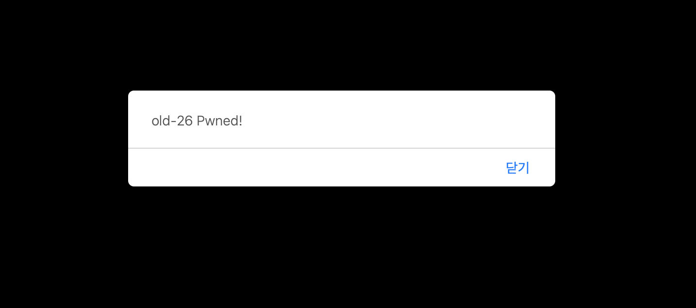
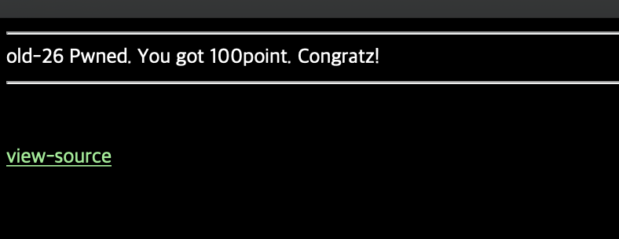

#Mentoring_Web #webhackingkr

26번 문제, php 문제다. 그렇다. 그냥 파라미터로 admin을 넘겨주는건 아닌것같고, preg_match로 그냥 admin이 넘어오면 소스를 날려버린다. 그러니까 이걸 그대로 넘겨주면 안된다. 그러므로 이걸 url 을 넘기기 위해 사용되는 값으로 인코딩 해서 넘겨보자. 어차피 admin이 그대로 넘어가지만 않으면 되니까 a만 인코딩해서 넘겨도 되려나?

안된다. 꾀부리지 말자

이게 한번 인코딩 되면, php 가 알아서 디코딩을 하는데, 보면 디코딩 과정이 한번 있다. 그 말은, 인코딩을 한번 더 해야  if문을 무시할 수 있게 된다는 것이다. 헤보자.

2번 인코딩 하니까 분노할 필요 없이 잘 풀리는 모습이다.
명심해라. Php 처음 파라미터 해석할 때 우선 디코딩 한번 하고간다.

Php 공부 좀 더해야 할 것 같다. 필요할때 좀 하도록 하자.