#Mentoring_Web #Docker #Appendix

과제는 아닌데 맥에서 작업하다가 실습환경을 리눅스 기반으로 이동하는것이 좋을것같아 새 과제가 나오기 전에\ docker를 이용해 실습 환경을 구성하려 한다. 알아둬서 나쁠것도 없고, 걍 하는김에 기록하려고 한다.
docker는 리눅스 "컨테이너"라고 한다. 이 컨테이너라는 물건에 대해 알아보기 전에, 서버에
대해 조금 알아보고, 문제를 파악해보도록 하자.

서버라는 물건은 상위 엔지니어들의 섬세한 작업과 관리가 필요하고, 일반적으로 서버를 유지보수하는 것은 복잡하고 어렵다. 하나의 서버에 여러개의 프로그램을 설치하는 것도 문제가 될 수 있고, 여러가지 고려해야할 요소들이 많다.

그럼에도 서버 환경은 계속 바뀌는데, 다른 배포판의 리눅스를 사용해야 하는 경우도 생기고, 다른 클라우드로 서비스 기반을 옮겨야 하는 경우도 생긴다. 클라우드의 발전과 개발주기의 단축이 관리를 계속 복잡하게 만들며, 이 관리를 편하게 하기 위해 도커라는것이 등장했다. 

이제 컨테이너라는게 뭔지 알아보자. 컨테이너는 “격리된 공간"에서 "프로세스”가 동작하는 기술이다. 지금까지 가상화는 OS를 주로 가상화하였다. VMware나 VirtualBox등의 가상 머신을 이용해 os 자체를 가상화해 사용했고, 사용법은 간단했지만, 무겁고 느렸다. 

이 문제를 해결하기 위해 os 자체를 가상화 하는것이 아닌, 리눅스 컨테이너라는 엔진을 이용해 프로세스 자체만을 가상화하는 방식이 등장했다.  추가적인 OS를 가상화하는것보다 용량이 작고 하드웨어를 가상화하지 않고 호스트와 공유하기 때문에 성능 손실 폭이 줄어드는 등의 장점이 있어, 사용이 증가하기 시작했다.

컨테이너의 장점은 하나의 서버에 여러개의 컨테이너를 실행해도 서로 영향을 미치지 않고 독립적으로 실행되게 된다는 가상 머신의 장점과, 그럼에도 불구하고 성능 하락폭이 크지 않다는 것이다.

도커를 알기 위해서는 이미지라는 개념도 알아야 한다. 이미지는 컨테이너 실행에 필요한 파일과 설정값 등이라고 할 수 있다. 컨테이너는 이미지를 실행한 상태라고 할 수 있고, 이미지 자체의 설정값은 변하지 않으며 변하는 값은 컨테이너에 저장된다. 같은 이미지로 여러개의 컨테이너를 생성할 수 있고 이미지는 컨테이너 상태 변화나 삭제에 영향을 받지 않는다. 

도커는 발전 속도가 빠른 소프트웨어이고, 이미 훌륭한 생태계를 갖추고 있다. 다양한 툴도 사용할 수 있고, 도커를 기반으로 한 오픈 소스 프로젝트는 10만개가 넘어간다. 컨테이너에 대한 정보만 있으면 설정에 대한 이동도 굉장히 쉬워진다.

우선 도커를 깔아야하는데, 가상머신 비슷한거래서 예전에 깔아뒀다.

네이티브처럼 설치되었지만 가상머신이다. 가상머신이 아닌것 처럼 작동하게 신경을 많이 쓴 것 뿐이란다.

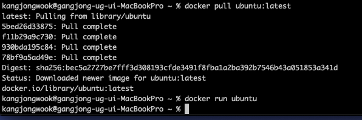

docker pull은 이미지를 당겨오는 명령어다.

우분투의 이미지를 받아와 컨테이너에 실행한 모습이다. 실행했지만 명령어가 전달되지 않아 동작할 게 없어 종료되었다. 이번에는 bash를 실행해보자

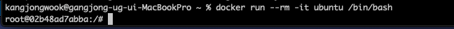
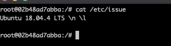

잘 굴러가고 계시는 모습이다. 

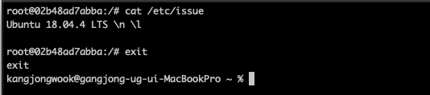

--rm 옵션을 사용하면bash 쉘을 종료하면 컨테이너도 같이 종료된다.

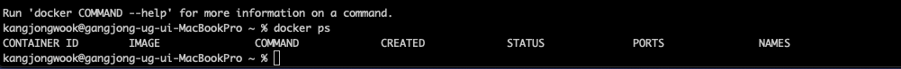

docker를 이용해 apache를 실행한 모습이다.

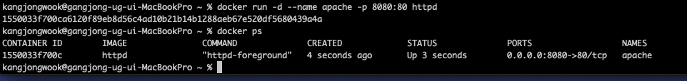

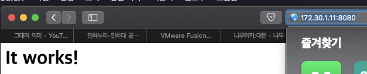

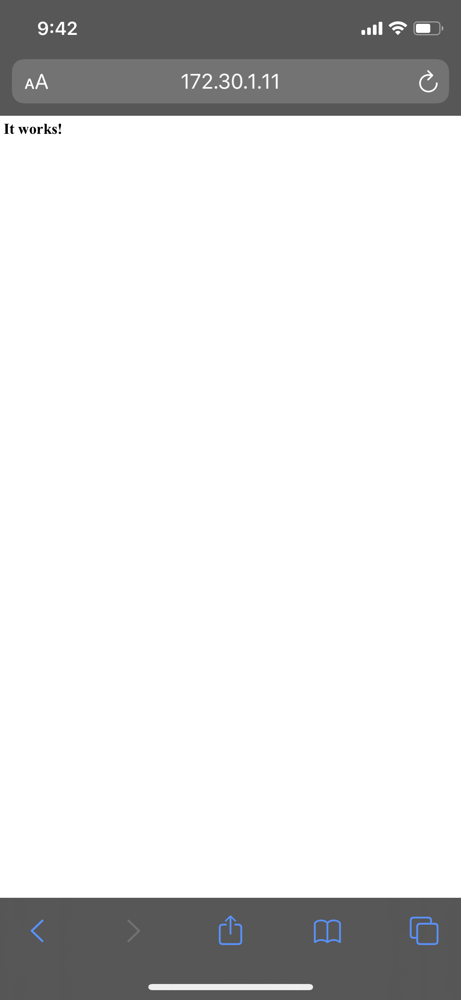

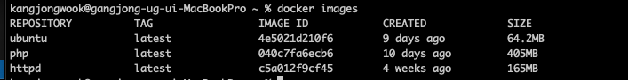

설치된 이미지를을 볼 수 있는 명령어는  images다, 삭제하는 명령어는 rmi이다.
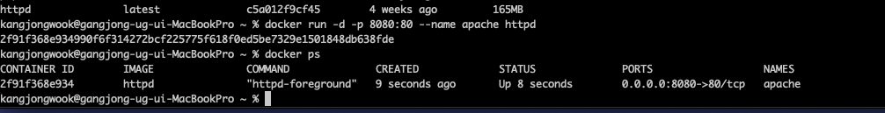

실행중인 컨테이너를 확인하는 명령어는 ps이다. stop을 통해 컨테이너를 중지하고, start를 통해 컨테이너를 실행할 수 있다.

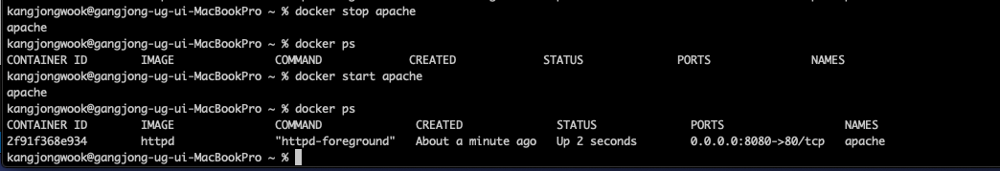
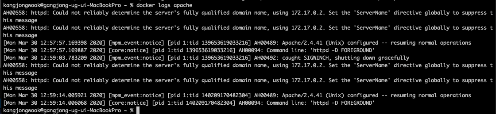

logs 명령을 통해 로그도 확인할 수 있다.

우분투 위에 아파치와 php, mysql을 올리고, 거기에 파일시스템과 마운트만 해주면 게시판을 위한 구축은 해결될 것 같다. 맘같아선 그냥 제로보드 올려버리고싶다. 공유기 비밀번호 까먹어서 포트포워딩도 안될건데 구글 클라우드 서버 하나 빌리던가 해야겠다.

reference : https://subicura.com/2017/01/19/docker-guide-for-beginners-1.html
저작권 관렪해서 어떻게 되는지 잘 모르겠어서 일단 출처라도 표시해둔다. 나중에 문제되면 지우고 대가리 박으면 되겠지 뭐.