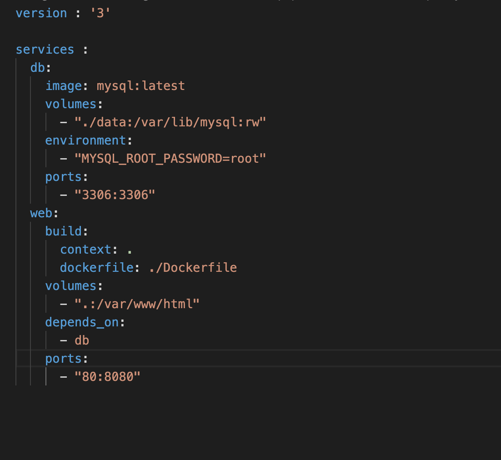
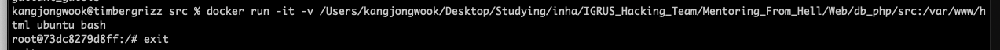
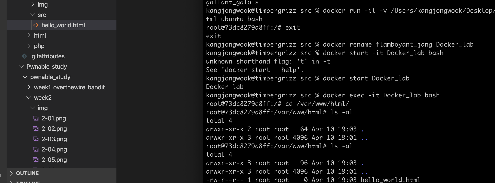
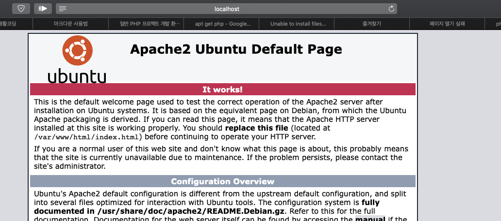
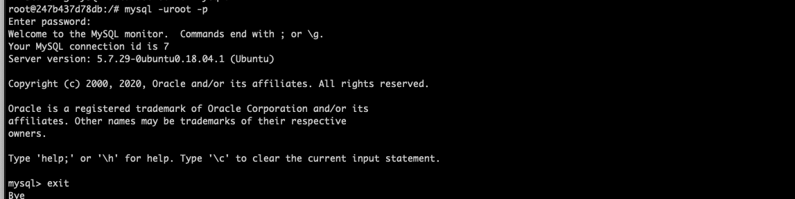
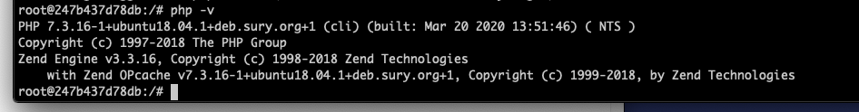
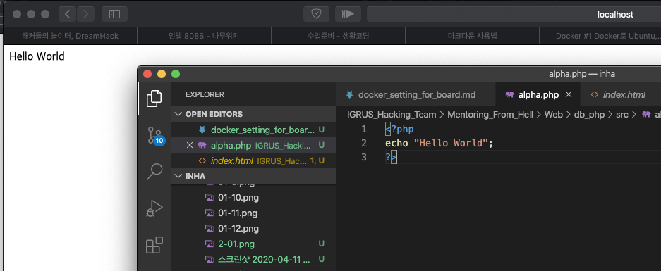

#Docker

이제 우리가 실제로 사용할 환경을 세팅해야 한다. 물론 mysql 할떄도 잘 썼다.

우리가 필요한 환경을 생각해보자
1. 아파치 / mysql / php가 기본적으로 설치되어 있어야 함
2. 로컬 폴더의 소스 영역과 컨테이너의 서비스 영역이 연결되어야 한다.

뭐 이 두개정도면 되는 것 같다. 우선 도커가 깔려있으니까, 환경 파일부터 작성을 좀 하자.

 [여기서](https://edykim.com/ko/post/using-the-docker-in-a-regular-php-project-development-environment/#환경을-파일로-작성하기) 기본적인 소스를 긁어왔다. phpmyadmin을 사용하지 않을 것이기 때문에 제거했고, 위험하지만 어차피 실습에 컨테이너 올리는거니까 mysql에 루트 계정만 만들었고, 아파치가 로컬에서 돌아가고 있기 때문에 도커에서 돌아가는 아파치의 80포트를 로컬의 8080포트와 연결시켰다. Localhost:8080으로 접속하면 도커에 실행된 아파치와 연결될 것이다. 그리고 도커 내부에 사용할 경로도 현재 폴더로 지정했다.

이미지로 제공되는 lamp 패키지도 있긴 한데, 얘네 업데이트가 무슨 4년전이더라. 그래서 깔끔하게 때려쳤다
근데 이렇게 사용환경 만들어놓고 시작하니까 또 에러가 폭발하며 골치가 아파온다.. 한번에 세팅하는건 포기하고 볼륨 연결만 하고 우분투에서 다운로드 하도록 하자.

우선 볼륨 연결만 한 모습이다. 연결은 참 잘된다. 이제 패키지들을 다운받자. 걍 좀 편하고 가벼운 가상머신 하나 올린걸로 치자. 근데 이것도 포트포워딩 안해서 또 다시 세팅했다. 

이 화면 보는데 1시간 걸렸다 ㅋㅋㅋㅋㅋㅋ 도커 배워서 어따 쓰나 싶다. 개발할것도 아니고.

mysql도 설치가 완료된 모습이다. 지금 새벽 4시반에 뭐하는 짓인가 싶다 ㅎㅎ php는 또 apt로 최신 버전이 설치가 안되서 ppa로 깔아야한단다. 신이나 신이나

php까지 설치했다. 진짜 내가 왜 이러고 있나 싶다. ㅋㅋㅋㅋㅋㅋㅋㅋㅋㅋㅋ

내가 이거 하나 보려고 2시간 삽질했다니 통탄할 노릇이다. 머리가 나쁘면 몸이 고생이다 역시.

여튼 일반 가상머신 다루듯이 열심히 apt-get을 이용해 무식한 방법으로 세팅을 해 보았다. 이게 뭐하는건가 싶다. ㅋㅋㅋㅋㅋㅋㅋㅋㅋㅋㅋㅋㅋㅋㅋ